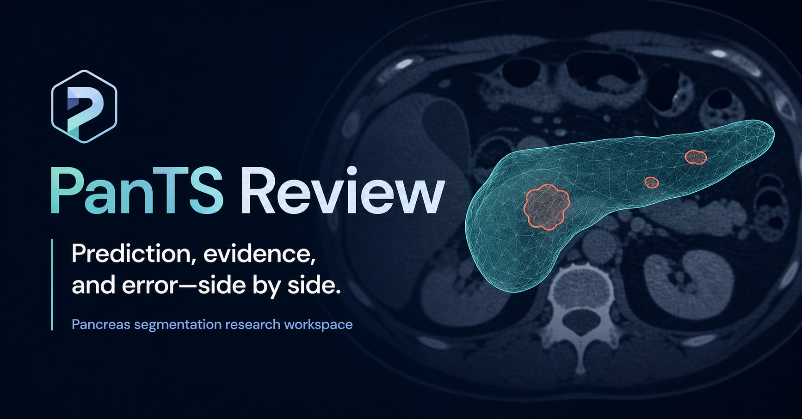
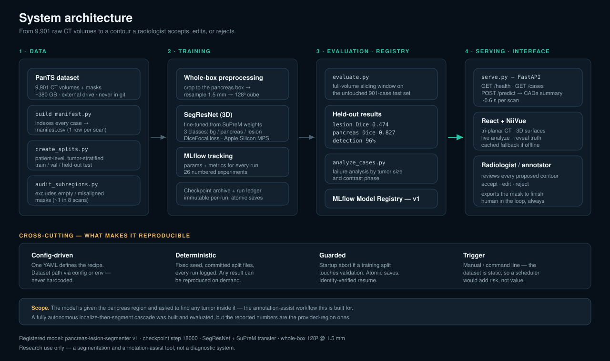

# PanTS Review — 3D Pancreatic Lesion Segmentation

A 3D deep-learning system that takes an abdominal CT scan, segments the **pancreas** and any
**pancreatic lesion**, and flags *"there could be a tumor here"* for a radiologist to review.
Built on the Johns Hopkins **PanTS** dataset with MONAI/PyTorch, served through a FastAPI endpoint,
and reviewed in a React + NiiVue clinical workspace.

> **Research use only.** This is a segmentation and annotation-assist tool, **not a diagnostic
> system**. A human reviews and edits every output; no clinical determination is made or claimed.

<p align="center">
  
</p>

---

## Results

Scored **once** on the official held-out test set — 901 CT volumes (151 tumor-positive, 750
tumor-free) that were never touched during development.

| Metric | Result | What it means |
|---|---|---|
| **Detection sensitivity** | **96%** (145/151) | Catch rate — of the tumors present, almost all are surfaced for review |
| **Lesion Dice** | **0.474** · 95% CI [0.42–0.52] | Outline quality on tumor-positive scans — the editing burden left for a human |
| **Pancreas Dice** | **0.827** | Organ segmentation, close to expert quality |
| **Specificity** | **17%** (128/750) | False-alarm rate on healthy scans — **the known weakness** |

Published PanTS benchmark for reference: **~0.53** lesion Dice (MedFormer 0.529, R-Super 0.534 —
the latter uses additional external report supervision).

**Honest scope.** These are **provided-ROI** numbers: the model is given the pancreas region and
asked to find any tumor inside it, which is the annotation-assist workflow it is built for. A fully
autonomous localize-then-segment cascade is implemented and runs, but its accuracy has not been
re-validated since the validation-leakage fix, so it is not reported here.

**Known failure mode.** The model detects small tumors (<1 cm³) but over-draws them by 25–50×,
which both caps their Dice (0.067) and drives the low specificity. One behaviour, two symptoms.
Full analysis in the [Week 4 report](deliverables/week4/tuning-orchestration-report.md).

---

## The interface

**PanTS Review** — a React + NiiVue clinical review workspace. A scan loads unmarked, the deployed
model scores it live, and the expert reference is revealed only when the reviewer asks for it.

**1 · Load an unmarked scan.** Exactly what a radiologist sees — no prediction, no reference.


**2 · The model scores it live.** A real call to the FastAPI endpoint. The badge shows *when* it was
scored and how long inference took — `Live · 18:01 · 0.6s`. Model contours are teal (pancreas) and
red (lesion), with the CADe flag, volume, diameter, and confidence in the panel below.


**3 · Reveal the source of truth and score it.** Prediction and expert reference together, with the
measured agreement — pancreas Dice 0.826, lesion Dice 0.907 on this study.


**And the honest one.** `PanTS_00009220` is a **tumor-free** scan. The model flags 51.68 cm³ at 94%
confidence. It is in the demo on purpose — it is the clearest single picture of the project's known
weakness, and the reason every output is framed as a prompt for review rather than a finding.


<details>
<summary><b>More of the interface</b> — scan library, difference view, 3D surfaces</summary>

**Scan library** — populated by a live `GET /cases` call against the running endpoint.


**Difference view** — agreement, over-segmentation, and missed regions as separate colours.


**3D surfaces** — marching-cubes meshes of the pancreas with the lesion inside, rotatable.


</details>

### 📖 Read more about the interface

| Document | What's in it |
|---|---|
| **[UI Walkthrough →](deliverables/week5/ui-walkthrough.md)** | Every input, output, and control · how the UI connects to the deployed endpoint · how data freshness is surfaced · the design decisions made for a non-technical user |
| **[How to Use It →](deliverables/week5/how-to-use.md)** | A plain-language user guide — step by step, what each output means, and the limitations to know about |
| **[All 10 screenshots →](deliverables/week5/ui-screenshots/)** | The complete captioned set, screen by screen |
| **[Interface architecture →](deliverables/week5/diagrams/ui-architecture.svg)** | Component tree, state, and the two data sources |

---

## 📌 Week 5 deliverables — grader map

### M5A1 — Final Deliverable Package (40 pts)

| Rubric criterion | Deliverable | Location |
|---|---|---|
| **Business-Facing UI** | UI walkthrough — inputs/outputs, how it connects to the deployed endpoint, how data freshness is surfaced, design decisions for a non-technical user | [`deliverables/week5/ui-walkthrough.md`](deliverables/week5/ui-walkthrough.md) |
| Business-Facing UI — *screenshots* | 10 captioned screenshots of the full user experience, captured from the running system | [`deliverables/week5/ui-screenshots/`](deliverables/week5/ui-screenshots/) |
| **User Guide** | Non-technical, step-by-step guide — what outputs mean and known limitations | [`deliverables/week5/how-to-use.md`](deliverables/week5/how-to-use.md) |
| **README** | This file — overview, business problem, architecture, tech stack + versions, setup, how to run everything | [`README.md`](README.md) |
| README — *system architecture* | System, inference-flow, model, and interface architecture diagrams | [`deliverables/week5/diagrams/`](deliverables/week5/diagrams/) |
| **AI Documentation** — usage log | Week 5 entry **+ the final retrospective** on how AI usage evolved and its impact | [`docs/ai-usage-log.md`](docs/ai-usage-log.md) |
| AI Documentation — plan | Final Week 5 status + honest MVP assessment (what was completed, what was descoped, why) | [`docs/implementation-plan.md`](docs/implementation-plan.md) |
| AI Documentation — context file | Finalized; reflects how AI was *actually* used, not just how it was planned | [`CLAUDE.md`](CLAUDE.md) |
| **Project Retrospective** | Proudest work, biggest challenge, what I'd do with five more weeks, Week 1 Takeaway callback | [`deliverables/week5/retrospective.md`](deliverables/week5/retrospective.md) |
| **Repository Quality** | Clean root, `deliverables/` structure matching this README, no debug files, raw data git-ignored | [Repository structure](#repository-structure) |

### M5P1 — Final Demo & Defense (40 pts)

| Rubric criterion | Deliverable | Location |
|---|---|---|
| **Live demo & system integration** | The running system — React + NiiVue front-end calling the live FastAPI endpoint (see [Run the demo](#run-the-demo)) | [`ui/`](ui/) · [`scripts/serve.py`](scripts/serve.py) |
| **Presentation** | Final 30-minute demo & defense slide deck | [`deliverables/week5/final-presentation.pptx`](deliverables/week5/final-presentation.pptx) |
| Presentation — *model performance & limitations* | Held-out test metrics, business interpretation, and honest failure modes | [`deliverables/week4/tuning-orchestration-report.md`](deliverables/week4/tuning-orchestration-report.md) |
| **Audience deliverable** | Notes on all three peer presentations — summary, questions asked, system-integration and business-value assessment, hiring-manager question | [`docs/audience-notes-week5.md`](docs/audience-notes-week5.md) |

### M5A2 — Daily Check-Ins (10 pts)

| Rubric criterion | Deliverable | Location |
|---|---|---|
| **Consistency & honesty** | Daily standup log — 28 entries across all five weeks | [`docs/standup-log.md`](docs/standup-log.md) |
| **1-on-1 Retrospectives** (Weeks 1, 3, 5) | Week 5 retrospective is the *Final Interview* entry, 2026-07-28 | [`docs/standup-log.md`](docs/standup-log.md) |

**Supporting evidence:** [`docs/experiments.md`](docs/experiments.md) — all 26 experiments with pre-registered accept/reject bars, including the honestly-rejected ones · [`docs/deliverables-index.md`](docs/deliverables-index.md) — Weeks 1–4 grader maps · [`docs/assignments/`](docs/assignments/) — the assignment briefs each week was graded against · [`tests/`](tests/) — regression tests for the deployment layer

*Weeks 1–4 grader maps are archived in [`docs/deliverables-index.md`](docs/deliverables-index.md).*

---

## System architecture



Four stages, plus a human at the end:

1. **Data** — `build_manifest.py` indexes 9,901 CT volumes and their masks into `manifest.csv`;
   `create_splits.py` carves patient-level, tumor-stratified train/val/test folds; an audit step
   excludes the ~1-in-8 scans with empty or misaligned masks.
2. **Training** — whole-box preprocessing crops to the pancreas region in native space, resamples to
   1.5 mm, and fits it into a single 128³ cube. A 3D SegResNet fine-tuned from **SuPreM** predicts
   three classes (background / pancreas / lesion). Every run logs to MLflow and writes an immutable
   checkpoint archive.
3. **Evaluation & registry** — full-volume sliding-window scoring on the untouched test set, failure
   analysis by tumor size and contrast phase, then registration to the MLflow Model Registry.
4. **Serving & interface** — a FastAPI endpoint loads the registered checkpoint once and answers
   `POST /predict` in ~0.6 s; the React + NiiVue workspace calls it live and renders the result.

Detailed diagrams: [inference flow](deliverables/week5/diagrams/inference-flow.svg) ·
[model architecture](deliverables/week5/diagrams/model-architecture.svg) ·
[interface architecture](deliverables/week5/diagrams/ui-architecture.svg)

**Reproducibility is the design goal.** The dataset is static, so there is no scheduler — instead
every result is reproducible on demand via a config-driven pipeline, a fixed seed, committed split
files, MLflow plus an MLflow-independent checkpoint ledger, a startup guard that aborts if a
training split ever touches validation, and atomic identity-verified resumable training.

---

## Tech stack

| Layer | Technology | Version |
|---|---|---|
| Language | Python | **3.12** (see note in Setup) |
| Deep learning | PyTorch — **MPS** backend, Apple Silicon (not CUDA) | 2.12.1 |
| Medical imaging / models | MONAI (SegResNet, transforms, sliding-window) | 1.6.0 |
| Pretrained weights | SuPreM `supervised_suprem_segresnet_2100.pth` (AbdomenAtlas) | — |
| Medical image I/O | nibabel · SimpleITK | 5.4.2 · ≥2.3 |
| Data / numerics | NumPy · pandas · scikit-image · scikit-learn | 2.5.0 · 2.3.3 · ≥0.22 · ≥1.3 |
| Experiment tracking | MLflow (tracking + model registry) | 3.14.0 |
| Hyperparameter search | Optuna (TPE + median pruner) | 4.9.0 |
| Serving | FastAPI + Uvicorn | 0.139.0 · 0.49.0 |
| Front-end | React · Vite · NiiVue · lucide-react | 18.3.1 · 5.4.8 · 0.69.0 · 0.468.0 |
| Hardware used | MacBook Pro M5 Pro — 20-core GPU, 64 GB unified memory | — |

---

## Setup

### 1. Clone and install

```bash
git clone <this-repo> && cd Neuro-data
python3.12 -m venv .venv312 && source .venv312/bin/activate
pip install -r requirements.txt
```

> **Use Python 3.12.** MLflow cannot be installed on Python 3.14, and the pipeline depends on it for
> experiment tracking and the model registry. The virtual environment is named `.venv312` throughout
> this project's documentation and commands.

### 2. Get the data (not included in this repo)

The CT volumes are **not committed** — they are ~380 GB of licensed medical imaging, and this
project's guardrails forbid committing raw patient data. Download it from the official source:

**Dataset:** [PanTS — Johns Hopkins (MrGiovanni/PanTS)](https://github.com/MrGiovanni/PanTS) · NeurIPS 2025

Expected layout once downloaded (full spec in [`docs/data-pipeline.md`](docs/data-pipeline.md)):

```
<PANTS_ROOT>/PanTS/data/
├── ImageTr/            9,000 training CT volumes (.nii.gz)
├── ImageTe/            901 test CT volumes
├── LabelAll/<case_id>/ segmentations/ + combined_labels.nii.gz
└── metadata.xlsx
```

Point the pipeline at it — never hardcoded, always via config or env var:

```bash
export PANTS_ROOT=/Volumes/YourDrive/PanTS     # or set paths.pants_root in configs/level45.yaml
```

> macOS note: extract the shards with plain `tar -xzf` (BSD `tar` rejects the `--checkpoint` flag),
> and keep the drive mounted with the lid open during long operations.

### 3. Pretrained weights

Download the SuPreM SegResNet checkpoint (`supervised_suprem_segresnet_2100.pth`) from the
[SuPreM repository](https://github.com/MrGiovanni/SuPreM) into `pretrained_weights/`. Training from
scratch works (`--scratch`), but transfer learning is what makes the model work at this data scale
(+0.13 lesion Dice — see EXP-09).

---

## Running it

### The data pipeline

```bash
python scripts/build_manifest.py     # index the dataset  → outputs/manifest.csv
python scripts/create_splits.py      # patient-level, tumor-stratified splits → outputs/splits/
python scripts/sanity_check_case.py  # verify one real case end to end (3-view overlays)
```

### Train

```bash
PYTORCH_ENABLE_MPS_FALLBACK=1 python scripts/train.py \
  --split scaledmax_clean --transfer \
  --whole-box --crop-native 16 --patch 128 --spacing 1.5 \
  --max-iters 24000 --val-positive --val-limit 20 --cache disk
```

### Evaluate (full-volume sliding window, held-out test set)

```bash
PYTORCH_ENABLE_MPS_FALLBACK=1 python scripts/evaluate.py \
  --ckpt outputs/checkpoints/pants-level45/runs/<run>/best.pt --split test \
  --pos-ids outputs/splits/test_pos.txt --neg-ids outputs/splits/test_neg.txt \
  --whole-box --crop-native 16 --roi 128 --spacing 1.5 --sweep --full-benchmark
```

### Serve the model

```bash
MODEL_CKPT=outputs/checkpoints/pants-level45/runs/<run>/best.pt \
  PYTORCH_ENABLE_MPS_FALLBACK=1 \
  uvicorn scripts.serve:app --port 8000 --workers 1
```

`GET /health` · `GET /cases` · `POST /predict {"case_id": "..."}` → CADe summary JSON (~0.6 s/scan).

### Run the demo

```bash
# 1. export prepared demo cases (needs the dataset + a checkpoint)
PYTORCH_ENABLE_MPS_FALLBACK=1 python scripts/export_case.py \
  --ckpt <checkpoint> --split test --out ui/public/cases \
  --whole-box --crop-native 16 --roi 128 --spacing 1.5 --full-ct \
  --case PanTS_00009005 --case PanTS_00009687 --case PanTS_00009016

# 2. start the API (above), then:
cd ui && npm install && npm run dev      # → http://localhost:5173
```

The interface works with **no backend running** — it falls back to cached results and says so — but
the live *Analyze* flow needs the API on port 8000.

### Experiment tracking

```bash
mlflow ui --backend-store-uri "sqlite:///$(pwd)/outputs/mlflow.db"   # → http://127.0.0.1:5000
```

Run from the repo root inside `.venv312`; the database schema is tied to that MLflow version.

---

## Repository structure

```
.
├── README.md              project overview + current grader map
├── CLAUDE.md              project state/decisions for AI agents
├── requirements.txt
├── configs/               level45.yaml — the locked recipe as config
├── deliverables/          per-week graded deliverables (weeks 2–5)
│   ├── week2/             data-understanding report, EDA notebook, diagrams
│   ├── week3/             experiment report, slide deck, diagrams
│   ├── week4/             tuning/orchestration/deployment report + img/
│   └── week5/             UI walkthrough, user guide, retrospective, diagrams, deck
├── docs/                  living docs — standup log, experiments, plan, AI usage,
│   │                      design docs, audience notes, metrics audits
│   ├── assignments/       the assignment briefs each week is graded against
│   └── process/           working artifacts kept for provenance (AI handoffs, research)
├── src/
│   ├── utils/             config, seed, paths
│   ├── data/              transforms (label compose, whole-box), dataset
│   ├── models/            SegResNet + SuPreM transfer loader
│   ├── training/          losses, metrics, trainer
│   └── inference/         sliding-window prediction, post-processing, cascade
├── scripts/               pipeline entrypoints — manifest, splits, train, evaluate,
│                          tune_optuna, register_model, serve, export_case
├── tests/                 regression tests for the deployment layer
├── ui/                    React + NiiVue clinical review workspace
└── outputs/               (git-ignored) manifest, splits, checkpoints, MLflow, figures
```

Raw data, model weights, and outputs are git-ignored and never committed — the dataset lives on an
external drive, referenced by config.

---

## Documentation

**The product** — start here to understand what was built and how it's used
- [`deliverables/week5/ui-walkthrough.md`](deliverables/week5/ui-walkthrough.md) — the interface in full: inputs, outputs, endpoint connection, data freshness, and design decisions, with screenshots
- [`deliverables/week5/how-to-use.md`](deliverables/week5/how-to-use.md) — plain-language user guide for a non-technical reader
- [`deliverables/week5/retrospective.md`](deliverables/week5/retrospective.md) — project retrospective
- [`deliverables/week5/diagrams/`](deliverables/week5/diagrams/) — system, inference-flow, model, and interface architecture diagrams
- [`deliverables/week4/tuning-orchestration-report.md`](deliverables/week4/tuning-orchestration-report.md) — tuning, held-out evaluation, orchestration, and deployment

**Project management & AI use**
- [`docs/implementation-plan.md`](docs/implementation-plan.md) — the five-week plan and its honest final MVP assessment
- [`docs/ai-usage-log.md`](docs/ai-usage-log.md) — weekly record of AI usage + a final retrospective
- [`CLAUDE.md`](CLAUDE.md) — project state and decisions, written for an AI agent picking this up
- [`docs/standup-log.md`](docs/standup-log.md) — daily check-ins across all five weeks

**Technical design**
- [`docs/system-overview.md`](docs/system-overview.md) — the whole system on one page
- [`docs/architecture.md`](docs/architecture.md) — master design doc + scope ladder
- [`docs/data-pipeline.md`](docs/data-pipeline.md) — on-disk layout, manifest, splits
- [`docs/training.md`](docs/training.md) — the locked training recipe
- [`docs/experiments.md`](docs/experiments.md) — all 26 experiments, each with a hypothesis and an accept/reject decision
- [`docs/ui.md`](docs/ui.md) — front-end design

---

## Scope & roadmap

**Delivered (5 weeks):** three-class segmentation (background / pancreas / lesion), a CADe
"possible tumor" flag, a measured transfer-vs-scratch comparison, Optuna hyperparameter search, a
registered model, a serving endpoint, and the React + NiiVue review interface.

**Next (capstone):** validate the autonomous localize-then-segment cascade so no pancreas region has
to be provided; add a tumor-presence gate to raise specificity (patient-level AUC is 0.804, so the
signal exists and the threshold is the problem); and scale training to all 9,000 cases, since data
scale was the only lever that consistently moved accuracy.

## Guardrails

Never commit raw data · split by patient, not by slice · full-volume sliding-window evaluation ·
report pancreas and lesion Dice separately · tumor-positive sampling · no clinical or diagnostic
claims · config-driven pipeline with the dataset path never hardcoded.
