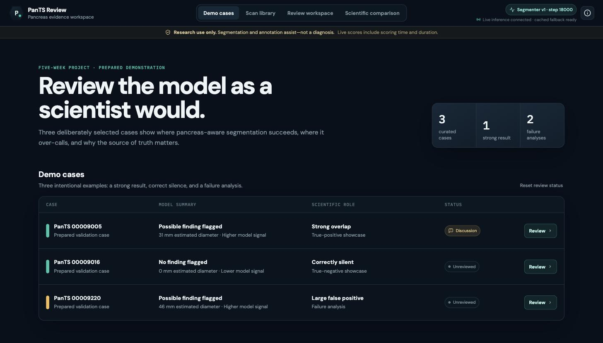
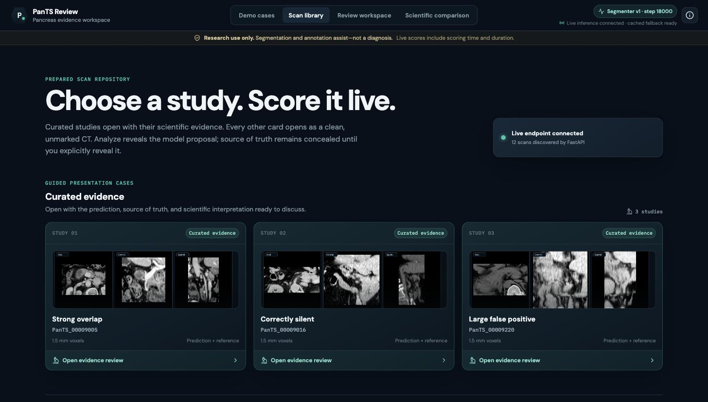
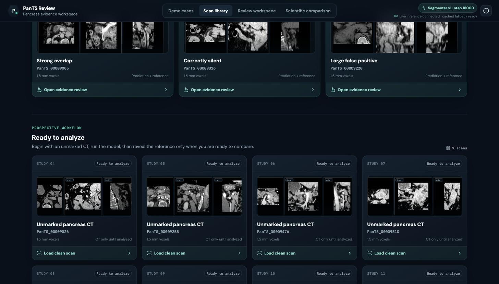
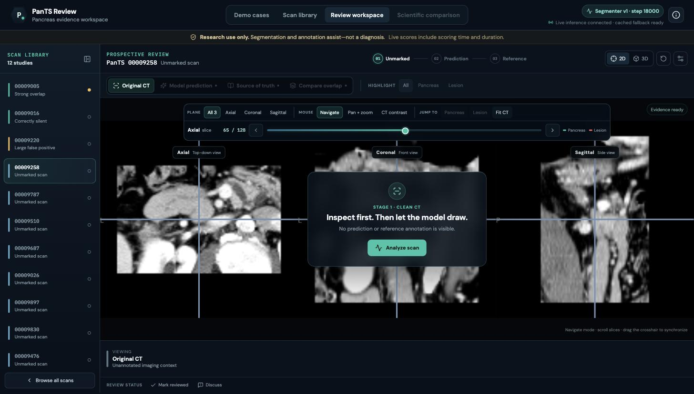
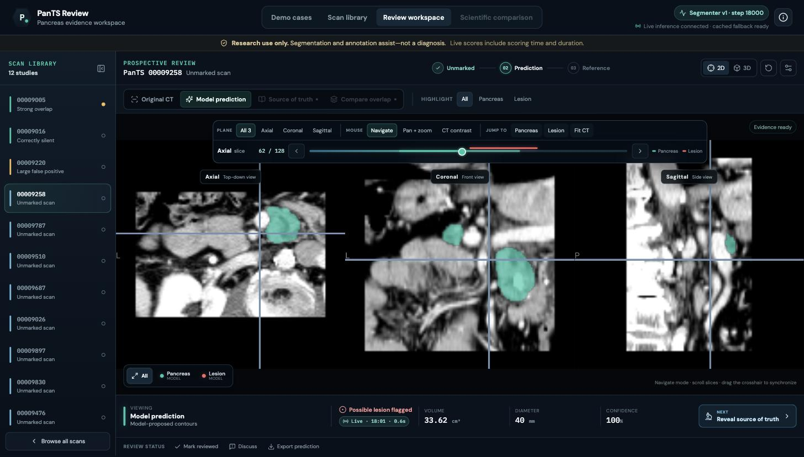
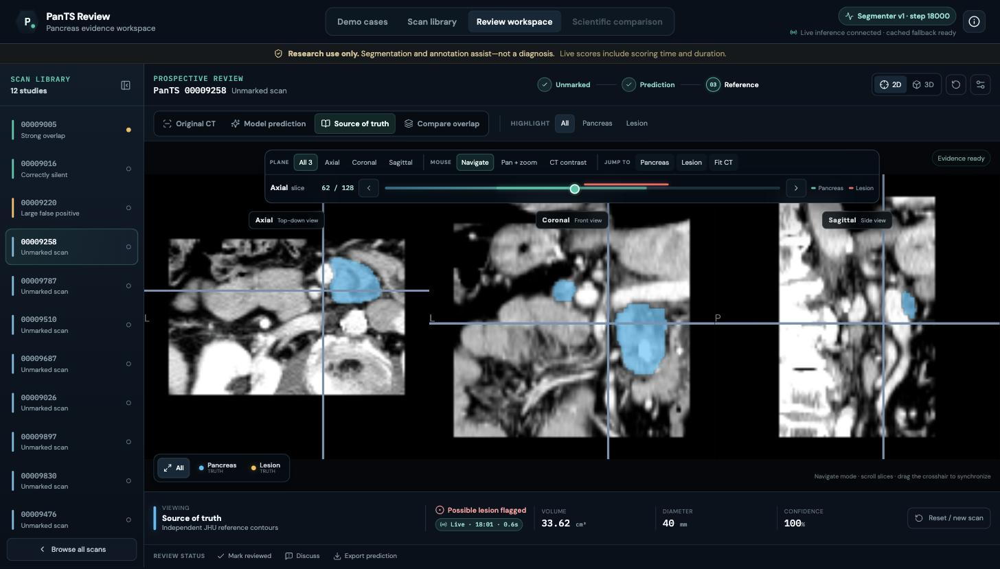
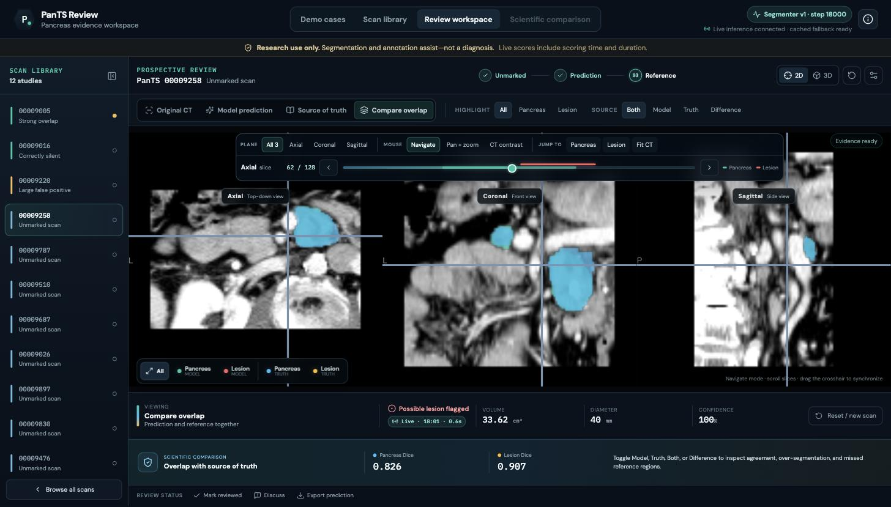
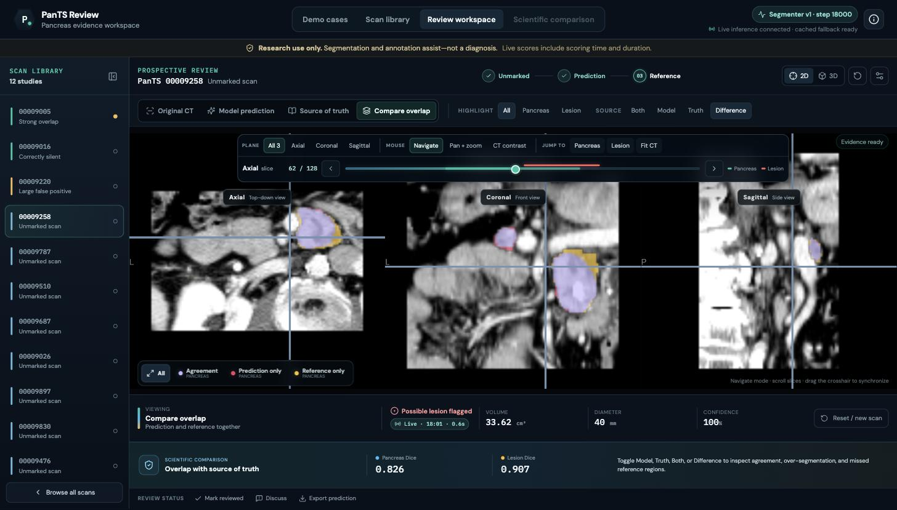
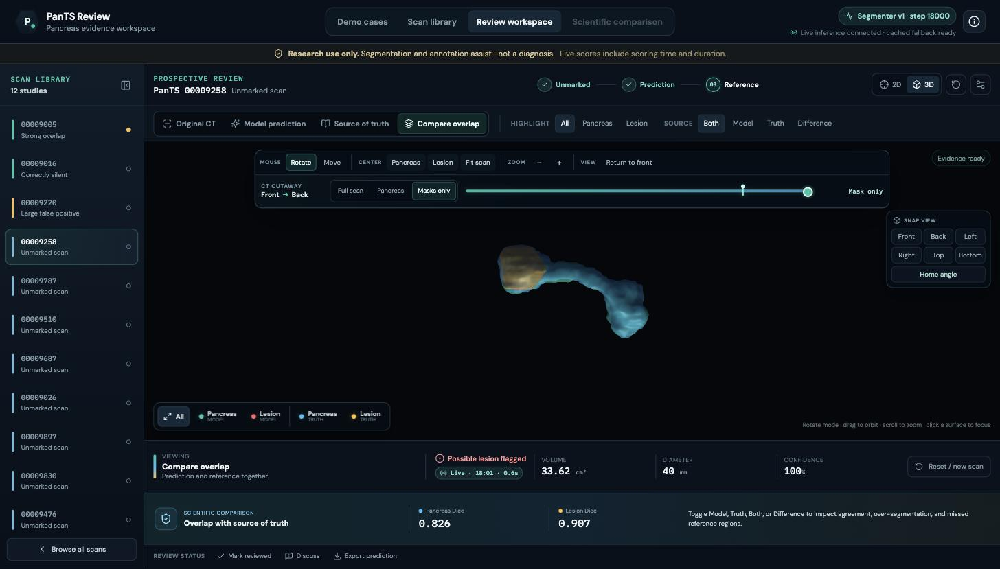
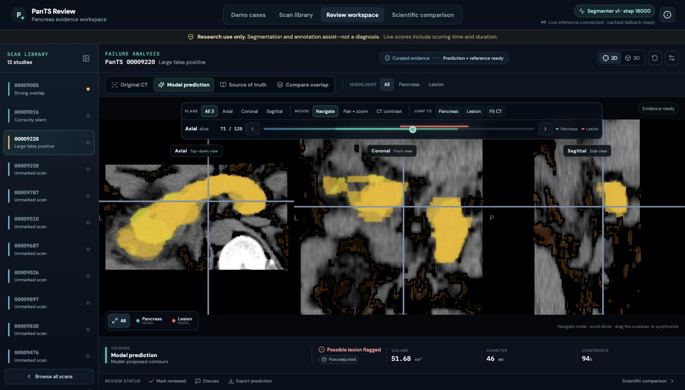

# UI Screenshots — PanTS Review

Captured from the running system: React + NiiVue front-end on `localhost:5173`, live FastAPI
inference endpoint on `localhost:8000`, serving the registered model
`pancreas-lesion-segmenter v1` (checkpoint step 18000).

Every scan shown is from the **official held-out test set** — never seen during training.
Full walkthrough of controls and design decisions: [`../ui-walkthrough.md`](../ui-walkthrough.md).

---

### 01 · Demo cases — landing

The three curated showcase studies: a strong true positive, a correctly-silent healthy scan, and a
large false positive. The header shows the loaded model (`Segmenter v1 · step 18000`) and the live
connection state. The research-use banner is permanent.

### 02 · Scan library — live endpoint connected

*"Live endpoint connected — 12 scans discovered by FastAPI."* The library is populated by a real
`GET /cases` call, not a hardcoded list. Curated studies open with their evidence; every other card
opens as a clean, unmarked CT.

### 03 · Scan library — unmarked studies

Nine studies marked *"Ready to analyze — CT only until analyzed."* This is the prospective workflow:
the reviewer starts from an unannotated scan, exactly as a radiologist would.

### 04 · Stage 1 — clean, unmarked CT

*"Inspect first. Then let the model draw."* No prediction and no reference is visible. Tri-planar
axial / coronal / sagittal views with a synchronized crosshair and slice navigation.

### 05 · Stage 2 — live prediction

**The model scored this scan live.** The badge reads `Live · 18:01 · 0.6s` — the time it was scored
and how long inference took. The finding panel reports the CADe flag, predicted volume (33.62 cm³),
approximate diameter (40 mm), and confidence. Model contours: teal pancreas, red lesion.

### 06 · Stage 3 — source of truth revealed

The expert reference contour, deliberately concealed until the reviewer asks for it. Reference
colours (blue pancreas, amber lesion) are distinct from the model's throughout the app.

### 07 · Compare overlap — the scorecard

Prediction and reference together, with the measured agreement: **pancreas Dice 0.826, lesion Dice
0.907** on this study. These match the offline evaluation exactly, because the same registered model
produced both.

### 08 · Difference view — where it agrees and where it doesn't

Agreement, prediction-only (over-segmentation), and reference-only (missed) regions rendered as
separate colours, so the failure mode is inspectable rather than described.

### 09 · 3D surfaces

Marching-cubes surface meshes of the pancreas with the lesion inside it, rotatable, with an
adjustable CT cutaway. A 3D array means nothing to a reviewer; a rotatable organ communicates
location instantly.

### 10 · Honest failure — a large false positive

`PanTS_00009220` is a **tumor-free** scan. The model flags **51.68 cm³** of lesion at **94%
confidence**. This case is in the demo on purpose: it is the clearest single illustration of the
project's known weakness (17% specificity on healthy scans) and the reason every output is framed
as a prompt for review rather than a finding.
