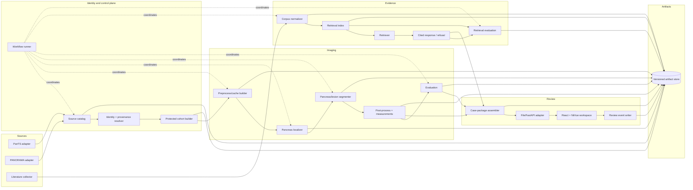

# Component architecture

**Status:** Approved architecture baseline  
**Style:** File-first components connected through versioned contracts

## Component view

## Ownership table

| Component | Owns | Consumes | Produces |
|---|---|---|---|
| Source adapters | Source-specific parsing and validation | Immutable source snapshot | Source records, annotations, reconciliation issues |
| Identity/provenance resolver | Canonical subject/study/annotation identity | Source records | Unified manifest records |
| Protected cohort builder | Membership, ancestry, disjointness, freeze | Unified manifest + cohort definition | Frozen cohort package |
| Workflow runner | Stage order, state, retries, lineage | Stage definitions + configuration | Run manifest, logs, completion/failure state |
| Preprocess/cache builder | Shared deterministic imaging preparation | Study/annotation + preprocessing config | Versioned prepared arrays and transform record |
| Pancreas localizer | Autonomous region proposal | Full CT/preprocessed full-volume representation | Predicted pancreas region and confidence |
| Segmenter | Pancreas/lesion probability and label output | Predicted region + image | Prediction volumes |
| Post-process/measure | Multi-lesion-safe cleanup and measurements | Prediction volumes + spacing/affine | Components, volume, diameter, score inputs, warnings |
| Evaluation | Metric definitions and matched comparisons | Frozen cohort + prediction set + labels | Versioned evaluation report/data |
| Corpus normalizer | Allowed text/source identity and chunking | PubMed/PMC records/text | Corpus and passage records |
| Retrieval index | Embedding/index construction | Corpus + index config | Rebuildable versioned index |
| Retriever | Query construction and ranking | Structured finding/question + index | Ranked passage records |
| Response/refusal | Evidence-limited wording | Ranked passages | Cited response or refusal |
| Retrieval evaluation | Recall/rank/grounding/refusal measurement | Frozen question set + retrieval/responses | Evaluation report |
| Case-package assembler | UI-facing scientific package | Prediction, measurement, optional reference/evidence | Case package conforming to one schema |
| File/FastAPI adapter | Transport only | Case package/review event | Identical JSON payload over disk or HTTP |
| Review workspace | Inspection and human action | Case package, evidence response | Review-event request |
| Review event writer | Append-only review history | Validated review event | Durable immutable event plus snapshot/index |

## Separation rules

- The workflow runner coordinates components but does not contain scientific logic.
- FastAPI validates/transmits contracts but does not create a second prediction schema.
- The UI renders measurements and evidence but does not recompute scientific metrics.
- Evaluation may use reference labels; autonomous inference may not.
- Review events reference predictions; they never modify prediction artifacts.
- File storage is the baseline. Any database later implements the same logical records rather than
  redefining them.
