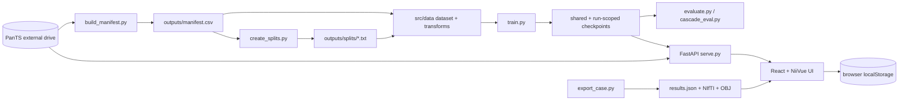

# Current-state architecture

**Observed:** 2026-09-08  
**Purpose:** Describe the inherited five-week project honestly before capstone changes.

## Current flow

## What is already valuable

- Config-driven MONAI/PyTorch training and inference utilities.
- Real PanTS manifest and protected train/validation/test list experience.
- Persistent/ram/no-cache dataset modes.
- Run-scoped checkpoint archives and a run ledger in addition to MLflow.
- Full-volume and cascade evaluation code paths.
- Working FastAPI and React/NiiVue application scaffolding.
- High-quality UI comparison and failure-analysis interactions.
- Extensive experiment and defect history that informs capstone guardrails.

## Current boundary gaps

| Area | Current behavior | Capstone consequence |
|---|---|---|
| Source scope | `build_manifest.py` is PanTS-specific. | PANORAMA needs a source adapter and unified identity/provenance contract. |
| Paths | Manifest writes absolute `ct_path` and label paths. | Artifacts are not portable between the external drive, another computer, or rented compute. |
| Identity | `case_id` is the dominant identifier; PanTS falls back to case-as-patient. | PANORAMA multiple-study patients require separate subject and study identities. |
| Cohorts | Plain text lists do not carry parent definition, source snapshot, schema, or membership hash. | A plausible file can be scientifically wrong without detection. |
| Cache | Cache tag uses only the first spacing and patch dimension and omits some preprocessing semantics. | Incompatible cached arrays can be silently reused after a recipe change. |
| Training/evaluation | Several entry points assemble or override configuration independently. | Train/inference/evaluation parity must become a shared contract. |
| Serving | `serve.py` is explicitly provided-ROI and requires a local ground-truth label to crop the pancreas. | It cannot serve the approved autonomous capstone workflow. |
| Case package | `results.json` combines prediction, reference annotation, Dice, display meshes, and cached presentation data. | Model output, evaluation evidence, and reference reveal are insufficiently separated. |
| Review state | UI stores `reviewed`/`discussion`/`unreviewed` in browser `localStorage`. | It is not an append-only accept/edit/reject record tied to a prediction version. |
| Literature | No production retrieval/index/evaluation pipeline exists. | This is new capstone work. |
| Workflow | Scripts are invoked separately and share some output locations. | A run lacks one restartable stage graph and terminal run manifest. |
| Tests | 37 Python tests exist, but the current environments lack `pytest`; UI has no test command. | The baseline cannot be verified until the test environment is defined. |

## Architectural lesson

The capstone should not replace the inherited code wholesale. It should place adapters and contracts
around useful scientific functions, then replace only the boundaries that are incompatible with the
approved workflow. The largest new boundaries are multi-source identity, autonomous inference,
retrieval, transport-neutral case packages, and durable review events.

## Migration principle

For each inherited component:

1. Capture current behavior with a fixture or regression test.
2. Put a stable contract in front of it.
3. Adapt its output into the contract.
4. Replace internals only when the contract cannot be satisfied safely.

This lets the capstone reuse experience and scaffolding without reusing the previous trained model or
preserving old scientific mistakes.
