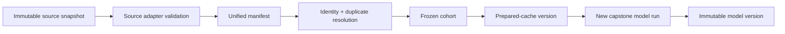
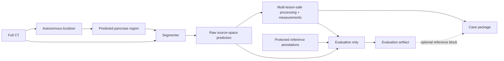
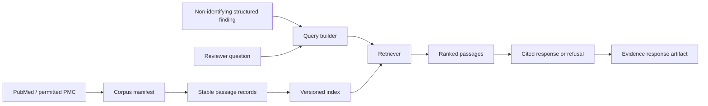
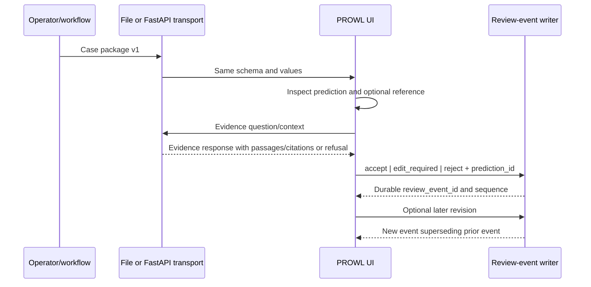

# Data-flow architecture

**Status:** Approved architecture baseline

## 1. Training and cohort flow

Each arrow creates or consumes a versioned artifact. A source, identity rule, cohort membership,
preprocessing, model configuration, or code change creates a new downstream derivation identity.

## 2. Autonomous inference and evaluation flow

The protected reference path never enters localization or segmentation. Reference information may
be included in a prepared demonstration package only as a separately labeled optional block with an
explicit reveal state.

## 3. Literature and evidence flow

No patient image, ground-truth label, source report, or direct identifier crosses into this flow.

## 4. Review flow

Transport does not alter the case package. A static demonstration can read the JSON directly; a
running workstation can receive the identical payload through FastAPI.

## 5. Invalidation flow

| Change | Must create a new version of |
|---|---|
| Source file/version or label repair | Source snapshot, manifest, affected cohorts and all descendants |
| Subject/study/duplicate rule | Manifest identity version, affected cohorts and descendants |
| Cohort definition/membership | Cohort and all models/predictions/evaluations trained from it |
| Preprocessing configuration/code | Prepared cache and downstream model/prediction artifacts |
| Model weights/config/code | Model version and all its predictions/evaluations/case packages |
| Inference/post-processing config | Prediction set or derived measurement version and evaluation |
| Metric definition | Evaluation artifact only; predictions may be reused if complete |
| Corpus content/chunking | Corpus, index, retrieval evaluation, evidence responses |
| Embedding/index configuration | Index, retrieval evaluation, evidence responses |
| Generation/prompt configuration | Evidence responses and response evaluation |
| UI presentation only | UI build; scientific package remains unchanged |
| Review action | New append-only event; nothing upstream invalidated |

## 6. Partial-failure flow

1. Stage writes to a temporary run-scoped location.
2. Stage validates schema, expected files, sizes/hashes, and domain-specific checks.
3. Stage atomically publishes the completion record.
4. Downstream stages accept only published complete artifacts.
5. On interruption, temporary output is quarantined or replaced; completed upstream artifacts are
   reused by identity.

The precise state machine belongs to the workflow-orchestration plan, but every component must honor
this boundary.
