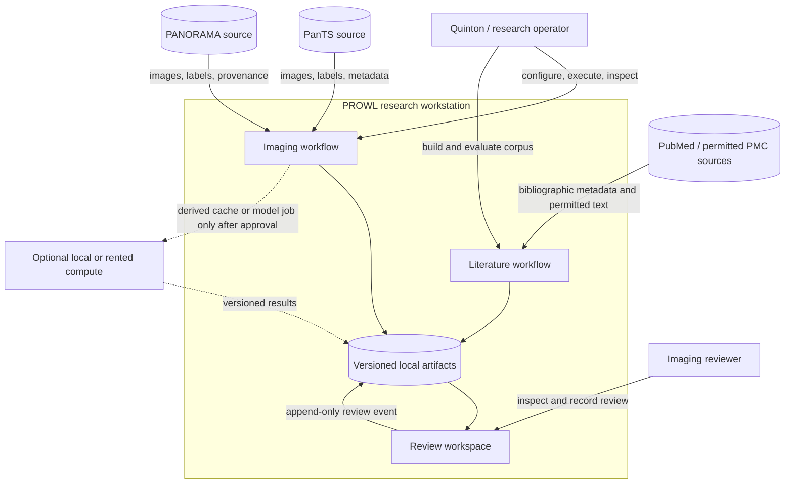

# System context and trust boundaries

**Status:** Approved architecture baseline  
**System:** PROWL single-user research workstation

## Context view

## Actors

### Quinton / research operator

Owns configuration, source acquisition, cohort approval, training, evaluation, corpus construction,
release decisions, and documentation. This is a single-user operational role for the capstone.

### Imaging reviewer

Inspects contours, measurements, warnings, and supporting literature, then records accept,
edit-required, or reject. The reviewer does not administer the system and is not asked to validate a
diagnostic claim.

## External systems and data sources

- **PanTS:** imaging, annotations, metadata, and the protected reference evaluation design.
- **PANORAMA:** additional imaging/annotations with separate patient/study identity and annotation
  provenance requirements.
- **PubMed/PMC:** bibliographic records and permitted text for a non-patient evidence corpus.
- **Optional compute:** may execute a derived-data/model job if local timing demonstrates need. It is
  not part of the minimum architecture.

## Trust boundaries

### Boundary A — external source to local immutable source tier

All inputs receive source/version/license records and reconciliation before use. Downloaded data is
not trusted merely because it has the expected filename.

### Boundary B — imaging versus literature

Patient/study images, annotations, source reports, and identifying fields never enter the literature
corpus or generation prompt. The literature pipeline receives only public evidence sources. The UI
may construct a non-identifying structured question from prediction measurements.

### Boundary C — autonomous inference

The autonomous component receives the CT and allowed acquisition metadata. It cannot access the
ground-truth pancreas/lesion mask, provided ROI, reference metrics, or a radiology conclusion.

### Boundary D — transport

Static files and FastAPI are delivery mechanisms for the same versioned case-package contract. A
transport may reject or transmit a package; it cannot reinterpret the fields.

### Boundary E — human review

Predictions are immutable evidence. Review decisions are separate append-only events. A correction
does not rewrite history; it adds a new revision and may reference a corrected mask artifact.

### Boundary F — optional compute

Only the minimum approved artifact set is transferred. Secrets and raw/restricted data are excluded
unless a later decision explicitly authorizes and protects them. Every returned artifact retains
source/config/code lineage.

## Context-level non-goals

- Multi-user accounts or simultaneous editing.
- Hospital network, DICOM routing, PACS, or EHR integration.
- Clinical deployment, uptime guarantees, or medical-device claims.
- Patient-facing advice.
- A database or cloud control plane as a prerequisite.
