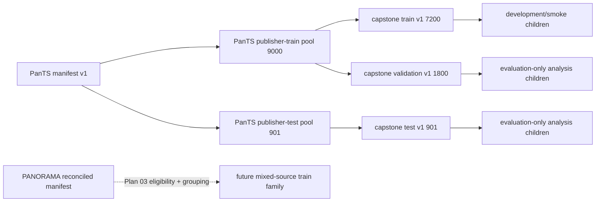

# Data inventory, identity, and protected cohorts

**Status:** Ready  
**Owner:** Quinton Evans  
**Target weeks:** 1–2  
**Depends on:** Plan 01 identity, artifact, and run contracts  
**Source requirements:** Approved Appendix A1–A4; protected split requirements  
**Last reviewed:** 2026-09-08

## Outcome

PROWL will have a source-independent imaging manifest and immutable cohort packages. Every imaging
study will resolve to a source-scoped subject, every annotation will retain structure-specific
provenance, and every cohort will prove its parent, purpose, membership, and protected role. Training
and evaluation will consume registered cohort artifacts rather than arbitrary text lists.

## Why this belongs

The preceding project demonstrated that a plausible split file can still be scientifically wrong:
two retained experiment lists contain validation studies because their builder sampled from the
PanTS source folder instead of the protected training fold. PANORAMA also has repeated subjects and
declared imports already represented in PanTS. Identity and ancestry therefore have to be enforced
as data contracts, not remembered as conventions.

## Core mental model

- A **subject** is the grouping unit used to prevent patient leakage.
- A **study** is one imaging examination and the atomic cohort member.
- An **annotation** describes one structure/version for one study, even when multiple structures
  share a physical label file.
- A **case package** is a downstream review artifact; it is not a source-data identity.
- A **source partition** describes where the publisher placed a study, such as PanTS `ImageTr`.
- A **protected role** describes how PROWL may use it: train, validation, test, or none.

Source partition and protected role are deliberately different fields. Confusing them caused the
earlier leakage incident.

## Scope

- Source snapshot, subject, study, annotation, issue, manifest, cohort, and cohort-member records.
- Root-alias plus relative-path resolution; no absolute path as identity.
- PanTS compatibility migration without changing the accepted base membership.
- Subject-grouped split creation, protected ancestry, deterministic selection, and freezing.
- Duplicate-candidate interface and quarantine behavior used later by Plan 03.
- Source, acquisition, outcome-evidence, annotation-provenance, and cohort profile fields.

## Non-goals

- Selecting which PANORAMA annotations enter the primary training arm; Plan 03 owns that decision.
- Decoding or remapping PANORAMA voxels; Plan 03 owns source-specific label semantics.
- Claiming PanTS has one study per biological patient when the source metadata supplies no patient ID.
- Replacing, renaming, or deleting historical manifests and split lists.
- Rebalancing the approved test cohort or selecting a split that improves results.
- Computing expensive image fingerprints during the metadata-contract implementation; Plan 03 adds
  them behind the duplicate-candidate interface.

## Current evidence

The detailed audit is recorded in [`../data/CURRENT-INVENTORY.md`](../data/CURRENT-INVENTORY.md).

- Current PanTS manifest: 9,901 unique studies, 9,901 fallback `patient_id` values, 29 columns, and
  absolute source paths.
- Current base lists: 7,200 train, 1,800 validation, and 901 publisher test studies; pairwise
  disjoint and complete over the manifest.
- Current `scaled300.txt`: 54 validation studies; `scaled600.txt`: 109; `scaledmax.txt`: 266.
  These and all unregistered legacy lists are historical/nonconforming and forbidden as capstone
  training inputs.
- PANORAMA metadata: 2,238 unique studies from 2,224 subjects; 11 subjects contribute 25 studies.
  The 1,964 declared-import-clean studies represent 1,950 subjects.
- The PanTS external drive was not mounted during the 2026-09-08 planning audit. Raw source
  inventories/checksums must be revalidated when implementation begins.

## Inputs

| Input | Authority | Required identity |
|---|---|---|
| PanTS source snapshot | Pinned local source/version record | `source_snapshot_id`, inventory assurance, root alias |
| PANORAMA source snapshot | Pinned metadata, labels commit/archive, and later images | Separate snapshot IDs when obtained/versioned independently |
| Legacy PanTS manifest | Compatibility input only | Content hash plus explicit `legacy` status |
| Legacy base split lists | Membership-reproduction input | Individual content hashes and expected counts |
| Cohort definition | New capstone configuration | Parent cohort ID/hash, purpose, protected role, seed/selection rules |

No downstream model script receives a free-form path to a `.txt` list after migration. It receives a
validated `cohort_id` that resolves to a frozen cohort package.

## Outputs and contracts

The data dictionary is in [`../data/DATA-DICTIONARY.md`](../data/DATA-DICTIONARY.md), and the cohort
algorithm is in [`../data/COHORT-PROTOCOL.md`](../data/COHORT-PROTOCOL.md).

Approved machine-readable schemas under `docs/capstone/contracts/`:

| Schema | Canonical file(s) | Purpose |
|---|---|---|
| Source snapshot | `source.json`, `file-inventory.jsonl` | Version, license, root alias, completeness, file assurance |
| Subject record | `subjects.jsonl` | Source-scoped grouping identity and assurance |
| Study record | `studies.jsonl` | Examination, source partition, image reference, acquisition, outcome evidence |
| Annotation record | `annotations.jsonl` | Per-structure file/value/version/provenance and allowed use |
| Data issue | `issues.jsonl` | Validation failure, exclusion, quarantine, or adjudication evidence |
| Manifest control | `manifest.json` | Snapshot inputs, record hashes/counts, schema versions, build lineage |
| Cohort control | `cohort.json` | Parent/ancestors, purpose, role, selection, membership hash, freeze state |
| Cohort member | `members.jsonl` | Study/subject/source membership and inclusion rationale |

## Approved design decisions

Quinton approved P02-01 through P02-07 on 2026-09-08. They are locked as D-021 through D-027 in
[`../DECISIONS.md`](../DECISIONS.md).

| Ref | Recommendation | Why | Alternative/consequence |
|---|---|---|---|
| P02-01 | Study is the atomic data member; subject is the protected grouping key; “case” is UI/workflow language only. | Handles repeated PANORAMA studies without conflating a person and scan. | Keeping `case_id` canonical would preserve ambiguity across sources. |
| P02-02 | Represent PanTS as one source-scoped subject per study with `identity_method=study_as_subject_fallback` and `identity_assurance=unverified_unique`. | It is usable and honest: no patient field exists, so uniqueness cannot be proven. | Calling it confirmed one-patient-per-case overstates the available evidence. |
| P02-03 | Reproduce the accepted 7,200/1,800/901 memberships exactly as the first capstone PanTS cohort family. | Preserves the known evaluation baseline and satisfies “reproduce cohorts.” | A fresh split creates avoidable comparison drift. |
| P02-04 | A duplicate manifest key or duplicate cohort member is a hard failure, never silently deduplicated. | Silent repair can change counts, prevalence, and membership without review. | Deterministic deduplication is allowed only as an explicit new source-repair artifact. |
| P02-05 | Child training/development cohorts may descend only from a frozen train-role parent; validation/test descendants are evaluation-only. | Prevents the exact wrong-parent sampling bug already observed. | Filename conventions and pairwise checks alone are too easy to bypass. |
| P02-06 | Use target-aware `positive`, `negative`, or `unknown` status plus named evidence; never coerce missing annotation/metadata to negative. | Preserves both the distinction between absence and unavailable evidence and the distinction between PDAC-negative and generic-lesion-negative. | A Boolean `has_lesion` silently converts data gaps into labels. |
| P02-07 | All legacy split files are denied by default; only explicitly registered migration inputs may be imported. | Prevents contaminated but plausible historical files from re-entering training. | An allow-all compatibility layer recreates the present hazard. |

## Invariants

1. Canonical IDs are source-scoped; equal raw IDs across sources never imply the same entity.
2. Every study resolves to exactly one subject within its source snapshot.
3. Every annotation resolves to one study and one semantic structure.
4. The same subject cannot occupy multiple protected roles in one cohort family.
5. A training-purpose cohort cannot descend from validation or test membership.
6. A publisher test partition cannot be assigned the train role.
7. Frozen cohort bytes and membership are immutable; any change creates a new `cohort_id` version.
8. Duplicate study IDs, duplicate membership rows, and unexpected requested sample shortages fail.
9. Every target status includes its target name, evidence type, and source record; `unknown` remains
   unknown, and a study cannot carry duplicate or contradictory records for one target.
10. Excluded or quarantined studies cannot enter a cohort unless a new adjudication artifact explicitly
    changes their status.
11. Annotation provenance is per structure; a machine pancreas mask cannot inherit an expert lesion
    designation from the same file.
12. Membership hashes use sorted canonical member records, not filesystem order.
13. Timestamps and machine-specific paths do not participate in scientific membership identity.
14. Original source files and historical output lists are never edited by migration.

## Protected cohort graph

The exact cohort names remain human labels; IDs and membership hashes are authoritative.

## Lifecycle and state rules

### Study state

`discovered → reconciled → eligible | excluded | quarantined`

- `excluded` means a known rule applies, such as a declared imported dataset.
- `quarantined` means correctness is unresolved, such as a missing annotation or probable duplicate.
- Neither state deletes the record; both carry issue IDs and evidence.

### Cohort state

`draft → validated → frozen → superseded`

- Draft output cannot be consumed by training/evaluation.
- Validation must finish before the membership hash and completion record are published.
- Frozen output never returns to draft.
- Superseded cohorts remain addressable for old run lineage.

## Implementation sequence

1. Add committed schemas, positive examples, and negative fixtures for every Plan 02 record.
2. Add a source-root resolver that accepts approved aliases and rejects traversal/absolute identity.
3. Implement a legacy PanTS adapter that emits source, subject, study, annotation, and issue records
   without modifying `outputs/manifest.csv`.
4. Register only the three accepted base membership files as migration inputs and verify their
   recorded hashes/counts.
5. Materialize the publisher pools and reproduce the 7,200/1,800/901 protected cohort family.
6. Implement general subject-grouped cohort selection from an explicit frozen parent.
7. Add ancestry, role, duplicate, missingness, and sample-shortage guards before publication.
8. Build twice in independent temporary run directories and compare canonical records/hashes.
9. Produce manifest reconciliation, issue/quarantine, cohort profile, ancestry, and disjointness
   reports.
10. Run a consumer smoke test resolving a frozen train cohort into current MONAI dataset records.
11. Update traceability, risks, and G1 evidence; preserve all historical inputs unchanged.

## Test matrix

| Level | Scenario | Expected result |
|---|---|---|
| Schema | Required identity, source snapshot, or provenance field missing | Record rejected with field path |
| Identity | Two studies share one PANORAMA subject | Both resolve to one subject; cannot split roles |
| Identity | PanTS study fallback | Unique source-scoped subject emitted with unverified assurance |
| Join | Metadata study appears twice | Manifest build fails; no last-row-wins behavior |
| Join | Image has no study metadata | Issue emitted and study quarantined |
| Annotation | Required mask missing | Target status is `unknown`/quarantine; never silent negative |
| Outcome | One study carries two statuses for the same target | Build fails and names both conflicting records |
| Annotation | Pancreas and lesion share one file | Two logical records retain distinct provenance/label values |
| Cohort | Same study listed twice | Build fails; no silent deduplication |
| Cohort | Same subject assigned train and validation | Build fails before publication |
| Ancestry | Development cohort requests member outside train parent | Build fails and names offending IDs |
| Regression | Builder uses PanTS publisher partition instead of protected train parent | Planted validation member is rejected |
| Regression | Import `scaled300.txt`, `scaled600.txt`, or `scaledmax.txt` as capstone training | Refused as unregistered/nonconforming legacy input |
| Protection | Publisher test study requested for training | Build fails regardless of requested label |
| Repeatability | Same inputs/config/seed built twice | Byte-equivalent canonical membership and same hash |
| Portability | Root alias points to another mount | Scientific IDs/hashes unchanged; files resolve |
| Invalidation | Identity rule or membership changes | New manifest/cohort derivation identity required |
| Consumer | Frozen train cohort enters dataset adapter | Expected count/source/annotation identity retained |

## Failure modes, detection, and recovery

| Failure | Detection | Recovery |
|---|---|---|
| Raw drive unavailable | Source-root preflight fails | Stop before build; remount and rerun into a new attempt directory |
| Source version cannot be proven | Snapshot status incomplete | Permit inventory work only; block cohort freeze |
| PanTS biological-patient uniqueness is unknowable | No source patient identifier | Use explicit fallback assurance and disclose residual risk |
| Metadata/file counts disagree | Reconciliation report and join assertions | Quarantine unmatched records; correct adapter/config, never source bytes |
| Duplicate/probable overlap unresolved | Duplicate candidate status not adjudicated | Quarantine candidate or keep source arms separate |
| Requested strata exceed parent availability | Exact target check fails | Change the versioned definition or use a named fallback; never silently shrink |
| Existing cohort must change | Frozen hash differs | Create a new cohort version; preserve old one and descendant lineage |
| Consumer still accepts free-form lists | Integration test demonstrates bypass | Keep G1 closed until cohort-ID-only path is enforced |
| Partial build exists after interruption | No completion marker/hash set | Quarantine attempt and reuse only validated upstream artifacts |

## Observability and evidence

Every successful build reports:

- source snapshots, schema versions, code/config identity, and root aliases;
- discovered/reconciled/eligible/excluded/quarantined counts by source;
- subject and study counts, repeated-subject distribution, and missingness;
- annotation counts by structure, method, validation, and allowed use;
- cohort study/subject counts, lesion status, source, phase, and provenance strata;
- parent and ancestor IDs/hashes;
- pairwise subject/study overlap matrix across protected roles;
- requested versus achieved sampling counts;
- issue counts and dispositions by rule code;
- deterministic membership and file hashes.

## Plan readiness gate

Plan 02 may move to `Ready` when:

- [x] Quinton accepted P02-01 through P02-07.
- [x] The record schemas/examples are written and validate.
- [x] PanTS source identity evidence and fallback assurance are documented.
- [x] The accepted legacy base-list hashes and contaminated-list denylist are recorded.
- [x] Unit/integration fixtures are enumerated under Plan 09's test strategy.
- [x] Plan 03 confirms it can express PANORAMA source-specific facts through these generic records.

## Completion gate (G1)

- [ ] Source inventory, data dictionary, schemas, examples, and validation report exist.
- [ ] PanTS manifest migration preserves 9,901 studies and exposes no absolute-path identity.
- [ ] Accepted 7,200/1,800/901 memberships reproduce exactly under frozen cohort artifacts.
- [ ] Subject/study disjointness, ancestry, protection, and repeatability tests pass.
- [ ] Legacy contaminated lists are rejected by the capstone loader.
- [ ] Source/provenance/status fields are complete or explicitly unknown.
- [ ] Quarantined/excluded records carry reasons and cannot enter training silently.
- [ ] A frozen train cohort resolves through a consumer smoke test without identity loss.

## Rollback and fallback

- Migration is additive under `outputs/prowl/`; legacy files remain untouched and remain usable only
  by the historical code path.
- If the generic cohort builder is not ready, no expensive capstone training begins. A validated
  compatibility adapter may reproduce the accepted base cohort, but it must still publish the new
  manifest/cohort contracts and pass ancestry/disjointness tests.
- If PANORAMA identity or overlap is unresolved, G1 may complete for PanTS; Plan 03 remains blocked
  and mixed-source training is not attempted.

## Planned artifacts

- [`../data/README.md`](../data/README.md)
- [`../data/CURRENT-INVENTORY.md`](../data/CURRENT-INVENTORY.md)
- [`../data/DATA-DICTIONARY.md`](../data/DATA-DICTIONARY.md)
- [`../data/COHORT-PROTOCOL.md`](../data/COHORT-PROTOCOL.md)
- Record schemas and examples under `docs/capstone/contracts/`.
- Versioned source/manifest/cohort packages under `outputs/prowl/`.
- Reconciliation, issue/quarantine, profile, ancestry, and disjointness reports.
- Unit, integration, regression, and consumer smoke-test evidence.

## Handoff

After Plan 02 is Ready, implementation may produce G1 for PanTS. Plan 03 can then adapt PANORAMA
through the same records, decide annotation eligibility, implement label remapping and duplicate
fingerprinting, and create the first eligible mixed-source cohort.
