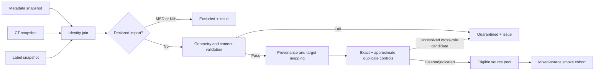

# PANORAMA integration

**Status:** Ready — design approved; execution gated on pinned CT and label snapshots  
**Owner:** Quinton Evans  
**Target week:** 3  
**Depends on:** Plan 01 contracts; Plan 02 manifest, identity, and protected-cohort implementation  
**Source requirements:** Approved Appendix A1–A4; PANORAMA metadata, labels, imaging, license, and version evidence  
**Last reviewed:** 2026-09-18 (acquisition prerequisite reconciliation)

## Outcome

PROWL will have a reproducible PANORAMA source adapter that converts publisher metadata, CT images,
and multi-structure masks into the Plan 02 contracts without changing their scientific meaning.
Declared imports will be excluded, repeated studies will remain grouped by subject, PDAC evidence
will not be misrepresented as generic lesion evidence, annotation method will remain visible per
structure, and unresolved cross-source duplicates will be quarantined. A frozen mixed-source smoke
cohort will prove that PANORAMA can enter the shared preprocessing path safely before any expensive
model experiment begins.

## Why this belongs

The preceding project showed that more tumor-positive training data was the only tested lever that
materially improved lesion Dice. PANORAMA can add hundreds of PDAC-positive studies, including 382
eligible expert lesion delineations, but it also introduces exactly the failure modes that can make
an apparent improvement scientifically invalid: different label values, machine-generated organ
masks, repeated subjects, declared overlaps with PanTS, possible undeclared duplicates, and a
PDAC-specific negative definition that is narrower than PROWL's pancreatic-lesion target. Plan 03
makes those differences explicit and test-enforced before the source is allowed into training.

## Core mental model

PANORAMA provides three different kinds of evidence that must not be collapsed:

- the spreadsheet says whether the source classified a study as `PDAC` or `non-PDAC` and names the
  reference-standard level;
- label-directory membership says whether the lesion delineation was manual or automatic;
- voxel values provide separate PDAC, pancreas parenchyma, vessel, and duct regions in one file.

These facts answer different questions. In particular, `non-PDAC` proves only that PDAC was not the
source diagnosis. It does not prove the absence of IPMN, PNET, cysts, pancreatitis, or another
pancreatic abnormality. The adapter therefore records target-aware evidence instead of deriving one
Boolean `has_lesion` field.

## Scope

- Independent metadata, label, and imaging snapshot/version records.
- Exact subject/study identity mapping from publisher identifiers.
- Metadata/image/label reconciliation with complete issue records.
- Declared NIH/MSD exclusion before cohort eligibility.
- One-way target-status mapping from PDAC evidence to the broader lesion target.
- Config-driven voxel remapping and deterministic paint precedence.
- Structure-level method, validation status, and allowed-use policy.
- Geometry, mask-content, and operational crop-suitability checks.
- Layered exact and approximate cross-source duplicate detection.
- Subject-grouped PANORAMA source pools and mixed-source smoke cohort.
- Source- and annotation-quality-stratified reporting requirements for downstream plans.

## Non-goals

- Treating all 1,964 import-clean studies as lesion-training examples.
- Treating `non-PDAC` as `pancreatic_lesion=negative` without additional evidence.
- Pooling expert and machine lesion masks in the first primary comparison.
- Treating machine pancreas masks as headline evaluation references.
- Modifying or replacing publisher CTs or label files.
- Claiming PANORAMA is an independent external validation source after any PANORAMA studies enter
  model development or training.
- Selecting the Week 6 model experiment before the Week 5 baseline and Plan 06 gate.
- Downloading or storing imaging in the Git repository.

## Current state and audited evidence

The complete local audit is in [`../data/PANORAMA-INVENTORY.md`](../data/PANORAMA-INVENTORY.md).

- `clinical_information.xlsx` is present and hashes to
  `2ae925de8067600db62e186a91844dec6555dab2b17cafd33b886b8c99f19ea7`.
- It contains 2,238 unique studies from 2,224 subjects. Eleven subjects contribute 25 studies, or
  14 studies beyond a one-study-per-subject representation.
- Removing 194 `MSD_dataset` and 80 `NIH_dataset` rows leaves 1,964 studies from 1,950 subjects,
  including 578 PDAC-positive studies.
- The checked manual-ID list contains 482 unique study IDs, all present in the spreadsheet. After
  declared exclusions, 382 PDAC studies are manual, 196 PDAC studies are automatic, and three
  import-clean manual records are unexpectedly `non-PDAC`.
- The earlier appendix recorded exact 2,238-row/2,238-label reconciliation and a real-mask legend of
  0 background, 1 PDAC, 2 veins, 3 arteries, 4 pancreas parenchyma, 5 pancreatic duct, and 6 common
  bile duct. These are strong historical observations, but the label archive must be re-pinned and
  revalidated before implementation claims completion.
- No PANORAMA CT archive or valid label archive is currently visible in the repository or mounted
  volumes. `panorama_sample_label.nii.gz` is a 14-byte `404: Not Found` response, not a NIfTI file;
  it is retained as a known invalid historical probe and must never be used as a fixture.
- Existing code is limited to an exploratory demo script. There is no production source adapter,
  mapping configuration, duplicate detector, or frozen PANORAMA cohort.

## Inputs and authority

| Input | Authority | Required proof before G2 |
|---|---|---|
| `clinical_information.xlsx` | Publisher labels repository | Content hash, repository commit/archive hash, schema/count reconciliation |
| Manual versus automatic directory membership | Publisher labels repository | Complete label inventory and exact one-file-per-study reconciliation |
| Multi-label NIfTI files | Publisher labels repository | File hashes, real-value legend validation, geometry/content audit |
| CT imaging batches | Publisher Zenodo release(s) | Batch/version identifiers, checksums, license record, complete image inventory |
| PanTS manifest and frozen cohorts | Plan 02 outputs | Manifest/cohort IDs and hashes; no arbitrary legacy list paths |
| PANORAMA adapter configuration | PROWL versioned configuration | Schema/version, canonical hash, code/run identity |

Metadata, labels, and imaging may be pinned as separate source snapshots because they have different
release mechanisms. The manifest lists every snapshot ID it consumes. A study references the CT
snapshot; annotation records reference the label snapshot; subject evidence references the metadata
snapshot through the adapter's build lineage.

## Outputs and contract mapping

The adapter emits the approved Plan 02 records rather than a second PANORAMA-only data model.

| PANORAMA fact | Plan 02 representation |
|---|---|
| `PANORAMA_patient_id` | `panorama:subject:<publisher-id>`, `identity_method=source_subject_id`, `identity_assurance=direct_metadata` |
| `PANORAMA_study_id` | `panorama:study:<publisher-id>`; one record per CT examination |
| Multiple studies for 11 subjects | Distinct study records sharing one subject and one protected role |
| `label=PDAC` | `pdac=positive`; by explicit one-way mapping, `pancreatic_lesion=positive` |
| `label=non-PDAC` | `pdac=negative`; `pancreatic_lesion=unknown` unless separate evidence proves otherwise |
| `level` | Named target-status evidence and preserved source metadata; imported-source values also create blocking exclusion issues |
| Manual/automatic label directory | Lesion annotation `method`, independent of the pancreas annotation method |
| One multi-label file | Separate logical pancreas and lesion annotation records referencing the same immutable file |
| Values 1 and 4 | Versioned mapping to canonical lesion value 2 and pancreas value 1 |
| Values 2, 3, 5, and 6 | Ignored by the committed three-class target but preserved in raw-source provenance |
| Missing/anomalous metadata | Explicit null plus issue record; never inferred outcome or imputed identity |
| Duplicate candidate | Issue/adjudication record and shared `protection_group_id`; source IDs are never merged |

Human-readable CSV summaries may be emitted, but canonical records remain JSON/JSONL under the Plan
02 schemas. The source-specific field and mapping meanings are specified in
[`../data/PANORAMA-MAPPING.md`](../data/PANORAMA-MAPPING.md).

## Approved design decisions

Quinton approved P03-01 through P03-08 as written on 2026-09-08. They are locked as D-028 through
D-035 in `DECISIONS.md`. Implementation evidence may narrow annotation eligibility or trigger a
versioned fallback, but it may not silently change these scientific and provenance rules.

| Ref | Recommendation | Why | Alternative/consequence |
|---|---|---|---|
| P03-01 | Use the 382 import-clean expert-manual PDAC lesion masks as the primary PANORAMA contribution. Keep the 196 automatic PDAC masks as a separately named optional experiment after audit. | Preserves the largest high-confidence data gain without silently equating label quality. | Pooling all 578 maximizes scale but confounds quantity with annotation method. |
| P03-02 | Map PDAC-positive evidence one way to `pancreatic_lesion=positive`; keep every non-PDAC study `pancreatic_lesion=unknown` unless additional source evidence proves no target lesion. | PDAC is a lesion subtype; non-PDAC is not equivalent to no lesion. | Treating all 1,386 clean non-PDAC rows as lesion negatives risks teaching the model that unlabeled non-PDAC abnormalities are background. |
| P03-03 | Retain every eligible repeat study in the source pool and any training cohort, while grouping by subject. If a future PANORAMA evaluation cohort is created, partition by subject and compute subject-weighted results. | The 14 extra studies add real acquisition variation and pose no leakage when the subject is the grouping unit. | One study per subject is simpler but discards data without solving a current problem. |
| P03-04 | After a defined quality audit, allow PANORAMA's machine pancreas mask as `crop_reference` and `training_target`, but never as a headline `evaluation_reference`. Report its method separately from expert lesion provenance. | This supports the approved whole-pancreas workflow without claiming silver-standard organ masks are expert truth. | Crop-only use is scientifically cleaner but requires a source-specific partially supervised loss before the primary mixed run. |
| P03-05 | Exclude all 274 declared NIH/MSD imports before any other eligibility rule and assert the exact 1,964/578 remainder. Quarantine the three clean manual/non-PDAC anomalies until their masks and repository placement are inspected. | The declared imports are known overlap; the three anomalies contradict the expected annotation rule. | Quietly retaining anomalies or checking overlap after cohort construction makes counts and provenance unreliable. |
| P03-06 | Use layered duplicate control: declared exclusions, exact hashes, then a versioned approximate CT fingerprint that only generates candidates. Calibrate recall on at least 20 planted transformations and manually adjudicate cross-role candidates. | Exact hashes miss reorientation/resampling/recompression; approximate scores are not safe automatic identity proof. | Automatic exclusion by similarity risks discarding distinct scans; metadata-only exclusion leaves undeclared overlap untested. |
| P03-07 | Use PANORAMA as a training source, not as the headline validation/test source. Preserve the accepted PanTS validation and publisher-test cohorts for the primary comparison; use PANORAMA only for adapter smoke checks and source-aware diagnostics unless a new untouched partition is explicitly frozen first. | Matches the approved purpose of PANORAMA and avoids calling reused development data external validation. | Holding out PANORAMA now reduces the expert training gain and creates a second efficacy target not required by the proposal. |
| P03-08 | Block all voxel-level work until the actual CT and label snapshots are pinned. Preserve but quarantine the invalid 14-byte sample; never “repair” or replace it under the same path. | A filename and historical observation are insufficient source identity for reproducible training. | Proceeding from metadata alone can build records, but cannot validate geometry, labels, or duplicate behavior. |

## Annotation-use policy

| Annotation stratum | Initial status | Allowed after required audit | Forbidden use |
|---|---|---|---|
| Clean manual PDAC lesion, expected 382 | Eligible after reconciliation and real-mask QC | `training_target`, local `display_reference`; evaluation only in a cohort never used for training | Silent pooling with automatic lesions |
| Clean automatic PDAC lesion, expected 196 | Catalogued; excluded from primary arm | `training_target` only in a named machine-label arm after project verification; `display_reference` | Presenting as expert or primary-arm truth |
| Clean manual/non-PDAC anomaly, expected 3 | Quarantined | Determined only by mask and repository inspection with an adjudication record | Automatic inclusion based on directory name |
| Machine pancreas mask | Catalogued; audit required | `crop_reference` and `training_target` under P03-04; source-stratified reporting | Headline `evaluation_reference` |
| Other source structures (vessels/ducts) | Preserved in raw file/provenance | Optional future mapping only through a new versioned decision | Entering the committed three-class output silently |

`allowed_uses` means a validated capability, not proof that the annotation was actually used in a
particular run. Cohort membership and the run manifest record actual use.

## Target and voxel mapping

The mapping is fully specified in [`../data/PANORAMA-MAPPING.md`](../data/PANORAMA-MAPPING.md). Its
essential rules are:

1. Verify the observed raw value set is a subset of `{0,1,2,3,4,5,6}`. Any other value blocks the
   study and mapping release.
2. Create the canonical target from an immutable source mask: value 4 becomes pancreas class 1;
   value 1 becomes lesion class 2; all other values become background class 0 for this target only.
3. For crop creation, use the physical bounding box of source values `{1,4}` plus the versioned
   margin. This keeps a PDAC replacing parenchyma inside the crop.
4. Apply lesion last if the implementation builds masks from binary layers, so lesion has precedence.
5. Use nearest-neighbor interpolation for label resampling and shared image/label spatial transforms.
6. Persist the source file hash, mapping version/hash, transform version/hash, and derived-mask hash.

The remap does not erase vessels or ducts from the source; it only excludes them from the current
three-class derived target.

## Reconciliation and eligibility pipeline

Eligibility is evaluated in that order. No later rule can re-enable a declared import, and no count
assertion may silently drop unmatched records to make the expected total appear correct.

## Duplicate-control protocol

The full procedure is in [`../data/DUPLICATE-PROTOCOL.md`](../data/DUPLICATE-PROTOCOL.md).

1. **Declared identity:** exclude the 274 source-declared imports and record the exact source field.
2. **Exact file identity:** compare compressed-file hashes where comparable.
3. **Exact decoded identity:** canonicalize orientation and numeric representation, then hash the
   decoded array plus physical geometry so header/compression changes do not hide equality.
4. **Approximate candidate generation:** create a versioned, body-cropped, physically normalized,
   intensity-clipped low-resolution CT signature and retrieve nearest cross-source neighbors.
5. **Calibration:** require recovery of at least 19 of 20 planted variants; inspect false candidates
   and record the selected threshold before scanning eligibility data.
6. **Adjudication:** approximate matches are never merged automatically. A candidate that could put
   related imaging across train and evaluation is quarantined until review.
7. **Residual-risk report:** publish detected, adjudicated, excluded, cleared, and unresolved counts
   plus the fingerprint version and planted-control recall.

## Cohort strategy

- Create an all-records PANORAMA source pool, an import-clean source pool, an expert-PDAC eligible
  pool, and an automatic-PDAC optional pool. These are distinct immutable cohorts, not filters hidden
  in a training script.
- Give every study from a subject the same protection group and protected role.
- The first mixed-source smoke cohort is train-role only and includes, at minimum: one PanTS lesion
  positive, one PanTS lesion negative, one eligible expert PANORAMA PDAC study, one eligible automatic
  PANORAMA PDAC study for adapter-path testing, and both studies from one repeated PANORAMA subject.
  Machine-lesion membership in smoke validates transport only; it does not authorize the primary arm.
- Include an excluded-import fixture outside the cohort and prove the builder refuses it.
- The first primary experiment cohort is built only after Plan 06 records its scientific comparison.
  Its PANORAMA contribution defaults to the expert-PDAC pool under P03-01.
- Preserve source, lesion-method, pancreas-method, reference-standard level, and repeated-subject
  strata in profiles and downstream results.

## Invariants

1. Publisher files are immutable; all repairs and remaps create new derived artifacts.
2. Every metadata row resolves to exactly one study and subject; duplicate IDs are hard failures.
3. Every discovered CT and label resolves to a metadata row or is quarantined as an orphan.
4. Declared NIH/MSD imports are excluded before any cohort eligibility decision.
5. A subject and every study belonging to it receive one protected role.
6. `pdac=positive` may support `pancreatic_lesion=positive`; `pdac=negative` never implies generic
   lesion-negative without separate named evidence.
7. A study carries at most one status per target; duplicate or contradictory target statuses fail.
8. Pancreas and lesion annotation provenance never inherit from one another.
9. Expert and machine lesion annotations remain selectable, countable, and reportable separately.
10. Unknown source voxel values, invalid geometry, empty required masks, or missing required files
   block eligibility rather than being coerced.
11. Label resampling uses nearest-neighbor interpolation; image resampling uses the shared Plan 05
    preprocessing contract.
12. Approximate duplicate similarity creates a candidate, not automatic identity.
13. Any unresolved cross-source candidate that crosses train/evaluation protection is quarantined.
14. A training run can resolve only frozen cohort IDs and exact annotation IDs; it cannot glob a
    PANORAMA directory or choose manual/automatic files by path at runtime.
15. Headline evaluation remains autonomous and PanTS-protected unless a separate untouched source
    cohort is deliberately frozen before model access.

## Implementation sequence

1. Mount or acquire the intended CT and label releases without moving any historical local files.
2. Create separate metadata, label, and imaging source snapshots with licenses, versions, hashes,
   inventories, and completeness state.
3. Implement the metadata adapter and emit subject/study records before reading label contents.
4. Reconcile all three inventories by exact publisher study ID; emit every mismatch as an issue.
5. Apply the declared-import rule and assert both excluded and remaining counts.
6. Classify manual/automatic lesion provenance from the pinned label inventory and quarantine the
   three clean manual/non-PDAC anomalies pending inspection.
7. Decode real masks, validate the full raw value set, implement the versioned remap, and compare
   derived overlays with source layers.
8. Validate CT/label geometry, finite intensities, nonempty expected structures, crop coverage, and
   source-specific plausibility ranges; publish the quality profile.
9. Assign structure-level validation status and allowed uses only after the relevant audit passes.
10. Run declared, exact, and approximate duplicate controls; calibrate on planted variants before
    applying the approximate threshold; adjudicate every cross-role candidate.
11. Publish all-record, import-clean, expert-PDAC, and optional machine-PDAC source pools.
12. Build the mixed-source smoke cohort and run it through the shared uncached preprocessing path.
13. Rebuild the adapter and cohorts in a fresh attempt directory and compare canonical hashes.
14. Update G2 evidence, decisions, risks, traceability, and the Plan 04/06 handoffs.

Each step publishes into a new attempt/version directory. A failure leaves previous completed
artifacts untouched and does not expose a partial cohort to consumers.

## Test matrix

| Level | Scenario | Expected result |
|---|---|---|
| Schema | Metadata field names/types match the pinned workbook | 2,238 unique rows load; drift fails with a named field/count difference |
| Identity | One subject owns two or more studies | Distinct study records share one subject and cannot split protected roles |
| Join | Metadata, CT, or label is duplicated/missing/orphaned | Build does not silently deduplicate; affected record is blocking/quarantined |
| Exclusion | `level` is `MSD_dataset` or `NIH_dataset` | Exactly 274 records excluded before eligibility; 1,964/578 remainder asserted |
| Target semantics | `label=PDAC` | `pdac=positive` and explicit-mapping `pancreatic_lesion=positive` |
| Target semantics | `label=non-PDAC` | `pdac=negative` and `pancreatic_lesion=unknown` |
| Target semantics | Duplicate/contradictory status for one target | Build fails and names the target/evidence records |
| Provenance | Manual PDAC label | Lesion method is manual; pancreas method remains machine-generated |
| Provenance | Automatic PDAC label | Cannot enter the primary expert pool |
| Anomaly | Clean manual label with `non-PDAC` metadata | Quarantined pending recorded adjudication |
| Outcome conflict | PDAC without value 1, or non-PDAC with value 1 | Study/lesion annotation quarantined; no guessed repair |
| Voxel mapping | Source values `{0..6}` | 4→1, 1→2, others→0; output values exactly `{0,1,2}` |
| Voxel mapping | Unknown source value | Mapping fails closed and names study/value |
| Paint order | Synthetic pancreas/lesion overlap | Lesion remains class 2 |
| Geometry | Shape/affine/orientation mismatch | Quarantine by default; no implicit interpolation |
| Geometry | Approved repair | Nearest-neighbor label transform has new version/hash and before/after evidence |
| Crop | PDAC replaces parenchyma at pancreas edge | `{1,4}` union crop still contains the full lesion plus required margin |
| Duplicate exact | Same voxels, different gzip/header | Decoded identity layer produces a match |
| Duplicate approximate | Twenty planted orientation/resampling/recompression variants | At least 19 recovered as candidates before threshold is accepted |
| Duplicate safety | Similar but distinct CT candidate | No automatic merge/exclusion; adjudication evidence required |
| Cohort | Excluded import requested by smoke/training cohort | Builder rejects it and names exclusion issue |
| Cohort | Repeated subject requested across roles | Builder fails before publication |
| Consumer | Mixed-source smoke cohort enters preprocessing | Source identity, target status, annotation IDs, and geometry survive |
| Repeatability | Same snapshots/config/code built twice | Canonical records and cohort memberships have identical hashes |
| Regression | Runtime directory glob selects annotations | Test fails; only frozen annotation IDs are accepted |

## Failure modes, detection, prevention, and recovery

| Failure | Detection | Prevention | Recovery |
|---|---|---|---|
| CT or labels are incomplete/unmounted | Snapshot preflight/count/hash mismatch | Complete source snapshots before voxel work | Remount/acquire; create a new attempt; retain metadata-only audit as partial |
| Upstream labels change | Archive/commit hash differs | Pin commit and archive bytes | Create a new snapshot/manifest version; never overwrite old lineage |
| Wrong label values are mapped | Value-set test/overlay looks implausible | Versioned explicit mapping plus real and synthetic fixtures | Quarantine derived artifacts, correct mapping version, rebuild downstream |
| Non-PDAC becomes lesion-negative | Target-status regression test | One-way mapping table and typed target statuses | Invalidate affected cohorts/runs and rebuild; prior metrics are non-comparable |
| Machine mask is presented as expert | Provenance/profile assertion | Separate structure records and pools | Reject run/report; rebuild from correct annotation IDs |
| Machine pancreas crop misses lesion | Crop-coverage test | Union lesion+pancreas source values and margin; operational QC | Quarantine case or use autonomous/localizer-derived crop under Plan 05 |
| Duplicate is missed | Planted-control recall or later adjudicated match | Layered exact/approximate protocol | Freeze affected work, expand candidate threshold/version, rebuild cohorts/evaluation |
| Distinct scans are falsely merged | Manual candidate review disagrees | Approximate layer never auto-merges | Clear candidate with immutable adjudication; regenerate protection groups |
| Repeated subject crosses roles | Cohort disjointness test | Subject grouping inherited from Plan 02 | Invalidate child cohorts and rebuild from source pool |
| Primary arm has all PANORAMA-positive cases and learns source cues | Source-stratified errors or failure to improve PanTS evaluation | Keep hypothesis explicit; use source-aware diagnostics and Plan 06 control design | Reject the experiment or redesign comparison; do not redefine data labels |
| Storage cannot hold raw source plus derived cache | Preflight capacity forecast fails | Plan 10 tiering and per-batch acquisition | Integrate one pinned batch for G2 smoke; defer full training without changing Plan 03 semantics |
| Interrupted build exposes partial data | Missing completion marker/hash | Atomic publish after all checks | Quarantine attempt and restart from last verified snapshot |

## Observability and evidence

Every completed adapter build reports:

- source versions, licenses, commit/archive IDs, file counts, bytes, and hashes;
- metadata/image/label join counts: matched, missing, orphaned, duplicated, and quarantined;
- studies and subjects before/after exclusions, including repeated-subject distribution;
- PDAC and pancreatic-lesion status counts with evidence methods;
- manual/automatic lesion counts and machine pancreas counts by allowed use;
- raw voxel-value frequencies, shape/spacing/orientation distributions, and geometry failures;
- crop dimensions, lesion coverage, empty-mask counts, and plausibility flags;
- declared, exact, approximate, adjudicated, cleared, excluded, and unresolved duplicate counts;
- planted duplicate-control recall and selected fingerprint configuration/hash;
- source-pool and smoke-cohort IDs, member hashes, strata, and protection/disjointness results;
- adapter/config/code/run identity and repeat-build comparison.

The report must show discrepancies, not only successful totals. A clean total reached by dropping
unmatched records is a failed reconciliation.

## Plan readiness gate

Plan 03 is `Ready` because:

- [x] Quinton approved P03-01 through P03-08 on 2026-09-08.
- [x] The Plan 02 contracts can represent PANORAMA identity, targets, annotations, and issues.
- [x] Current local metadata, manual-ID evidence, anomalies, and missing source files are inventoried.
- [x] Label mapping, annotation-use policy, duplicate protocol, and cohort strategy are specified.
- [x] Unit, data-quality, regression, integration, and manual checks are named.
- [x] The acquisition route is identified: obtain pinned publisher CT and label snapshots on the
      verified new workspace, or copy separately verified available source snapshots. The old drive
      is unusable per Quinton, with no recovery dependency. Live path, capacity, version, and checksum
      verification still keep G2 closed until they pass. Fresh acquisition is prioritized under
      D-257; see `../operations/DATA-ACQUISITION-QUEUE.md` (September 19 update).

## Completion gate (G2)

- [ ] Metadata, label, and CT snapshots are pinned with version/license/hash evidence.
- [ ] All 2,238 metadata rows reconcile or every discrepancy is explicitly quarantined.
- [ ] Exactly 274 declared imports are excluded and the expected 1,964/578 remainder is reproduced.
- [ ] Subject grouping prevents all repeat-subject cross-role leakage.
- [ ] Expert, automatic, anomalous, and machine-pancreas annotations remain independently selectable.
- [ ] Voxel mapping and crop logic pass synthetic and real-file checks with reviewed overlays.
- [ ] Machine pancreas masks pass the approved operational quality audit before allowed-use promotion.
- [ ] Exact and approximate duplicate controls pass their calibration and adjudication gates.
- [ ] No unresolved candidate can connect a training study with protected PanTS validation/test.
- [ ] Frozen PANORAMA source pools and the mixed-source smoke cohort validate and reproduce.
- [ ] Shared preprocessing completes the smoke cohort without losing identity/provenance.
- [ ] Decisions, risks, traceability, source limitations, and G2 evidence are updated.

## Rollback and fallback

- Integration is additive under a new `outputs/prowl/` lineage. It never edits the spreadsheet,
  source archives, old manifests, or historical experiment lists.
- If only metadata and labels are available, complete reconciliation and mapping work but leave the
  source snapshot partial and G2 closed.
- If storage prevents a full imaging download, pin one complete publisher batch for adapter and smoke
  validation. This can prove plumbing, not authorize the full training experiment.
- If automatic lesion labels fail quality review, the expert-only primary path remains intact.
- If machine pancreas masks fail crop suitability, quarantine affected cases or use a Plan 05
  autonomous/localizer-derived crop. Do not substitute a ground-truth crop at evaluation.
- If approximate duplication cannot reach acceptable planted recall without excessive candidates,
  keep PANORAMA and PanTS in separate experiments and disclose the residual risk rather than
  weakening protected evaluation.

## Planned artifacts

- [`../data/PANORAMA-INVENTORY.md`](../data/PANORAMA-INVENTORY.md)
- [`../data/PANORAMA-MAPPING.md`](../data/PANORAMA-MAPPING.md)
- [`../data/DUPLICATE-PROTOCOL.md`](../data/DUPLICATE-PROTOCOL.md)
- Source adapter and mapping configuration under the future implementation package.
- Versioned metadata/label/imaging snapshot records and file inventories.
- Reconciliation, quality, anomaly, duplicate, and adjudication reports.
- All-record, import-clean, expert-PDAC, and optional machine-PDAC source cohorts.
- Frozen mixed-source smoke cohort, reviewed overlays, and preprocessing evidence.
- Unit/integration/regression/real-data test results linked from G2 evidence.

## Handoff

Plan 04 may orchestrate PANORAMA stages only after G2 defines their inputs, outputs, retries, and
completion markers. Plan 05 may consume eligible imaging and annotation IDs but may not reinterpret
their target status or provenance. Plan 06 owns the primary mixed-source experiment, its control,
success bar, and source-stratified evaluation; it must default to the expert-PDAC pool if P03-01 is
approved.
