# Autonomous imaging workflow

**Status:** Approved design — implementation remains gated on Plan 10 boundaries  
**Owner:** Quinton Evans  
**Target week:** 5  
**Depends on:** G1 and G3 for the expensive PanTS baseline; G2 additionally for PANORAMA/mixed-source work; Plans 02, 04, 06, 09, and 10  
**Source requirements:** Approved Proposal v3.8 Sections 2–6; Appendix v3.1 A1, A2, A5, A7, and A8  
**Last reviewed:** 2026-09-18 (PanTS/PANORAMA execution prerequisite clarification)

## Outcome

PROWL will accept a validated full CT volume and produce a versioned autonomous prediction without
receiving a ground-truth mask, provided pancreas region, report-derived finding, or evaluation label.
A newly trained pancreas localizer will propose a high-recall region; a newly trained segmenter will
produce pancreas and suspected-lesion probabilities inside that predicted region; and an auditable
spatial transform will restore probabilities and masks to the exact source grid. Every requested
study will end in either a validated prediction or an explicit failure/abstention record. The Week 5
baseline will be evaluated separately from the preceding project's provided-region result and will
become the evidence that selects Plan 06's model experiment.

## Why this belongs

The approved proposal names the human-supplied pancreas region as the preceding project's
disqualifying limitation. Its reported 0.474 lesion Dice, 96% detection sensitivity, and 17%
specificity are useful motivation, but they describe a provided-region system and are not capstone
results. Plan 05 removes that supplied location, trains new model artifacts, measures the cost of
automatic localization, and makes the scan-to-prediction boundary honest enough for the UI and final
evaluation.

The earlier project also demonstrated why autonomy is more than placing a second model in front of
the first. Its cascade experiments exposed validation leakage, lesion-informed localizer training,
pre-normalization containment that overstated what Stage 2 could see, fixed-cube clipping, broken
pancreas annotations, stale-cache risk, and a whole-volume fallback after empty localization. This
plan converts those discoveries into contracts and tests rather than carrying their conclusions
forward.

## Approved-source interpretation

- PanTS is the primary imaging source and establishes the autonomous baseline and protected
  evaluation path.
- PANORAMA expands the available tumor examples and proves multi-source integration, but its data are
  not silently pooled into the baseline.
- The capstone trains and evaluates new models. No checkpoint trained during the preceding project
  may initialize either capstone stage.
- Full-volume autonomous inference is required. Patch-only or provided-region results may appear only
  as separately labeled diagnostic/reference conditions.
- Model architecture and experimental technique remain flexible. This plan selects the minimum
  defensible baseline; Plan 06 selects one controlled improvement only after the baseline error
  analysis.
- A poorer autonomous result is not a failed capstone. It is reported beside the provided-region
  reference with the localization loss decomposed honestly.

## Core mental model

- The **localizer** answers “where is the pancreas likely to be?” from the full CT.
- The **ROI builder** converts the predicted pancreas evidence into a bounded, versioned region. It
  is deterministic configuration, not a hidden model.
- The **segmenter** answers “which voxels in this predicted region are pancreas or suspected lesion?”
- The **spatial transform** is a scientific artifact that maps source voxels, world coordinates,
  localizer voxels, and the segmenter tensor in both directions.
- The **restorer** maps continuous predictions back to the source grid before final masks and
  physical measurements are created.
- An **autonomous prediction** is valid only when none of those inference stages had access to a
  reference annotation or supplied region.
- A **provided-region reference** is a different prediction mode, not a fallback and not a way to
  repair an autonomous failure.
- A **cascade bundle** identifies the localizer, ROI policy, segmenter, preprocessing, and inference
  recipe together. One component cannot be swapped while keeping the same prediction identity.

## Scope

- Image-only autonomous input contract and a separate evaluation-reference join.
- Newly trained pancreas localizer and pancreas/lesion segmenter with independent model records.
- Full-volume localizer preprocessing and sliding-window inference.
- Predicted-component selection, physical margin, crop construction, normalization, and plausibility
  checks.
- Explicit source↔canonical↔localizer↔segmenter coordinate transformations.
- Source-space probability maps, raw masks, derived post-processed masks, and component measurements.
- Prediction-set completeness, failure/abstention states, warnings, and cascade lineage.
- Development-only localization-policy selection and a frozen Week 5 autonomous baseline.
- Provided-region reference evaluation using the same segmenter and a pancreas-only reference box.
- Training/inference parity, no-oracle, spatial round-trip, MPS/resource, and failure-path tests.

## Non-goals

- Reusing a localizer or segmenter checkpoint trained during the preceding project.
- Treating `scripts/cascade_eval.py`, `src/inference/predict.py`, or `scripts/serve.py` as capstone-ready
  autonomous interfaces without contract adapters and regression tests.
- Selecting Plan 06's architecture, calibration, post-processing, ensemble, distillation, or
  multi-source experiment before the baseline errors exist.
- Optimizing localization or lesion thresholds on the protected publisher-test cohort.
- Using lesion extent to construct an inference ROI or a provided-region reference box.
- Silently switching to a ground-truth box, whole-volume segmenter, or older checkpoint after a
  localizer failure.
- Claiming that model scores are calibrated disease probabilities or diagnostic confidence.
- Dropping additional lesion components merely to improve one overlap metric.
- Browser voxel editing, DICOM/PACS ingestion, clinical deployment, or multi-user serving.

## Current state

### Reusable foundation

- MONAI/PyTorch data loading, SegResNet construction, full-volume sliding-window inference, CPU
  stitching, model checksum utilities, checkpoint archives, MLflow integration, and NIfTI export.
- A previous whole-box recipe and cascade harness that demonstrate the mechanics of localize, crop,
  segment, and measure.
- Real evidence that data leakage, crop-source mismatch, oversize-box clipping, mask defects, and
  specificity can all create plausible but wrong conclusions.
- A working provided-region FastAPI/UI path that can serve as a presentation regression fixture.
- Plan 01 artifact identities, prediction IDs, case packages, run manifests, and file-first storage.
- Plans 02 and 03 subject/study identity, annotation-use, source-quality, and cohort boundaries.
- Plan 04 stage IDs for `build_prepared_cache`, `train_model`, `infer_autonomous`,
  `postprocess_measure`, `evaluate_model`, and `export_review_cases`.

### Evidence that remains historical only

- The preceding project's trained localizer and segmenter checkpoints.
- Cascade headline values derived from contaminated historical scaled splits.
- Any localizer described as pancreas-only when its three-class training target included lesion
  supervision.
- Containment measured before the final Stage 2 mapping or center crop.
- The ground-truth-union crop, which allowed lesion extent to alter the ROI.
- Shared `best.pt`, `last.pt`, free-form split files, and configuration assembled independently by
  training, evaluation, and serving entry points.

### Gaps to close

- The current single-case predictor and server require a local reference mask to crop the input.
- The cascade harness loads evaluation labels into the same process that performs inference and
  offers ground-truth ROI modes beside autonomous mode.
- There is no dedicated capstone pancreas-only target/model contract.
- There is no versioned ROI-policy artifact or complete cascade-bundle identity.
- The current case-package schema has one `model_version_id` and does not yet expose both cascade
  components or the full spatial-transform record.
- Failure, low-confidence, boundary-contact, implausible-geometry, and effective-resolution states
  are not governed by one taxonomy.
- The exact localization operating policy and segmenter tensor size remain unmeasured capstone
  parameters.

## Component flow and trust boundary

```mermaid
flowchart LR
    I[Image-only study record] --> V[CT preflight]
    V --> C[Canonical full-volume preparation]
    C --> L[New pancreas-only localizer]
    L --> R[ROI policy + plausibility gate]
    R --> N[Containment-first ROI normalization]
    N --> S[New pancreas/lesion segmenter]
    S --> X[Inverse spatial restore]
    X --> P[Source-space probabilities + raw masks]
    P --> M[Derived components + measurements]
    M --> O[Autonomous prediction artifact]

    GT[Protected reference annotations] --> E[Evaluation join only]
    O --> E
    E --> ER[Plan 06 evaluation artifact]
```

The autonomous subgraph receives the image-only study record. The evaluation join is a different
stage and process boundary. An annotation URI is not merely ignored; it is structurally absent from
the autonomous input schema and rejected if supplied.

## Proposed design decisions

| Ref | Recommendation | Why | Alternative/consequence |
|---|---|---|---|
| P05-01 | Use a two-stage cascade as the Week 5 baseline: a newly trained dedicated pancreas localizer followed by a newly trained pancreas/lesion segmenter. | It directly removes the provided-region assumption while preserving a tractable high-resolution lesion task and matches the approved localize-then-segment flow. | A single-stage whole-volume model stays eligible for Plan 06 if baseline evidence shows cascade failure, but making it the initial path would discard the strongest prior engineering knowledge. |
| P05-02 | Train the localizer as a pancreas-only task from the resolved pancreas `training_target`; do not include lesion labels, lesion-derived channels, or pancreas-plus-lesion unions in its target. | This makes “pancreas-only localizer” literally true and prevents lesion supervision from being hidden inside the localization claim. | A three-class localizer may learn useful context but confounds localization and lesion supervision and repeats a known historical framing error. |
| P05-03 | Establish the baseline on a registered PanTS train-role cohort. Do not silently pool PANORAMA into it; make PANORAMA eligible for a source-aware Plan 06 comparison after G2. | The approved appendix says PanTS establishes the baseline and PANORAMA expands tumor examples. A PanTS baseline preserves a clean control for measuring the value or harm of added data. | Pooling from the start removes the control and makes source/annotation effects difficult to interpret. |
| P05-04 | Build Stage 2 training regions from pancreas-only training annotations with a physical margin and bounded localization-like jitter. Never use the lesion union. At autonomous inference use only the predicted region; at provided-region reference use only the pancreas reference. | Training may use training labels, but lesion extent must not tell the segmenter where to look. Jitter reduces the gap between ideal training boxes and imperfect predicted boxes. | Using exact reference boxes only creates a train/deployment mismatch; using lesion union leaks target extent into the field of view. |
| P05-05 | Select a deterministic high-recall ROI policy on a frozen development localization cohort. Compare largest-component, plausible-near-component union, and probability-envelope candidates; rank effective pancreas/lesion containment before crop size and runtime. Freeze threshold, component rule, and margin before baseline evaluation. | Dice alone does not prove the target reaches Stage 2. A coverage-first policy protects the cascade while still controlling false-positive box inflation. | Hard-coding largest connected component or a low probability threshold can respectively delete a valid tail or create an unusably large box. |
| P05-06 | Normalize the selected ROI with an aspect-preserving scale-to-fit plus symmetric pad (“letterbox”) policy. Do not center-crop overflow and do not independently stretch each axis. Select the tensor size after a geometry and MPS benchmark. | The entire selected box remains visible and anatomy is not distorted differently by axis. | A larger fixed-spacing cube is the fallback if scale-to-fit makes effective resolution too coarse; unconditional resize-to-cube risks shape distortion, while fixed center crop can silently discard anatomy. |
| P05-07 | Treat the source affine and world coordinates as authoritative. Persist the complete forward/inverse transform; restore continuous probability maps to the source grid before discretization and physical measurement. | The UI and evaluation require masks aligned to the original CT. Continuous interpolation followed by source-grid discretization avoids compounding hard-label resampling error. | Pasting a cube by array offsets alone fails on orientation, anisotropy, nontrivial affine, padding, or scale changes. |
| P05-08 | Emit explicit `failed` or `completed_with_warnings` predictions for invalid input, empty/ambiguous localization, unsafe ROI mapping, inference error, or failed source-space validation. Never use a reference box or silent whole-volume fallback. | Every requested study remains visible, and autonomous performance cannot improve by skipping difficult scans. | A separately preregistered image-only fallback may be tested later, but it must have its own prediction identity and cannot retroactively repair the baseline. |
| P05-09 | Permit a pinned, licensed third-party abdominal CT pretraining source such as SuPreM as initialization, with checksum and tensor-load audit; prohibit every checkpoint trained during the preceding project. Train from scratch if the source, license, architecture match, or load audit cannot be confirmed. | The proposal forbids reuse of the old trained model, not transparent use of permitted general pretraining. This produces new capstone models while preserving a controlled fallback. | Reusing a course checkpoint violates scope; accepting arbitrary partial loads can hide an architecture mismatch. |
| P05-10 | Register localizer and segmenter as separate immutable model versions and create a `cascade_bundle_id` from both model hashes plus preprocessing, ROI, and inference configuration. Prediction identity depends on the complete bundle. | A cascade cannot be reproduced or compared from one ambiguous `model_version_id`. | Treating the pair as one undocumented checkpoint makes component replacement and error decomposition untraceable. |
| P05-11 | Always preserve source-space raw pancreas/lesion masks; preserve the lesion probability map and localization probability/diagnostic output for baseline evaluation. Post-processing produces separately identified derived masks and never overwrites raw output. | Plan 06 needs probabilities for threshold curves and raw masks for honest re-evaluation. Multi-lesion-safe alternatives can be compared without rerunning inference. | Keeping only a cleaned mask locks in one operating point and can conceal destructive processing. |
| P05-12 | Plan 05 exports versioned candidate features—component probabilities, volumes, counts, spatial bounds, and warnings—but does not choose the reviewer-ordering score or lesion operating threshold. D-208 and Plan 06 own that evidence-based decision. | It preserves the proposal's model-experimentation flexibility and prevents one preliminary score from being presented as disease probability. | A temporary score may be used only in a synthetic/UI fixture and must be labeled non-selected. |
| P05-13 | Use training-only fixtures and smoke cohorts first, then a train-disjoint development-validation baseline. Do not run the capstone publisher-test evaluation until the cascade recipe and Plan 06 selection/operating policy are frozen for the planned final evaluation. | The Week 5 baseline can be held out from training without spending the strongest remaining evaluation role on iterative debugging. | Repeated publisher-test use turns it into development data and weakens the final claim; the preceding project's prior use must still be disclosed. |

Quinton approved P05-01 through P05-13 on 2026-09-09. P05-01 resolves D-204. The exact localizer
threshold, component rule, margin, ROI tensor size, and resource profile remain measured,
version-controlled configuration values rather than permanent architectural guesses. P05-12
intentionally leaves D-208 open until Plan 06.

## Inputs, outputs, and authority

| Artifact | Required content | Authority/owner | Invalidated by |
|---|---|---|---|
| Image-only inference study | Study/source IDs, CT file reference and hash, shape, affine/header facts, allowed acquisition metadata | Plans 01–03 | Source or CT-content change |
| Prepared full volume | Canonical orientation, localizer spacing/intensity transform, source linkage, transform prefix | Plans 05 and 10 | Input, preprocessing, code, or environment change |
| Localizer model | Architecture, target definition, initialization lineage, train cohort, config, selected checkpoint, hashes | Plan 05 | Immutable; replacement creates new model |
| Localization prediction | Source study, model, probability/mask references, selected components, world-space box, diagnostics | Plan 05 | Image, model, or localization config change |
| ROI policy | Threshold, component rule, physical margin, normalization mode, tensor shape, warning/failure limits | Plan 05 | New policy version only |
| Segmenter model | Three-class label contract, initialization, training ROI policy, cohort, config, checkpoint, hashes | Plan 05 | Immutable; replacement creates new model |
| Cascade bundle | Both model IDs/hashes, prepared-volume config, ROI policy, segmenter inference config | Plan 05 | Any component/config change |
| Autonomous prediction | Bundle/study identity, status, source-space files, transform, warnings/failure, timing | Plan 05 | Study, bundle, or inference config change |
| Derived measurement set | Raw prediction ID, post-processing/measurement version, per-component records and case summary | Plans 05 and 06 | Prediction or derived policy change |
| Evaluation reference join | Prediction ID plus protected annotation IDs and evaluation cohort | Plan 06 | Prediction, reference, cohort, or metric change |

Absolute paths are resolved through Plan 10 root aliases. They never appear as scientific identity.
The image-only inference record contains no annotation collection, role, URI, provided box, or
report-derived lesion status.

## Localizer contract

### Target and training

- Output is background/pancreas only.
- Target comes from one validated, resolved pancreas annotation permitted as `training_target`.
- If a source pancreas annotation is absent, unknown, geometrically invalid, or not permitted for
  training, the study is ineligible for localizer supervision; it is not converted to background.
- Lesion masks may be used later by Plan 06 to evaluate lesion containment, never to construct the
  localizer target or ROI.
- A training case may contribute negative/background patches from the same CT, but a study without a
  trustworthy pancreas target cannot be called a negative-pancreas study.

### Inference

- Run on the entire validated full-volume representation using sliding-window or an equivalent method
  that covers every canonical voxel.
- Stitch the full output on CPU by default while model windows use the selected compute device. MONAI
  supports separate window and stitched-output devices in its current sliding-window interface.
- Preserve the pancreas probability map before component processing.
- Record threshold, component candidates, selected components, bounding box, boundary contact,
  volume/extent plausibility, confidence proxy and method, and runtime.
- A localizer mask is not the final pancreas contour. The segmenter's restored pancreas output is the
  review contour; the localizer output remains diagnostic evidence.

## ROI policy and Stage 2 input

The selection procedure is specified in
[`../imaging/LOCALIZATION-AND-ROI.md`](../imaging/LOCALIZATION-AND-ROI.md). Its central rule is
coverage first: candidate policies are compared on the part of the reference pancreas and lesion
that remains visible **after** all selection, margin, scale, and padding operations. Pre-normalization
box containment is diagnostic only.

The selected world-space region receives a margin expressed in millimeters. Its aspect ratio is
preserved while its longest axis is fitted into the chosen Stage 2 tensor; remaining axes receive
symmetric padding. Padding, scaling, rounding, and effective millimeter spacing are recorded. A
tensor size is admissible only if the 95th-percentile effective spacing, inference time, and peak MPS
memory fit Plan 10's resource envelope.

## Segmenter contract

- Output classes are background, pancreas, and suspected pancreatic lesion.
- Training labels follow source-specific, tested remapping and lesion-over-pancreas paint precedence.
- Stage 2 training ROIs use pancreas-only training references plus the frozen jitter policy. Lesion
  masks supervise the segmentation output but never change ROI bounds.
- Stage 2 validation and autonomous inference use the frozen predicted ROI without repair from labels.
- A provided-region reference uses the same segmenter and preprocessing but replaces the predicted
  ROI with a pancreas-only reference ROI under a different `prediction_mode` and prediction ID.
- The model returns continuous class probabilities. The raw source-space label map is created only
  after inverse restoration.
- Post-processing and review-ordering decisions are downstream derived artifacts owned jointly with
  Plan 06; they do not change model output bytes.

## Spatial transform and restoration

The detailed contract is in
[`../imaging/SPATIAL-TRANSFORMS.md`](../imaging/SPATIAL-TRANSFORMS.md). The minimum chain is:

1. source voxel indices and source affine;
2. canonical RAS+ full-volume grid;
3. localizer grid and full-volume probabilities;
4. selected ROI in localizer voxels and source/world coordinates;
5. aspect-preserving Stage 2 scale and padding;
6. Stage 2 probability tensor;
7. inverse unpadding/scaling into the ROI;
8. continuous probability resampling to the exact source grid;
9. source-grid raw masks and physical measurements.

NiBabel defines the image affine as the mapping from voxel coordinates to RAS+ world coordinates.
MONAI supports tracked invertible transform metadata, but PROWL also preserves its own serializable
transform record so framework state is not the only explanation of a published prediction.

## Failure and abstention policy

The complete taxonomy is in
[`../imaging/FAILURE-AND-ABSTENTION.md`](../imaging/FAILURE-AND-ABSTENTION.md). Required behavior:

- input failures stop before model compute;
- localizer empty/ambiguous/implausible states do not receive an oracle repair;
- Stage 2 never starts if the ROI cannot be mapped safely;
- an inverse-transform or source-alignment failure prevents mask publication;
- every requested study appears exactly once in the prediction set as completed,
  completed-with-warnings, or failed;
- failures and warnings are included in the baseline report by source and reason;
- Plan 06 defines how abstentions enter each metric; no failure is silently removed from a denominator.

## Model lineage and training boundary

The model rules are in
[`../imaging/MODEL-LINEAGE-AND-TRAINING.md`](../imaging/MODEL-LINEAGE-AND-TRAINING.md). Both models have
new capstone run IDs and immutable selected checkpoints. An initialization manifest identifies a
third-party checkpoint by source, license/citation, content hash, architecture, and expected tensor
mapping. Loading fails if unexpected layers are missing or mismatched. A denylist/inventory of
preceding-project checkpoint hashes prevents accidental selection by a familiar filename.

PanTS establishes the baseline. PANORAMA's expert lesion annotations and qualified machine pancreas
annotations become eligible only through their recorded allowed uses and source-quality strata. They
may support Plan 06's controlled data experiment, but an unknown PANORAMA lesion status cannot enter
the negative loss.

## Implementation sequence

1. Preserve the approved P05-01 through P05-13 decisions and resolved D-204 while leaving D-208 open.
2. Freeze the image-only input, localization, transform, cascade-bundle, prediction, and
   prediction-set documentation contracts.
3. Extend the case-package design so autonomous lineage exposes the cascade bundle and both component
   models without breaking the static/FastAPI transport rule.
4. Add synthetic CT, affine, pancreas, lesion, boundary, empty-localizer, and multi-component fixtures.
5. Audit the inherited preprocessing, cascade, single-case prediction, export, and server paths
   against the new contracts; classify reusable functions versus historical-only entry points.
6. Implement one shared source-image validator and canonical full-volume transform with a serializable
   forward transform record.
7. Implement and test the dedicated pancreas-only target adapter and localizer model definition.
8. Validate permitted third-party initialization loading; create the previous-checkpoint denylist and
   negative lineage tests.
9. Train a tiny localizer smoke model on a registered train-role smoke cohort; run full-volume
   inference on synthetic and train-role fixtures only.
10. Implement ROI candidate policies and development-only coverage/crop-cost reporting.
11. Select and freeze threshold, component, margin, letterbox, tensor-size, and failure rules using the
    frozen development localization cohort and Plan 10 resource benchmark.
12. Implement the shared Stage 2 training/inference ROI transform and its inverse; prove round-trip
    behavior before training.
13. Implement pancreas-only reference boxes and bounded jitter for segmenter training; prove lesion
    masks cannot alter box coordinates.
14. Train a tiny segmenter smoke model and verify the complete cascade on image-only synthetic and
    train-role cases.
15. Implement source-space probability restoration, raw masks, derived component measurements, and
    prediction-set completeness validation.
16. Run failure injection, repeated inference, train/inference parity, missing-drive, and MPS timing
    tests through the trusted Plan 04 DAG.
17. Preregister the PanTS baseline recipe, cohort IDs, checkpoint selection rule, maximum compute,
    localization policy, and stop/fallback criteria.
18. Train the new localizer, freeze its model version, and publish development localization evidence.
19. Train the new segmenter, create the immutable cascade bundle, and run the autonomous baseline on
    the frozen train-disjoint development-validation cohort.
20. Run the matching pancreas-only provided-region reference, publish the decomposition/error report,
    satisfy G4, and hand measured failures to Plan 06 before selecting an experiment.

No publisher-test run occurs in this sequence. That evaluation is reserved until model and operating
policy selection are frozen for the planned final held-out evaluation.

## Test matrix

| Level | Scenario | Expected result |
|---|---|---|
| Contract | Annotation or ROI field supplied to autonomous input | Schema/interface rejects it before a run or prediction ID is created |
| Contract | Image-only CT has no label directory | Autonomous inference remains runnable |
| Lineage | Prior-project checkpoint hash selected | Training/model registration fails with the prohibited source named |
| Lineage | Permitted pretrained checkpoint has unexpected mismatches | Load fails; only the explicitly expected task head may differ |
| Cohort | Train member has validation/test parent role or legacy free-form split | Training preflight fails before cache/model work |
| Target | Lesion mask changes while pancreas target is fixed | Localizer target and ROI-training box remain byte/scientifically equivalent |
| Target | PANORAMA lesion status is `unknown` | Study cannot be used as a lesion-negative example |
| Full volume | Synthetic target placed in every corner/face of a large volume | Localizer windows cover all canonical voxels and stitched output has no gaps |
| ROI | Multiple nearby pancreas components | Frozen policy selects them deterministically and records why |
| ROI | Distant high-probability component inflates union | Policy warns/fails according to frozen plausibility rule; no hidden largest-component switch |
| ROI | Box crosses source boundary | Margin clips in world/source bounds without coordinate drift and records boundary contact |
| ROI | Selected box exceeds nominal tensor field | Letterbox preserves the entire box; no center truncation |
| Spatial | Identity affine | Forward/inverse landmarks and masks return exactly to source indices |
| Spatial | Flipped/rotated affine and anisotropic spacing | World-coordinate landmarks and restored masks align within defined tolerance |
| Spatial | Nontrivial origin and odd crop dimensions | Rounding/padding is deterministic; no one-voxel drift |
| Spatial | Probability inversion | Linear interpolation then source-grid discretization matches golden fixture |
| Output | Completed prediction | CT, pancreas mask, lesion mask, probabilities, and transform validate and align |
| Output | Post-processed prediction | Raw files remain unchanged and derived identity names the policy |
| Components | Two lesions | Both components and measurements remain present before any explicit threshold rule |
| Failure | Empty localizer | Failed/abstained prediction record; no full-volume, GT, or previous-model fallback |
| Failure | Invalid/noninvertible affine | Input failure before model compute |
| Failure | External drive disconnect during probability write | No published prediction; partial quarantined and resumable through Plan 04 |
| Completeness | Requested cohort contains success, warning, and failure | Exactly one terminal prediction record exists per requested study |
| Parity | Same resolved recipe through batch and single-case adapter | Numerically equivalent source-space probabilities/masks within tolerance |
| Determinism | Repeat inference with same model/input/config | Equivalent arrays/status/lineage under the documented MPS tolerance and output-hash policy |
| Separation | Autonomous and provided-region runs share the segmenter | Distinct modes, ROI sources, prediction IDs, and report columns remain visible |
| Holdout | Localization/tensor/threshold choice queries publisher-test results | Workflow blocks or audit flags the selection as invalid |
| Performance | Full CT on MPS | Peak memory, windows, stage/runtime, output bytes, and effective spacing are recorded |

## Quantitative selection and stop rules

Before the baseline run, the development plan freezes:

- localizer model-selection metric and checkpoint rule;
- minimum acceptable pancreas containment and lesion-containment diagnostic;
- maximum empty/failed localization rate;
- threshold/component/margin candidate grid;
- effective Stage 2 spacing and crop-inflation summaries;
- tensor-size peak-memory and runtime ceiling;
- segmenter checkpoint-selection metric and fixed validation cohort;
- maximum training steps/time/cost and early termination conditions;
- acceptable spatial round-trip tolerance; and
- fallback trigger for localizer, ROI normalization, or compute.

The localization choice is lexicographic: reject unsafe failure/containment candidates first; among
the candidates within the frozen coverage tolerance of the best, choose the smaller/faster region.
This avoids buying tiny coverage changes with a nearly full-volume crop. Exact numerical bars require
the registered development cohort and Plan 10 resource envelope and therefore are not invented in
this planning document.

## Failure modes and recovery

| Failure mode | Detection | Prevention | Recovery/fallback |
|---|---|---|---|
| Reference data reaches inference | Contract field/input lineage or suspicious crop equivalence | Image-only schema, separate processes/stages, forbidden-input tests | Invalidate predictions and rerun from image-only inputs |
| Localizer learns lesion supervision | Target/channel audit names lesion annotation | Dedicated binary pancreas adapter; label-change invariance test | Discard model and retrain from permitted target |
| Train/deployment ROI mismatch | Provided-box strong but predicted-box performance drops | Training-only pancreas box jitter and same normalization code | Plan 06 may test predicted-ROI fine-tuning or a different localization interaction |
| Target lies outside selected ROI | Low effective containment or boundary contact | Coverage-first policy and physical margin | Widen/revise policy on development data, create new version, rerun baseline |
| Large box is clipped or distorted | Effective containment loss or per-axis scale mismatch | Aspect-preserving fit plus pad; record effective resolution | Use larger fixed cube or fixed-spacing ROI inference after MPS benchmark |
| Source-space mask is shifted/flipped | Landmark/affine/overlay failure | Serializable world-coordinate transform and golden fixtures | Block publication; correct transform and regenerate predictions |
| Old checkpoint is reused | Hash/run ancestry matches historical inventory | Initialization allowlist and old-checkpoint denylist | Discard run; retrain new model |
| Pretraining load is partial in an unexpected way | Missing/unexpected/mismatched tensor audit | Exact architecture/source manifest and allowlisted head mismatch | Train scratch or choose a documented compatible source |
| Localizer is empty or implausible | Failure taxonomy/plausibility checks | Input QC, calibrated policy, failure record | Report abstention; test a separate image-only fallback only through new decision |
| Difficult studies disappear from metrics | Prediction-set count differs from requested cohort | One terminal record per member and Plan 06 denominator audit | Fail evaluation until missing records are produced or explained |
| Probability storage exceeds capacity | Preflight forecast or partial write | Compressed/typed probability retention plan and 4 TB root | Preserve required lesion/evaluation probabilities; recompute documented disposable maps if allowed by Plan 10 |
| MPS operation is unsupported/unstable | Smoke failure, fallback warning, memory/runtime breach | Pinned environment, CPU stitching, small staged benchmark | Approved CPU fallback for specific operation or D-210 compute decision |
| Baseline misses schedule | Week 5 timing forecast breaches gate | Smoke timing, fixed step/cost ceilings, no premature model comparison | Reduce registered training cohort/steps transparently; retain valid autonomous baseline and null/limited result |

## Observability and evidence

Every autonomous run must expose:

- requested, completed, warned, failed, and resumed study counts;
- exact source, manifest, cohort, prepared-cache, localizer, segmenter, cascade-bundle, and prediction
  identities;
- third-party initialization sources/hashes and explicit proof that prior-project checkpoint hashes
  are absent;
- localizer probability/mask, selected components, threshold, margin, world-space ROI, boundary
  contact, plausibility, and runtime;
- forward/inverse spatial transform, shapes, affines, scales, padding, interpolation, and effective
  spacing;
- source-space probability/mask shape, affine, content hash, label values, and multi-component count;
- warnings/failure codes and whether Stage 2 executed;
- per-stage CPU/MPS runtime, peak memory where measurable, sliding windows, and output bytes;
- raw versus derived post-processing identity; and
- development baseline localization, autonomous segmentation/detection, provided-region reference,
  subgroup, and error-decomposition artifact IDs supplied by Plan 06.

The operator must be able to answer, for one study: what image entered, which two models ran, how the
ROI was selected, which transforms changed its grid, whether anything was clipped or downsampled,
where the source-space result is stored, and why the prediction succeeded, warned, or failed.

## Plan readiness gate

Plan 05 may move to `Ready` when:

- [x] Quinton approved P05-01 through P05-13 on 2026-09-09.
- [x] Approved proposal/appendix commitments and historical-only evidence are separated.
- [x] Autonomous input, output, model-bundle, spatial, ROI, and failure behavior are specified in
      tool-independent Markdown contracts.
- [x] Prior checkpoint reuse, lesion-informed localization, lesion-union crop, silent fallback,
      center clipping, and test-set tuning are explicitly prohibited.
- [x] Unit, integration, spatial, lineage, performance, failure, and holdout tests are named.
- [x] Approved Plan 06 accepts the baseline/reference handoff fields and failure/denominator
      requirements.
- [ ] Plan 10 confirms the root, environment, probability-retention, MPS resource envelope, and
      permitted pretraining inventory, or names tested fallbacks.
- [x] D-204 records the selected localization baseline and D-208 remains deliberately open.

Plan 05 can be design-approved before G1/G3 (and G2 for PANORAMA) are implemented. Expensive model training remains gated
on trusted cohorts, trusted orchestration, and Plan 10 preflights.

## Completion gate (G4)

- [ ] Image-only autonomous input and cascade/prediction schemas validate with positive and negative
      fixtures.
- [ ] Both selected model versions were trained during the capstone and contain no prior-project
      checkpoint ancestry.
- [ ] Localizer training target is demonstrably pancreas-only.
- [ ] Localization policy is frozen from development data with effective containment, failure,
      crop-cost, and runtime evidence.
- [ ] Spatial round-trip tests pass across identity, anisotropic, flipped/rotated, boundary, and
      odd-dimension fixtures.
- [ ] A complete registered study runs full-volume localizer → predicted ROI → segmenter → source-grid
      output without annotation/ROI access.
- [ ] Every requested development-validation study has exactly one terminal prediction record.
- [ ] Completed masks/probabilities align to the source CT, preserve multiple lesions, and validate
      against their manifests.
- [ ] Empty/unsafe localization creates an explicit failure/abstention artifact and never an oracle
      repair.
- [ ] Autonomous and pancreas-only provided-region reference outputs use distinct identities and are
      reported side by side.
- [ ] Baseline evaluation includes localization, pancreas, lesion, patient-level detection,
      specificity, runtime, failures, and error groups under Plan 06 definitions.
- [ ] Raw predictions, configurations, selected checkpoints, transforms, logs, and model lineage are
      preserved and reproducible.
- [ ] G4 evidence is linked and D-205 is opened for evidence-based experiment selection only after the
      baseline error analysis.

## Rollback and fallback

- Existing scripts, checkpoints, outputs, UI cases, and prior results remain unchanged and historical.
- New autonomous artifacts live under versioned PROWL paths and never overwrite provided-region
  outputs.
- If the dedicated cascade fails its localization gate, widen or revise the development-frozen ROI
  policy first; then consider a simpler low-resolution localizer or a separately registered
  image-only single-stage baseline. Report the failed attempt.
- If aspect-preserving fit produces unacceptable effective resolution, benchmark a larger fixed cube
  or fixed-spacing ROI sliding-window path using the same spatial contract.
- If permitted third-party initialization cannot be verified, train scratch; do not substitute an old
  course checkpoint.
- If PANORAMA is unavailable, the PanTS autonomous baseline remains valid. Plan 06's source experiment
  can select a different measured uncertainty without changing G4.
- If compute must be reduced, shrink steps/cohort through a preregistered new baseline version and
  disclose it. Weeks 9 and 10 are not used for new training scope.

## Planned artifacts

- [`../imaging/README.md`](../imaging/README.md)
- [`../imaging/AUTONOMOUS-IO.md`](../imaging/AUTONOMOUS-IO.md)
- [`../imaging/LOCALIZATION-AND-ROI.md`](../imaging/LOCALIZATION-AND-ROI.md)
- [`../imaging/SPATIAL-TRANSFORMS.md`](../imaging/SPATIAL-TRANSFORMS.md)
- [`../imaging/MODEL-LINEAGE-AND-TRAINING.md`](../imaging/MODEL-LINEAGE-AND-TRAINING.md)
- [`../imaging/FAILURE-AND-ABSTENTION.md`](../imaging/FAILURE-AND-ABSTENTION.md)
- Image-only study, localization, spatial-transform, cascade-bundle, prediction, prediction-set, and
  measurement schemas with synthetic examples.
- Golden spatial and failure fixtures under the Plan 09 test layout.
- Model initialization audit and prior-checkpoint denylist evidence.
- Localization policy comparison and MPS geometry/resource report.
- New localizer/segmenter model manifests and cascade bundle.
- Development autonomous prediction set, provided-region reference set, and G4 baseline/error report.

## Technical references

- [MONAI sliding-window implementation](https://github.com/Project-MONAI/MONAI/blob/dev/monai/inferers/utils.py)
  documents separate window-compute and stitched-output devices and full input coverage/padding.
- [MONAI invertible-transform contract](https://github.com/Project-MONAI/MONAI/blob/dev/monai/transforms/inverse.py)
  documents tracked forward operations and reverse-order inversion.
- [NiBabel coordinate systems and affines](https://nipy.org/nibabel/coordinate_systems.html) defines
  the voxel-to-world affine and RAS+ convention used by the spatial contract.
- [NiBabel NIfTI affine selection](https://nipy.org/nibabel/nifti_images.html) documents the possible
  sform, qform, and fallback affine sources that input validation must record.

These references describe implementation capabilities. PROWL's own serialized transform, artifact
validation, and golden fixtures remain authoritative.

## Handoff

G4 produces a frozen autonomous baseline, matching provided-region reference, complete prediction
set, and error decomposition. Only then may Plan 06 resolve D-205 and preregister the highest-value
controlled model experiment. Plan 08 receives only source-space, schema-valid prediction and warning
artifacts; it never receives a Stage 2 cube as if it were the original CT.
