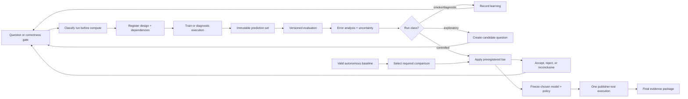

# Evaluation and model experimentation

**Status:** Approved design — metric/registry implementation remains gated on Plans 09 and 10  
**Owner:** Quinton Evans  
**Formal milestone weeks:** 5–6, with a continuous model-learning lane through Week 8  
**Depends on:** Plans 02, 05, 09, and 10; G1 for trusted PanTS cohorts; G2 for any PANORAMA arm;
G4 before selection of the required controlled comparison  
**Source requirements:** Approved Proposal v3.8 Sections 3–6; Appendix v3.1 A1, A5, A7, and A8  
**Last reviewed:** 2026-09-18

## Outcome

PROWL will maintain a continuous, versioned model-learning process while protecting the formal
scientific claims. Smoke tests, diagnostics, exploratory training, and controlled experiments may
begin as soon as their individual dependencies pass and may continue in parallel with other
workstreams. Weeks 5 and 6 remain the dates by which a valid autonomous baseline and at least one
evidence-selected controlled comparison must exist; they are not artificial start dates for model
work.

Every run will be classified before compute, tied to immutable cohorts/configuration/code/model
lineage, and preserved whether it succeeds, fails, or produces a null result. Evaluation will report
autonomous coverage, localization, pancreas and lesion segmentation, patient-level detection and
specificity, multi-lesion behavior, uncertainty, subgroups, and resource cost under a versioned
metric specification. The publisher-test cohort will be used only after the model, post-processing,
and operating policy are frozen.

Quinton reaffirmed on 2026-09-18 that [`../../experiments.md`](../../experiments.md) remains the
living notebook: a game plan before every experiment, an entry for every attempt and outcome, and
explicit evidence-based reasoning for each follow-up. New `CAP-EXP-NNN` entries link the structured
registry and immutable run/evaluation artifacts. Preserve the earlier log and queued ideas, but
reassess them under current capstone rules before execution; they are not automatic commitments.

## Why this belongs

The preceding project learned quickly because model training began early and continued while other
deliverables were being built. That rhythm remains valuable: long-running models can generate
evidence while data, retrieval, UI, or documentation work proceeds. The failure was not frequent
experimentation; it was that some historical runs used ambiguous subsets, shared checkpoint names,
changing evaluation conventions, contaminated validation members, oracle regions, and intermediate
results as if they were final evidence.

This plan keeps the productive cadence and removes those scientific weaknesses. It separates
learning from claiming:

- an exploratory run may teach the project what to test next;
- a diagnostic may reveal a broken assumption without competing for model selection;
- a controlled comparison may support a decision only if its design was frozen first; and
- a final held-out result estimates the selected system only after development choices stop.

Continuous experimentation is therefore a governed workstream, not an excuse to tune against every
visible metric.

## Core mental model

- A **training run** is one execution that changes model parameters.
- An **inference run** applies one immutable model/cascade bundle to one registered prediction set.
- An **evaluation run** joins a complete prediction set to protected references under one metric
  specification.
- An **experiment** is a question plus one or more deliberately related runs that can answer it.
- A **result** is an immutable evidence package, not a number copied from terminal output.
- A **candidate** is a model/policy under consideration; it is not the selected system.
- A **development result** may guide choices; a **publisher-test result** may not.
- A **negative or null result** is retained evidence that prevents repeated dead ends.
- The **formal required comparison** is selected from autonomous baseline errors after G4, even if
  earlier exploration has already identified plausible candidates.

## Scope

- Continuous run classification, experiment queue, cadence, promotion, and freeze rules.
- Registered cohort/prediction-set roles and strict holdout controls.
- Versioned metric definitions, empty/failure handling, and golden fixtures.
- Localization and cascade-decomposition evaluation.
- Separate pancreas and lesion segmentation evaluation in source space.
- Patient-level detection/specificity curves, operating-policy selection, and D-208 resolution.
- Multi-lesion-preserving component matching and tumor-wise sensitivity.
- Autonomous versus provided-region reference comparison using the same segmenter.
- Raw versus derived/post-processed comparisons without overwriting either.
- Per-case results, subgroup/error analysis, paired uncertainty, and model-selection evidence.
- At least one preregistered, evidence-selected controlled comparison after G4.
- Final publisher-test execution after system/policy freeze.
- Reproducible reports for the UI, final paper, presentation, and future experiments.

## Non-goals

- Fixing the Week 6 experiment to an ensemble, distillation, architecture, loss, or data intervention
  before autonomous baseline errors justify it.
- Treating every overnight run as a formal experiment or every higher mean as a discovery.
- Selecting models, thresholds, margins, post-processing, or UI ordering from publisher-test results.
- Reusing preceding-project checkpoints as capstone candidates.
- Reporting patch-training metrics as full-volume evaluation.
- Hiding failed/abstained cases, empty references, source shifts, or annotation quality in one mean.
- Making a diagnostic, calibration, or lesion score sound like disease probability.
- Deleting additional lesion components for presentation or metric improvement.
- Replacing the protected Week 9 buffer or Week 10 delivery period with open-ended model search.
- External benchmark submission as a required outcome.

## Current evidence and inherited hazards

### Useful foundation

- Existing Dice, patient-level threshold-sweep, AUC, per-case export, post-processing, MLflow, and
  experiment-log code provides a concrete starting point.
- The preceding project demonstrated overfit gates, controlled comparisons, negative-result logging,
  data-scale effects, sensitivity/specificity tradeoffs, paired evaluation, and checkpoint archiving.
- Its best clean provided-region result gives motivation and a reference condition, not a capstone
  baseline.
- Existing reports identify the need for multi-lesion-safe processing, source stratification,
  probability retention, complete cohorts, and confidence intervals.

### Historical conclusions that cannot be promoted

- Any autonomous/cascade value derived from a contaminated historical scaled cohort.
- Any model initialized from a preceding-project checkpoint.
- Results chosen by repeatedly reading the accepted publisher-test cohort.
- “First N” manifest-ordered convenience samples without registered membership.
- Lesion Dice that includes empty ground truth as a perfect score without a separately named
  convention.
- Specificity described without naming its reference definition, probability rule, and volume rule.
- “Cleaned” masks whose largest-component operation prevents multi-lesion evaluation.
- Comparisons where preprocessing, cohort, training horizon, or checkpoint-selection rules differed
  but the difference was presented as one isolated variable.

### Gaps to close

- Metrics currently live across multiple scripts rather than one versioned specification and result
  schema.
- Current defaults can select the first positive/negative cases and may accept free-form split files.
- Pancreas Dice semantics, empty-ground-truth conventions, failure denominators, and tumor matching
  need explicit names.
- The current post-processing default retains only the largest lesion component.
- The experiment log contains rich history but is not yet a strict capstone registry with run class,
  cohort lineage, preregistration hash, and promotion status.
- D-208 has not selected a reviewer-ordering score or operating policy.
- The final holdout execution/freeze protocol is not yet machine-enforced.

## Evaluation and decision flow



The loop is intentionally continuous during development. The final holdout path is intentionally
one-way: a disappointing publisher-test result becomes the honest final result, not a reason to
resume threshold search on that cohort.

## Proposed design decisions

| Ref | Recommendation | Why | Alternative/consequence |
|---|---|---|---|
| P06-01 | Operate a continuous model-learning lane after G0 through Week 8. Weeks 5 and 6 are formal baseline/comparison deadlines, not the only training weeks. Week 9 permits only defect-driven stabilization reruns; Week 10 cannot introduce result-changing training. | Early and overlapping training maximizes learning and uses long compute windows well while preserving the approved buffer and delivery schedule. | Waiting until Week 5 wastes learning time; open-ended experiments in Weeks 9–10 make the release unstable. |
| P06-02 | Classify every run before compute as `smoke`, `diagnostic`, `exploratory`, `controlled`, `confirmatory`, or `stabilization`. A completed run cannot be relabeled to obtain stronger evidentiary status. | Each class has a different purpose and claim strength. Classification prevents an accidental good result from becoming a retroactively “preregistered” experiment. | One undifferentiated run ledger encourages cherry-picking and makes failures look like discarded noise. |
| P06-03 | Require registered cohort IDs and immutable membership hashes for evaluation. Convenience subsets must be seeded, role-valid registered descendants; arbitrary paths and “first N” selection are forbidden. | Exact membership is necessary for paired comparison, reproducibility, and leakage protection. | Free-form subsets can change case mix and manufacture apparent improvement. |
| P06-04 | Evaluate source-space raw probabilities/masks first. Post-processing and operating policies create separately versioned derived prediction sets evaluated beside raw output. | Raw evidence remains reusable and multi-lesion-safe while policy effects stay attributable. | Overwriting raw output permanently ties the result to one threshold or cleanup rule. |
| P06-05 | Name segmentation metrics precisely: class-1 pancreas-parenchyma Dice for continuity, pancreas-region Dice on pancreas-or-lesion union for anatomy context, and lesion Dice on evaluable lesion-positive studies with empty-ground-truth reported separately. Never use an unnamed aggregate. | The mutually exclusive three-class target makes “pancreas Dice” ambiguous at lesion voxels, and empty cases should not inflate lesion overlap. | Reporting only one unlabeled Dice can hide lesion failure or change meaning between runs. |
| P06-06 | Report one terminal status for every requested study. Segmentation metrics condition on valid source-space predictions and disclose coverage. Report standard sensitivity/specificity among completed eligible predictions plus end-to-end detection sensitivity and negative-clearance rate across all eligible requested studies; failures receive no credit. | Fake blank masks distort overlap, while silently excluding failures rewards abstention. Paired conditional and end-to-end metrics show both model quality and system reliability without misnaming an abstention as an anatomical false positive. | Counting every failure as background falsely improves specificity; dropping failures entirely permits a system to look good by refusing difficult cases. |
| P06-07 | Use mask-evidence status as the primary internal detection reference and keep any report/metadata-derived status separate. Resolve D-208 on development evidence, then freeze the case score, probability threshold, volume threshold, and denoising/anatomical policy before publisher-test inference. | Ground-truth meaning and operating policy both change sensitivity/specificity. Separate identities prevent an apparent gain caused by a changed label definition. | Pooling reference definitions or choosing one favorable test threshold makes the operating claim uninterpretable. |
| P06-08 | Preserve multiple predicted lesions. Define source-grid 26-connected components, deterministic one-to-one prediction/reference matching, and a preregistered overlap criterion; report sensitivity across stricter matching criteria when external compatibility is uncertain. Largest-lesion-only processing is never the tumor-wise default. | A patient may contain multiple lesions, and component deletion structurally caps tumor-wise sensitivity. Sensitivity analysis prevents an unverified matching convention from masquerading as benchmark compatibility. | Largest-component cleanup may help patient specificity but destroys valid lesion-level evidence. |
| P06-09 | Report point estimates with counts and uncertainty: Wilson intervals for sensitivity/specificity proportions, study/subject-level bootstrap intervals for continuous metrics, and paired bootstrap distributions for matched model differences. Fix seed and resample unit in the metric version. | Small tumors, negative cases, and repeated studies can make means unstable. Paired resampling uses the actual study-level comparison and shows heterogeneous wins/losses. | Point estimates alone make one or two cases look like a material change. |
| P06-10 | Decompose the autonomous result into localization coverage/failure, conditional Stage 2 segmentation, end-to-end source-space performance, and the same-segmenter pancreas-only provided-region reference. | This identifies whether a failure comes from finding the organ, preserving the lesion in the ROI, or outlining it. | One end-to-end mean does not tell the project what experiment to run next. |
| P06-11 | Select the required controlled comparison only after G4 using a recorded decision matrix: user impact, frequency/severity of failure, causal mechanism, ability to isolate the intervention, compute/time, and downstream value. Early exploration may nominate candidates but cannot bypass this gate. | The approved proposal intentionally preserves model-experiment flexibility. Baseline evidence should determine whether data, localization, loss, calibration, architecture, ensemble, or another intervention is highest value. | Committing now could lock the project into a fashionable technique unrelated to the actual error. |
| P06-12 | A controlled experiment freezes one primary hypothesis, intervention unit, primary endpoint, non-inferiority guards, matched cohort, fixed factors, training horizon/checkpoint rule, compute budget, stop rule, uncertainty method, and accept/reject/inconclusive bar before execution. A coherent multi-change intervention is allowed only when the combined mechanism is the stated unit and no single-variable claim is made. | This is strict enough for causal interpretation without pretending every practical system change can be decomposed into one flag. | Undisclosed compound changes produce a useful model but not a defensible explanation. |
| P06-13 | Maintain an ordered experiment queue and a weekly evidence review. Prefer correctness gates and cheap mechanism-discriminating diagnostics before long training; use safe background/overnight compute while another workstream is active; preserve every terminal result. | Continuous training stays intentional and avoids repeating failed ideas or occupying the workstation with low-information runs. | “Always be training” without prioritization can generate many models but little knowledge. |
| P06-14 | Select the release candidate and operating policy on development evidence, freeze all identities, then execute the publisher-test prediction/evaluation once. A discovered implementation defect permits a documented corrective rerun of the entire affected evaluation, never test-guided model or threshold tuning. | The test cohort estimates the selected system only if it did not participate in selection. A transparent correctness repair is different from optimization. | Iterative test reads convert the holdout into development data and weaken the capstone claim. |
| P06-15 | Every evaluation produces machine-readable per-study/component results plus a human-readable evidence report. Git/versioned artifacts are authoritative; Notion may summarize status and link evidence but cannot replace run, prediction, or metric identity. | Detailed records support new analyses without rerunning models, while a concise report keeps Quinton and the professor in the loop. | Terminal screenshots and manually copied numbers cannot be audited or recomputed safely. |

Quinton approved P06-01 through P06-15 on 2026-09-09. P06-01 formalizes his continuous-training
instruction without changing the protected Week 9 and Week 10 purposes. P06-11 leaves D-205 open
until G4. P06-07 and the baseline evidence will resolve D-208. Exact numerical experiment bars are
intentionally written after the relevant baseline rather than invented during architecture planning.

## Run taxonomy and claim strength

| Class | Purpose | Minimum data role | Required before run | May select release model? |
|---|---|---|---|:---:|
| `smoke` | Prove wiring, learning, output, or timing on a tiny bounded case set | Train-role fixture/smoke descendant | Run identity, expected binary gate, maximum cost | No |
| `diagnostic` | Measure a mechanism without claiming superiority | Train-role development or approved validation, depending on question | Question, measurement, interpretation branches | No; informs candidates |
| `exploratory` | Generate/refine hypotheses and discover useful settings | Train-role development descendants by default | Question, changed factors, cohort, metrics, budget | No direct promotion |
| `controlled` | Test a preregistered intervention against a matched control | Frozen development-validation prediction/evaluation roles | Complete experiment contract and passing dependencies | Yes, after G4/G5 process |
| `confirmatory` | Estimate the fully selected system under frozen policy | Publisher-test or separately frozen untouched cohort | Release/model/policy freeze and audit | Confirms result; cannot trigger tuning |
| `stabilization` | Reproduce an affected artifact after a verified defect/operational failure | Same role and membership as affected run | Defect record, expected invariant, approval under Week 9 rules | Only restores the already selected design |

An exploratory result may be valuable and may motivate an identical controlled experiment, but its
original output remains exploratory. A controlled experiment planned before G4 may run for technical
learning, but it cannot become the required evidence-selected comparison unless the post-G4 decision
independently selects it and a fresh/matched valid design is executed.

## Cohort and prediction-set roles

| Role | Allowed use | Forbidden use |
|---|---|---|
| Train | Fit model parameters and construct training-time samples | Formal generalization estimate |
| Train-smoke | Tiny correctness/overfit/timing gates | Accuracy claim or model selection |
| Train-development | Early diagnostics, exploratory settings, pipeline comparisons | Publisher claim or final uncertainty estimate |
| Development-validation | Checkpoint selection, autonomous baseline, error analysis, controlled comparison, threshold/policy selection | Model fitting or claim of untouched final test |
| Publisher-test | One confirmatory estimate after model/policy freeze | Architecture, checkpoint, threshold, margin, post-processing, or score selection |
| Provided-region reference | Error decomposition using the same selected segmenter and pancreas-only reference ROI | Replacing/autocorrecting an autonomous result |

Each role is an immutable registered cohort with source/subject/study membership, ancestry, target
evidence, and content hash. A positive/negative or subgroup subset inherits the parent role. If the
same development-validation cohort is read many times, it is explicitly called development data;
the project does not claim it remained untouched.

## Metric layers

### Layer 1 — input and completion

- requested, eligible-reference, completed, completed-with-warnings, failed, and unevaluable counts;
- failure/warning code rates overall and by source/geometry subgroup;
- missing-output and duplicate-terminal-record assertions; and
- full-volume spatial-coverage and source-grid-validation rates.

### Layer 2 — localization and ROI

- pancreas mask/box coverage and localization failure rate;
- pancreas and lesion effective containment after the final Stage 2 tensor mapping;
- selected ROI physical volume, source-volume fraction, expansion/margin, and boundary contact;
- effective Stage 2 spacing/downsampling and crop inflation; and
- localizer/ROI runtime and memory.

Lesion annotations may evaluate development containment but never construct the predicted ROI.

### Layer 3 — segmentation

- class-1 pancreas-parenchyma Dice;
- pancreas-region Dice on class 1 or class 2 union;
- lesion Dice over evaluable lesion-positive studies;
- per-case median, interquartile range, distribution, and worst-case examples;
- optional surface metric only after tolerance and empty handling are frozen; and
- raw and each derived policy reported separately.

### Layer 4 — patient-level detection

- sensitivity, specificity, confusion counts, F1, and coverage;
- score/threshold and probability-by-volume operating curves;
- AUC only for a precisely named continuous case score;
- false-positive lesion count/volume per negative scan; and
- calibration/error summaries only when the score semantics support them.

### Layer 5 — lesion-level detection

- number of eligible reference lesions and predicted components;
- matched, missed, duplicate, and unmatched predicted components;
- tumor-wise sensitivity under the frozen matching convention;
- false-positive components per scan; and
- matching-threshold sensitivity analysis when benchmark convention is unknown.

### Layer 6 — workflow comparison and cost

- autonomous result versus pancreas-only provided-region reference;
- localization-caused loss versus conditional segmenter performance;
- runtime by stage, peak memory where measurable, prediction bytes, and manual review warnings; and
- performance stratified by source, label provenance/quality, contrast phase, lesion size/count,
  acquisition geometry, and other sufficiently populated fields.

The detailed definitions live in
[`../evaluation/METRIC-SPECIFICATION.md`](../evaluation/METRIC-SPECIFICATION.md).

## Failure and empty-reference accounting

For every requested prediction set:

```text
requested = completed + completed_with_warnings + failed
```

Evaluation then records whether each completed prediction has the reference evidence needed for a
particular metric. The policies are:

- **Segmentation:** never manufacture a blank prediction for a failed case. Report Dice among valid
  evaluable outputs together with autonomous completion/coverage and failure counts.
- **End-to-end detection sensitivity:** an eligible positive failed by the autonomous workflow is not
  detected and remains in the all-requested denominator.
- **End-to-end negative-clearance rate:** an eligible negative failed/abstained by the workflow is not
  credited as correctly cleared and remains in the all-requested denominator. This is not mislabeled
  as standard specificity.
- **Completed-case view:** also report standard sensitivity/specificity among completed eligible cases
  so anatomical model behavior and system reliability can be diagnosed separately.
- **Empty lesion reference:** exclude from lesion-positive Dice, include in the explicitly defined
  negative detection cohort only when target evidence proves negative, and never infer negative from
  missing/unknown labels.
- **Empty lesion prediction on a positive completed case:** lesion Dice is zero and detection follows
  the frozen candidate rule.
- **Both empty:** may be described as correct absence in a separately named whole-cohort convention;
  it never enters the primary lesion-positive Dice mean as 1.0.

Plan 06 thereby accepts the Plan 05 terminal-status handoff. The executable schema/tests remain Plan
09 work, and exact field storage remains aligned with Plan 01 contracts.

## Continuous training and experiment cadence

### Queue priority

1. Correctness gates that could invalidate every later result.
2. Short diagnostics that distinguish between competing failure mechanisms.
3. Required autonomous-baseline training or inference on the critical path.
4. Controlled experiments with frozen decision bars.
5. Exploratory models likely to inform a later critical-path choice.
6. Optional or stretch investigations.

### Normal rhythm

- Maintain a short ordered queue with owner, dependency status, expected start, duration, resource,
  information gained, and fallback.
- Prepare configs, cohort identities, output capacity, and smoke commands before a long compute
  window begins.
- Start with the smallest gate that can falsify the design: schema/fixture, overfit, short training,
  full-volume inference, then full horizon.
- Use long MPS/CPU jobs during documentation, retrieval, or UI work only when Plan 04 locks prevent
  competing accelerator/writer use.
- Inspect health signals without selecting a winner from intermediate evaluation reads.
- At completion, validate and archive outputs before another run can reuse the resource.
- Conduct a weekly evidence review: what was learned, what was ruled out, what remains uncertain,
  and which run has the highest information value next.

The detailed strategy is in
[`../evaluation/CONTINUOUS-TRAINING-STRATEGY.md`](../evaluation/CONTINUOUS-TRAINING-STRATEGY.md).

## Experiment selection and execution

### Candidate generation

Baseline errors are grouped into localization miss, ROI coverage/resolution, segmentation boundary,
small-lesion miss, false-positive lesion, probability/operating-policy, source shift, annotation
quality, compute, and workflow usability. Each group can nominate interventions such as:

- additional eligible data or source-balanced sampling;
- localization/ROI interaction or predicted-region training;
- loss/sampling/augmentation or architecture change;
- calibrated threshold, multi-lesion-safe denoising, or anatomical constraint;
- single-stage versus cascade comparison;
- ensemble, distillation, or pretraining comparison; or
- a cheaper inference/resource policy.

No category is guaranteed a run. D-205 selects the intervention whose mechanism best matches the
observed high-impact error and can be evaluated honestly in the remaining time.

### Preregistration record

Before controlled compute, record:

- question, hypothesis, null, and mechanism;
- run class and experiment version;
- control/treatment definitions and exact changed factors;
- fixed data, preprocessing, initialization, architecture, training, inference, and evaluation
  factors;
- cohort and prediction-set identities;
- primary endpoint and direction;
- non-inferiority guardrails on other critical metrics;
- uncertainty method and paired unit;
- accept, reject, and inconclusive rules;
- maximum steps/time/cost and health-based termination rule;
- checkpoint-selection rule and evaluation horizon;
- known confounds and interpretation limits; and
- operational fallback if the run cannot complete.

The immutable preregistration is hashed before the treatment result exists. A correction afterward
creates an amendment that never rewrites the original timing or claim.

### Decision result

The final record says `accepted`, `rejected`, `inconclusive`, `invalid`, or `operationally_failed`.
It includes all point estimates/intervals, per-case paired differences, subgroup direction, guardrail
results, deviations, and the next consequence. A result can improve a model while failing its
preregistered hypothesis; that is recorded as a rejection with a possible new exploratory lead.

## Baseline error-analysis package

Before D-205 is resolved, G4 evidence must answer:

1. How often does image-only localization complete, warn, or fail?
2. What pancreas and lesion fraction remains visible after the final Stage 2 mapping?
3. How much performance is lost from provided-region to predicted-region input using the same
   segmenter?
4. Among successful localizations, what limits lesion Dice: miss, under-outline, over-outline, merge,
   duplicate, or boundary error?
5. Where do patient-level false positives occur, at what score/volume, and in which acquisition
   groups?
6. Does one source, annotation-quality stratum, contrast phase, lesion size/count, or geometry group
   dominate failures?
7. Is the likely intervention data-, model-, localization-, policy-, or compute-limited?
8. What experiment can separate the leading explanation from its alternative within the schedule?

The report contains aggregate tables plus a bounded, deterministic review set of best, median,
worst, false-negative, false-positive, localization-failure, and disagreement cases. Case examples
are selected by frozen rules rather than aesthetics.

## Implementation sequence

1. Approve or revise P06-01 through P06-15; retain D-205 and D-208 as open evidence decisions.
2. Freeze the run-class, experiment, metric, result, and prediction-set-role documentation contracts.
3. Accept the Plan 05 terminal-status, raw-probability, cascade-bundle, provided-region, and
   prediction-set handoff.
4. Inventory every current metric/evaluation/post-processing/experiment path and classify behavior as
   reusable, corrected, compatibility-only, or historical.
5. Add golden source-space fixtures covering perfect, empty, missed, false-positive, multiple-lesion,
   anisotropic, failed, and warning cases.
6. Implement one metric engine that consumes registered prediction sets rather than model-specific
   scripts or arbitrary checkpoint paths.
7. Implement per-study segmentation results with explicit pancreas and lesion conventions.
8. Implement terminal-status coverage and conservative/conditional detection accounting.
9. Implement multi-lesion component extraction, deterministic one-to-one matching, and matching-rule
   sensitivity tests without largest-component destruction.
10. Implement patient score/volume grids, sensitivity/specificity/F1/AUC, uncertainty, and per-study
    output under one versioned specification.
11. Implement comparison preflight: same cohort/membership, reference, metric version, source-grid
    prediction mode, and declared fixed factors.
12. Create the capstone experiment registry linked to active `CAP-EXP-NNN` entries in
    `docs/experiments.md`. Retain preceding-project entries as `historical` evidence rather than
    capstone candidates; preserve their original text and replan selected future ideas explicitly.
13. Establish the continuous experiment queue and run the cheapest training-role smoke/diagnostics
    needed to prepare Plan 05 implementation.
14. After G1/G3 and Plan 05's valid prediction handoff, evaluate the autonomous development-validation
    baseline and matching provided-region reference. G2 is additionally required for any PANORAMA
    arm; Plan 05/06 completion evidence is produced together rather than required circularly.
15. Publish the error-analysis package and use the decision matrix to resolve D-205.
16. Preregister, smoke, execute, and evaluate the required controlled comparison; preserve nulls and
    operational failures.
17. Resolve D-208 from development curves and reviewer needs; freeze model, cascade, raw/derived
    policy, case score, thresholds, and metric version.
18. Audit the release-selection manifest for test blindness, then execute publisher-test inference
    and evaluation once.
19. Produce the final machine-readable results, human-readable report, UI summary payloads,
    limitations, and release evidence.

## Test matrix

| Level | Scenario | Expected result |
|---|---|---|
| Registry | Run starts without class, cohort, config, lineage, budget, or output identity | Preflight rejects it before compute |
| Registry | Completed exploratory run is relabeled controlled | Registry rejects mutation; new controlled experiment required |
| Cohort | Evaluation receives arbitrary text list or first-N request | Rejected; registered role-valid cohort required |
| Cohort | One subject spans comparison arms or protected roles | Comparison/build fails before scoring |
| Holdout | Publisher-test ID appears in tuning, threshold, margin, or checkpoint-selection evidence | Selection audit fails and final execution is blocked |
| Segmentation | Perfect 3-class source-space prediction | Both named pancreas metrics and lesion-positive Dice equal 1 where applicable |
| Segmentation | Pancreas correct but lesion voxels differ | Parenchyma and region metrics change according to their explicit definitions |
| Empty | Empty lesion GT and empty prediction | Excluded/NaN for primary lesion-positive Dice; correct-negative only under named detection convention |
| Empty | Positive lesion GT and empty prediction | Lesion Dice 0 and patient not detected |
| Failure | Positive autonomous case fails localization | No fake mask; conservative sensitivity counts it not detected and coverage exposes failure |
| Failure | Negative autonomous case abstains | Not credited in end-to-end negative-clearance rate; completed-case specificity remains separately labeled |
| Completeness | Requested count differs from terminal results | Evaluation fails before metrics publish |
| Components | Two GT lesions and three predictions with overlaps | Deterministic one-to-one match; duplicate/unmatched component retained and counted |
| Components | Largest-lesion flag enabled for tumor-wise evaluation | Preflight rejects incompatible derived policy |
| Spatial | Anisotropic source affine and unequal voxel volume | Physical volumes/distances use world units and golden values |
| Operating curve | Synthetic monotonically ordered case scores | Threshold confusion counts/curve match hand calculation |
| AUC | Tied scores and known labels | Deterministic rank handling matches golden value |
| Uncertainty | Fixed seed and resample unit | Interval and paired distribution reproduce exactly |
| Comparison | Control and treatment differ in cohort or metric version | Comparison fails rather than coercing rows |
| Comparison | Same studies arrive in different order | Join uses immutable identity and produces identical paired result |
| Preregistration | Result written before preregistration timestamp/hash | Cannot receive controlled status |
| Reporting | Pooled improvement hides source regression | Required source/quality table remains visible and guardrail may reject result |
| Raw/derived | Post-processing is evaluated | Raw result remains byte-identical and both policy IDs appear |
| Reproducibility | Re-run same prediction-set evaluation | Machine-readable per-study rows and aggregates reproduce under metric tolerance |
| Final freeze | Model or threshold changes after publisher-test prediction | New release identity is required and test-blind claim is invalidated |

## Quantitative rules to freeze before compute

Plan 06 does not invent improvement bars without baseline variance. Before each controlled run it
does require explicit values for:

- primary endpoint and minimum material improvement;
- guardrails for pancreas Dice, lesion detection sensitivity, specificity, autonomous coverage,
  failure rate, runtime, and storage where relevant;
- evaluation cohort and required eligible case counts;
- resample unit, interval method, number of bootstrap draws, seed, and tie rule;
- maximum training horizon/cost and checkpoint-selection rule;
- early termination only for invalidity, numerical failure, or clearly preregistered futility—not an
  unfavorable intermediate score;
- treatment/control run count and whether stochastic repeats are necessary;
- missing/failed prediction policy; and
- accept/reject/inconclusive thresholds.

A statistically nonzero but operationally trivial change does not automatically win. A larger mean
that violates a critical non-inferiority guard may be rejected. An interval crossing the decision
bar is `inconclusive`, not silently accepted or rejected for narrative convenience.

## Failure modes and recovery

| Failure mode | Detection | Prevention | Recovery/fallback |
|---|---|---|---|
| Many runs but little information | Queue grows while decisions remain unchanged | Information-value priority and weekly evidence review | Pause long jobs; run diagnostic or close low-value branches |
| Validation becomes de facto test | Same cohort repeatedly drives every setting | Explicit development label and untouched publisher-test freeze | Preserve development status; do not overclaim; use final untouched role once |
| Test influences selection | Test result precedes model/policy freeze | Role-aware access and release-selection audit | Mark evidence exploratory/contaminated; no test-blind claim |
| Historical checkpoint enters a run | Initialization/teacher hash matches denylist | Plan 05 lineage preflight | Invalidate run and retrain from permitted initialization |
| Evaluation scripts disagree | Same predictions yield different results | Single metric engine, versioned spec, golden fixtures | Identify convention; publish corrected version without erasing prior result |
| Failed cases vanish | Prediction/evaluation counts disagree | Complete prediction-set contract | Block report and restore terminal records |
| Empty cases inflate Dice | Both-empty assigned 1 in primary lesion mean | Named empty convention and positive-only primary Dice | Recompute under correct metric version |
| Multi-lesion truth is destroyed | Largest-component derived mask used | Raw-first policy and compatibility preflight | Recompute from raw probability/mask; rerun inference only if raw absent |
| Compound experiment overclaims causality | Multiple changed factors presented as one knob | Changed-factor diff and intervention-unit statement | Relabel practical composite result; run isolation study only if valuable |
| Intermediate checkpoint creates false win | Selection based on a favorable early read | Preregistered horizon/checkpoint rule | Complete planned horizon or label incomplete/invalid |
| Source mix improves pooled mean but harms one group | Source/quality direction diverges | Required stratification and guardrails | Reject selection, constrain use, or disclose limitation |
| Compute run is interrupted | Missing valid terminal checkpoint/result | Plan 04 resume plus Plan 10 checkpoint retention | Resume only under strict identity; otherwise record failure and restart new run |
| Experiment consumes buffer | New hypothesis queued in Week 9/10 | Week-based run-class policy | Stop new experiment; allow only stabilization or deliver existing evidence |

## Observability and evidence

The operator must be able to answer for any reported number:

- which question and run class produced it;
- whether the design existed before the result;
- which exact subjects/studies and reference definitions entered it;
- which model/cascade, input, raw/derived policy, and metric version were used;
- how failures, warnings, and empty references were treated;
- what point estimate, count, distribution, interval, and subgroup evidence support it;
- what changed and stayed fixed relative to the control;
- whether publisher-test evidence had been available during selection;
- whether the preregistered rule accepted, rejected, or left the result inconclusive; and
- where the immutable predictions, per-case rows, logs, configs, checkpoints, and report reside.

Notion may show a concise experiment card and link to this evidence. Git/versioned artifacts remain
the authority for scientific identity and result history.

## Plan readiness gate

Plan 06 may move to `Ready` when:

- [x] Quinton approved P06-01 through P06-15 on 2026-09-09.
- [x] Continuous training is separated from formal baseline/comparison/final claims.
- [x] Run classes, promotion rules, cohort roles, and final-freeze behavior are specified.
- [x] Plan 05 raw outputs, failure states, cascade decomposition, and provided-region reference have
      an explicit evaluation handoff.
- [x] Metric layers, empty/failure treatment, uncertainty, and multi-lesion behavior are specified in
      tool-independent Markdown.
- [x] Experiment selection, preregistration, comparison, and result-status rules are defined.
- [x] Approved Plan 09 accepts golden-fixture/test responsibilities and exact tolerance ownership;
  executable fixtures/results remain pending.
- [ ] Plan 10 confirms experiment storage, environment, checkpoint retention, resource locking, and
      run-cost boundaries.
- [x] D-205 and D-208 remain open with explicit evidence/deadline rather than being prematurely
      resolved.

Plan 06 can be design-approved before G4. Its metric/registry implementation can begin after Plan 09
and Plan 10 boundaries are accepted. The required comparison cannot be selected until G4.

## Completion gate (G5 and final evaluation handoff)

- [ ] Metric specification has a version/hash and all golden fixtures pass.
- [ ] Evaluation accepts only complete registered prediction sets and role-valid references.
- [ ] Pancreas, lesion, localization, patient-detection, lesion-detection, coverage, and cost metrics
      use their documented conventions.
- [ ] Raw and derived policies remain distinct and multiple lesions survive the tumor-wise path.
- [ ] Autonomous and provided-region results use the same selected segmenter with distinct prediction
      identities and a complete error decomposition.
- [ ] Baseline per-study results, intervals, curves, subgroups, failures, and deterministic case review
      set are published.
- [ ] D-205 is resolved only after baseline error analysis.
- [ ] At least one controlled comparison has an immutable preregistration, matched evidence,
      uncertainty, guardrails, and honest terminal decision.
- [ ] D-208 is resolved on development evidence and the reviewer-ordering/operating policy is frozen.
- [ ] Release-selection manifest proves model, cascade, post-processing, thresholds, score, cohort,
      and metric version were frozen before publisher-test execution.
- [ ] Final publisher-test evaluation is complete, reproducible, and reported without test-guided
      revision.
- [ ] All null, rejected, inconclusive, invalid, and failed runs remain in the experiment history.
- [ ] Selected case-package summary fields and final report/presentation tables trace to immutable
      machine-readable evidence.

## Rollback and fallback

- If metric compatibility with an external benchmark is uncertain, publish PROWL's precise internal
  convention and a separately named sensitivity analysis; do not guess equivalence.
- If a subgroup is too small, show count/distribution and label it descriptive rather than making a
  comparative claim.
- If the required long comparison cannot finish by G5, run the cheapest controlled intervention
  that directly addresses the baseline error—often a frozen policy/calibration/post-processing
  comparison—without consuming Week 9.
- If no candidate has a defensible mechanism, run the simplest scientifically useful baseline
  comparison and record that more complex experimentation was not justified.
- If an experiment is invalid, preserve its outputs and reason; repair the design under a new
  experiment version rather than overwriting it.
- If the publisher-test result is worse than development, report the generalization gap and examine
  causes without selecting a new model on that cohort.
- If final compute fails operationally, resume/retry only with unchanged frozen identity; any model or
  policy change waits outside the confirmatory claim.

## Planned artifacts

- [`../evaluation/README.md`](../evaluation/README.md)
- [`../evaluation/METRIC-SPECIFICATION.md`](../evaluation/METRIC-SPECIFICATION.md)
- [`../evaluation/PREDICTION-SETS-AND-HOLDOUTS.md`](../evaluation/PREDICTION-SETS-AND-HOLDOUTS.md)
- [`../evaluation/EXPERIMENT-PROTOCOL.md`](../evaluation/EXPERIMENT-PROTOCOL.md)
- [`../evaluation/CONTINUOUS-TRAINING-STRATEGY.md`](../evaluation/CONTINUOUS-TRAINING-STRATEGY.md)
- [`../evaluation/ERROR-ANALYSIS-AND-REPORTING.md`](../evaluation/ERROR-ANALYSIS-AND-REPORTING.md)
- Metric-spec, experiment, experiment-run, evaluation-result, per-study-result, component-match, and
  release-selection schemas with valid/invalid examples.
- Golden metric, failure, component, curve, uncertainty, comparison, and holdout fixtures.
- Imported historical experiment index with capstone eligibility/provenance classification.
- Continuous experiment queue and weekly evidence-review records.
- G4 autonomous baseline, provided-region reference, and error-analysis package.
- D-205 experiment-selection record and controlled comparison package.
- D-208 operating-policy decision and frozen release-selection manifest.
- Final publisher-test per-study results and human-readable evaluation report.

## Handoff

Plan 05 receives exact metric/failure requirements and may advance toward implementation once Plan
10 confirms resource/retention boundaries. Plan 08 receives only selected, source-space,
schema-valid case-package summaries and clearly non-diagnostic ordering fields. Plan 12 receives the
frozen release-selection manifest, final evaluation package, limitations, and comparison decision;
it does not recompute headline values inside presentation code.
