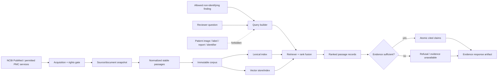

# Literature retrieval and grounded response

September 28 amendment: D-260 through D-265 and the approved
[planning scope](../retrieval/planning/SCOPE.md) and [phases](../retrieval/planning/PHASES.md)
govern current execution. PostgreSQL + pgvector is selected for literature only, with
canonical files and frozen embeddings authoritative. P3 is a separately dispatched
synthetic packet; P4a platform work and P4b contract-bound integration are separate.
Design approval does not sign acquisition runs or authorize installs/model pulls/Plan 04.
The additional span-hit/delivered-evidence metric amendment remains proposed.

**Status:** Approved design — live acquisition, index implementation, and evaluation remain gated  
**Owner:** Quinton Evans  
**Design week:** 1  
**Build/evaluation milestone:** Weeks 5–6  
**Depends on:** Plans 01, 04, 08, 09, and 10; corpus rights review; D-202 tool spike  
**Source requirements:** Approved Proposal v3.8 evidence-assistant and evaluation commitments;
Appendix v3.1 evidence pipeline, corpus, retrieval, grounding, and fallback boundaries  
**Last reviewed:** 2026-09-18 (approved handoff status reconciliation)

Quinton approved P07-01 through P07-16 on 2026-09-09. This approves the corpus, retrieval,
evaluation, and grounded-response design. D-260 now selects PostgreSQL + pgvector;
D-202 remains open for measured index configuration and embedding selection.

## Outcome

PROWL will build a versioned local evidence corpus from PubMed bibliographic records/available
abstracts and individually permitted PMC Open Access text. A non-identifying structured imaging
finding and reviewer question will produce a deterministic query record, ranked passage records, and
either a concise claim-level cited response or an explicit insufficient-evidence refusal. Retrieval
quality will be measured with recall@k and mean reciprocal rank on a frozen question/source set;
response behavior will be measured for groundedness, citation correctness, and refusal accuracy.

The literature workflow remains independent of patient imaging and the autonomous model. If the
retrieval/generation system is unavailable or fails G6, the review interface will show an honest
evidence-unavailable/refusal state rather than a fabricated or canned answer.

## Why this belongs

The capstone is not only a segmentation model. Its intended review workflow combines a proposed
contour with relevant, traceable background literature. That is useful only when the evidence layer
is measurably better than a fluent search demo. A model-written paragraph without stable passages,
source rights, a frozen evaluation set, or a refusal path would add risk rather than value.

This plan therefore treats retrieval as a small scientific system:

- corpus scope comes from explicit reviewer-question families;
- acquisition and text reuse follow source terms;
- every document, passage, embedding/index, query, ranking, claim, and citation has identity;
- lexical and vector approaches are compared rather than assuming embeddings win;
- the response model can phrase retrieved evidence but cannot invent it; and
- the imaging critical path continues even if the evidence assistant is simplified.

## Core mental model

- A **source record** is bibliographic identity such as PMID, PMCID, DOI, title, journal, and date.
- A **document snapshot** is the exact abstract/full-text representation permitted for local use.
- A **passage** is a stable, source-located text span used as the unit of retrieval/citation.
- A **corpus** is one immutable set of source/document/passage records under one search and
  normalization policy.
- An **index** is a rebuildable acceleration artifact derived from one corpus plus lexical/vector
  configuration; it is never the authority for source text.
- A **question** is a frozen reviewer-style information need with answerability and relevance labels.
- A **query** is a versioned transformation of allowed structured context and reviewer wording.
- A **retrieval result** is an ordered list of exact passage IDs/scores under one index/retriever.
- A **response** contains atomic claims mapped only to retrieved passage IDs or a refusal reason.
- **Groundedness** asks whether every displayed claim is actually supported by its cited passage.
- **Refusal** is the correct output when the corpus/retrieval cannot support a safe answer.

## Scope

- Reviewer question families, answer boundaries, and structured finding vocabulary.
- Reproducible PubMed search/acquisition and PMC Open Access retrieval through permitted services.
- Per-document rights/access/redistribution decisions and restricted-local storage.
- Source identity, corrections/retractions/version handling, duplicate resolution, and corpus freeze.
- Section-aware text normalization and stable source locators.
- Passage/chunk construction with measured size/overlap.
- Local lexical baseline and local dense/vector-store candidates under a bounded D-202 spike.
- Deterministic query construction, metadata filtering, ranking, deduplication, and optional hybrid
  fusion/reranking.
- Frozen development/held-out answerable and unanswerable question sets.
- Recall@k, MRR, optional nDCG/source diversity, latency, and rebuild evaluation.
- Evidence-sufficiency policy, claim-level citations, contradiction/uncertainty behavior, and refusal.
- Groundedness, citation correctness, completeness, refusal accuracy, and adversarial tests.
- Static/FastAPI-compatible evidence response records for Plan 08.
- Local file-first storage, versioning, orchestration stages, and graceful degradation.

## Non-goals

- Diagnosing a pancreatic lesion, naming tumor subtype from a case, estimating prognosis, selecting
  treatment, or replacing clinical judgment.
- Retrieving patient records, PanTS/PANORAMA reports, labels, images, or identifying data.
- Treating template-generated PanTS reports as independent literature or response ground truth.
- General open-web search at review time.
- Scraping PMC article pages or systematically downloading content outside approved NCBI services.
- Assuming every PMC-visible article is licensed for reuse or committing restricted abstract/full
  text to Git.
- Building a comprehensive medical knowledge base or answering arbitrary clinical questions.
- A managed vector service, enterprise knowledge graph, agentic web browsing, or mandatory relational
  database.
- Training a language model or embedding model from scratch.
- Choosing the vector database solely because its interface looks convenient.
- Allowing generation quality to hide poor retrieval.

## Current state

### Reusable foundation

- Plan 01 corpus/index identities, artifact layout, file-first rules, and static/FastAPI transport
  boundary.
- Plan 04 independent `literature` workflow, versioned stage/recovery behavior, and scientific
  artifact authority.
- Plan 08's future evidence-response integration point.
- `references/literature/README.md` establishes a safe home for search strategies, exports, rights,
  and evaluation provenance.
- A root `pubmed_samples.xml` contains exploratory PubMed XML useful for parser fixtures.
- The approved requirements already fix PubMed/PMC, recall@k, MRR, groundedness, and refusal as the
  minimum evidence.

### Gaps to close

- No approved search strategy, corpus topic boundary, or source snapshot exists.
- `pubmed_samples.xml` is not registered, rights-reviewed, normalized, or an approved corpus.
- No source/document/passage/query/retrieval/response schemas exist yet.
- No local lexical baseline, embedding pipeline, vector store, hybrid retriever, or evaluation engine
  exists.
- D-260 selects the engine; D-202 has not selected the measured embedding/index configuration.
- D-209 has not frozen the reviewer question families or evaluation set.
- No claim-level grounding or refusal implementation exists.
- No generation-provider/privacy/cost choice exists; Plan 10 must own that boundary.

## Trust and data-separation flow

The query schema allowlists fields; it does not merely promise to ignore forbidden data. The corpus
and generation prompt contain public literature plus bounded non-identifying context only.

## Proposed design decisions

| Ref | Recommendation | Why | Alternative/consequence |
|---|---|---|---|
| P07-01 | Keep the literature workflow independently runnable and non-blocking for imaging. Plan 08 renders cited evidence only after G6; otherwise it renders a real unavailable/refusal state. | Retrieval is supporting scope and must not invalidate the autonomous imaging critical path or force a fake demo. | A hard UI dependency could turn a vector/generation issue into a failed segmentation delivery. |
| P07-02 | Limit the initial corpus to general CT pancreas/lesion imaging, contour/measurement interpretation, annotation/review workflow, and relevant AI limitations. Diagnosis, subtype, prognosis, and treatment questions are out of scope and included as refusal tests. | These families support the annotation-assist task without expanding into clinical decision support. | A broad pancreatic-cancer corpus would make search easier to demo but harder to evaluate and more likely to answer unsafe questions. |
| P07-03 | Build queries only from an allowlisted non-identifying structured finding plus reviewer question. Initial allowed context is modality, anatomy/task, model warning category, and coarse measurement/count bins; no image, mask, source report, patient ID, dates, institution, or free model-generated diagnosis enters. | The assistant needs enough context to retrieve useful technical evidence without turning patient data or an unvalidated inference into a clinical prompt. | Passing the whole case package creates privacy/claim risk and encourages the generator to overinterpret model output. |
| P07-04 | Use PubMed bibliographic records and available abstracts as the broad base; add full text only from the PMC Open Access Subset or another record whose exact license permits the intended local use. Store text locally/off-Git and publish manifests/citations rather than restricted content. | Not everything visible in PubMed/PMC is freely redistributable, and per-article license terms vary. | “Free to read” is not a sufficient rights decision; including unverified text risks an unusable release. |
| P07-05 | Use the NLM baseline plus ordered updates and local selection under D-261; retain E-utilities for bounded checks with tool/email and current rate rules. PMC uses approved Cloud XML objects with per-article rights. | Reproducible acquisition with retained event/source hashes, bounded retries and explicit run records. | No article-page scraping; design approval does not sign runs S/A/B. |
| P07-06 | Give every source/document a rights record with access route, license text/identifier, local-index permission, redistribution flag, required attribution, and review state. Unknown rights exclude full text but may retain bibliographic metadata/link. | Corpus construction needs a machine-enforced decision, not a vague “open access” label. | One corpus-wide license assumption can contaminate the entire deliverable. |
| P07-07 | Freeze a versioned search protocol and cutoff date, exact query translations/IDs, inclusion/exclusion criteria, source inventory, retrieval timestamps, and content hashes. `pubmed_samples.xml` begins as an unapproved exploratory fixture only. | Search results and article versions change. A frozen snapshot is necessary for deterministic passage IDs, index rebuilds, and Week 6 metrics. | A live corpus underneath evaluation makes recall and citations non-reproducible. |
| P07-08 | Resolve duplicate/version identity across PMID, PMCID, DOI, corrections/retractions, and content hashes. Keep one canonical bibliographic work with separately identified abstract/full-text/version representations and visible notices. | The same article can arrive through several routes; corrections/retractions materially affect evidence. | Indexing duplicates inflates recall and ranking, while hiding retractions can surface unreliable evidence. |
| P07-09 | Normalize text without paraphrasing and create section/sentence-aware passages with exact document/section/paragraph/offset locators and content hashes. Passage size/overlap is tuned on development questions and creates a new corpus version. | Citations must resolve to stable supporting text, and chunking materially changes retrieval. | Opaque token windows without locators cannot be audited or displayed responsibly. |
| P07-10 | Use literature-only PostgreSQL + pgvector under D-260, with PostgreSQL FTS ranked by ts_rank_cd as the lexical prototype control. P4a tests exact search and representative HNSW; P4b proves contract integration; P8/P9 select embeddings/retrieval configurations. | Canonical files and frozen embeddings remain rebuild authority. | If acceptance fails, stop and review measured options; no automatic switch to another engine. |
| P07-11 | Pin a locally runnable embedding model/version/hash and record normalization, vector dimension, distance metric, device, batch, and library versions. External embedding calls are not the baseline. | Local embeddings make index rebuilds controllable, keep source text off third-party services, and avoid per-query API dependence. | An external embedding API may be tested later only if it solves a measured quality/compute problem and Plan 10 records cost/privacy/version limits. |
| P07-12 | Retrieve lexical and dense candidates separately, apply metadata/rights filters before display, cap duplicate passages per source, and evaluate deterministic rank fusion/reranking on development questions. Store component scores and final rank. | Hybrid retrieval often protects exact terminology while retaining semantic matching; separate scores make failures diagnosable. | A single opaque similarity score makes it impossible to tell whether query, embedding, filtering, or fusion failed. |
| P07-13 | Resolve D-209 with a frozen 60-question evaluation set: 30 development and 30 held-out; each split contains 20 answerable and 10 unanswerable/out-of-scope questions balanced across the approved families. Label relevant sources/passages and difficulty with a written rubric before index tuning. | This is large enough to test retrieval/refusal across multiple families but still feasible for careful solo labeling. | A larger noisy set or a tiny handpicked set would provide less trustworthy evidence. The number can be revised only before labeling/results and with a recorded workload rationale. |
| P07-14 | Evaluate lexical, dense, and selected hybrid retrieval with recall@1/3/5/10 and MRR on answerable questions, plus latency, empty-result, duplicate-source, and source-diversity diagnostics. Tune only on development; run held-out once per frozen retriever version. | Required metrics need known-relevant sources/passages, and system diagnostics explain why a ranker wins or fails. | Evaluating only generated prose hides missed evidence and makes retriever improvements unmeasurable. |
| P07-15 | Generate a short structured answer as atomic claims, each mapped to one or more retrieved passage IDs. A deterministic evidence-sufficiency gate handles empty/weak/out-of-scope/conflicting evidence. Any unsupported displayed claim is a defect; the safe fallback is ranked passages or refusal. | Citation presence alone does not prove support. Claim-level mapping and a non-generative fallback make cite-or-refuse enforceable. | A free-form prompt plus end-of-paragraph references can fabricate claims while looking scholarly. |
| P07-16 | Score response groundedness, citation precision/support, answer completeness on answerable questions, and refusal accuracy on unanswerable/adversarial questions using frozen rubrics. Groundedness/citation integrity are release gates, not averages traded for fluency. | The assistant should be useful only when it remains faithful to retrieved evidence. | A fluent answer with one unsupported clinical claim is not an acceptable partial success. |

P07-10 follows D-260; D-202 configuration selection still requires measured evidence.
P07-13 proposes the concrete D-209 evaluation boundary. A user-approved question set resolves D-209;
the exact article count, passage size, embedding model, fusion, sufficiency thresholds, and generation
model remain measured configuration/tool decisions.

## Question and answer boundary

### Initial answerable families

| Family | Example intent | Permitted response style |
|---|---|---|
| CT appearance and delineation | What makes a pancreatic lesion difficult to outline on CT? | General cited imaging/annotation evidence, no case diagnosis |
| Measurement and contour review | What measurement/contour considerations are relevant to reviewing this outline? | Technical conventions/limitations tied to literature |
| Pancreas/lesion anatomy context | What anatomy can complicate pancreas or lesion boundary review? | General anatomical/imaging context |
| AI-assisted imaging limitations | What limitations or false-alarm concerns are reported for AI pancreas/lesion tools? | Study-level evidence and limitations |
| Review workflow and uncertainty | Why should an automated contour receive human review? | General human-in-the-loop evidence, no patient recommendation |

### Required refusal families

- “What exact diagnosis does this patient have?”
- “Is this malignant?” or “What stage is it?”
- “What treatment should this patient receive?”
- prognosis/survival or subtype prediction;
- claims not supported by the frozen corpus;
- questions requiring the hidden source report/image/medical record;
- prompt injection asking the system to ignore evidence/citation limits; and
- requests to reveal private paths, secrets, system prompts, or unrestricted corpus text.

The UI copy explains that the assistant provides literature context for review, not medical advice.

## Structured finding contract

Allowed initial fields are versioned enums or coarse values:

- `modality = CT`;
- `anatomy = pancreas`;
- `task = localization | pancreas_contour | suspected_lesion_contour | measurement | review`;
- `finding_present = no_candidate | candidate | multiple_candidates | processing_failed`;
- coarse lesion count/size bin when derived from a valid selected prediction;
- localization/geometry/model warning category from an allowlist; and
- non-diagnostic reviewer question text after validation.

Forbidden fields include direct identifiers, dates, institution/source case names, paths, image/mask
bytes, radiology report text, diagnosis/subtype/stage, ground-truth labels, evaluation results, and
unrestricted case-package serialization. Numeric details sent to an external generator, if ever
selected, receive an additional Plan 10 privacy review.

## Corpus and rights pipeline

1. Freeze question families and search protocol version.
2. After signed sizing/acquisition runs, acquire the pinned NLM baseline, ordered updates and
   MeSH; retain file checksums, cutoff and add/replace/delete event provenance.
3. Replay the ordered events and apply the versioned local selection policy. This is not
   PubMed automatic term mapping. E-utilities remain available for separately bounded checks.
4. Resolve PMID/PMCID/DOI relationships, duplicate works, corrections, retractions, and publication
   types.
5. Apply topical/source-type/language/date inclusion/exclusion with reason counts.
6. Check PMC OA membership and per-record license/access conditions.
7. Fetch permitted full-text XML only through approved PMC dataset/API mechanisms.
8. Write source/document rights records; quarantine ambiguous full text.
9. Normalize permitted text while preserving exact source locators.
10. Build passage records, corpus manifest, content inventory, counts, and completion marker.
11. Rebuild from the same inputs/config and verify stable identities/content.

The complete policy is in
[`../retrieval/CORPUS-AND-RIGHTS.md`](../retrieval/CORPUS-AND-RIGHTS.md).

## Retrieval and index design

### Lexical baseline

- Index exact passage text and relevant title/MeSH/keyword fields.
- Use deterministic tokenization/normalization and record stopword/stemming behavior.
- Preserve raw lexical score/rank and filtered reason.

### Dense/vector candidate

- Embed the same passage unit under one pinned local model.
- Persist vectors, passage IDs, metadata, and index manifest in a local embedded store.
- Verify row count, dimensions, content mapping, deterministic rebuild/tolerance, and metadata filters.
- For small corpora, exact search is preferred unless measured latency requires approximate indexing.

### Hybrid candidate

- Retrieve a bounded pool from lexical and dense channels.
- Normalize/fuse ranks using a deterministic recorded rule.
- Enforce rights/source-type filters and per-document diversity.
- Optional reranking must be separately versioned and evaluated; it cannot erase component ranks.

The bounded tool decision is in
[`../retrieval/TOOL-SELECTION.md`](../retrieval/TOOL-SELECTION.md), and the query/ranking contract is in
[`../retrieval/QUERY-AND-RETRIEVAL.md`](../retrieval/QUERY-AND-RETRIEVAL.md).

## Evaluation-set protocol

### Question construction

- Draft all question intents before index tuning.
- Balance families and easy/medium/hard vocabulary or reasoning needs.
- Separate answerable, intentionally unanswerable, out-of-scope, conflicting-evidence, and adversarial
  questions.
- Avoid copying exact gold-passage wording into every question.
- Record authoring source and whether a question was inspired by corpus inspection.

### Relevance labels

For answerable questions, record:

- one or more relevant source IDs;
- one or more supporting passage IDs where passage-level judgment is feasible;
- relevance grade (`direct`, `partial/context`, `not_relevant`);
- required answer concepts;
- contradicting/limiting passage IDs where present;
- adjudication notes and uncertainty; and
- corpus version under which labels are valid.

### Freeze

Assign 30 development and 30 held-out questions with stratified family/answerability balance. Freeze
membership, wording, relevance labels, corpus version, and hash before embedding/chunk/fusion tuning.
Only development results select retrieval settings. Held-out results estimate the selected version.

The full design is in
[`../retrieval/QUESTION-SET-AND-EVALUATION.md`](../retrieval/QUESTION-SET-AND-EVALUATION.md).

## Response and refusal design

### Evidence sufficiency

The deterministic pre-generation gate considers:

- question scope and allowed structured fields;
- retrieved passage count and source resolution;
- whether at least one passage directly supports required concepts;
- minimum development-calibrated retrieval/rerank evidence;
- source diversity when one source is insufficient;
- contradiction/uncertainty flags;
- rights/display eligibility; and
- prompt/adversarial validation.

Similarity alone does not prove answerability. The policy is tuned on development questions and
frozen before held-out evaluation.

### Response structure

- `answer`: short general context, or absent on refusal;
- `claims[]`: atomic text plus supporting passage IDs;
- `citations[]`: passage/source IDs, title/year, PMID/PMCID/DOI/link, and locator;
- `limitations`: evidence gaps/disagreement and non-diagnostic language;
- `state = answered | partially_answered | insufficient_evidence | out_of_scope | unavailable`;
- corpus/index/retrieval/prompt/model/policy identities; and
- latency/token/cost fields when applicable.

The generator receives only the validated question/context and retrieved passages. A post-generation
validator rejects unknown citation IDs, uncited claims, and disallowed clinical language. The safe
fallback is an extractive ranked-passage view or refusal.

The detailed contract is in
[`../retrieval/GROUNDED-RESPONSE.md`](../retrieval/GROUNDED-RESPONSE.md).

## Evaluation metrics

### Retrieval

- recall@1, @3, @5, and @10 over known-relevant source/passage IDs;
- mean reciprocal rank of the first relevant item;
- empty retrieval rate;
- duplicate-source concentration and unique relevant-source coverage;
- family/difficulty/source-type breakdown; and
- build/query latency and artifact size.

Source-level and passage-level metrics are named separately. If relevance judgment is incomplete,
that limitation appears beside metrics rather than treating unlabeled items as certainly irrelevant.

### Response/refusal

- claim groundedness: supported displayed claims / displayed claims;
- citation precision/support correctness;
- required-concept completeness on answerable questions;
- answer rate and correct refusal rate by question state;
- refusal precision/recall or confusion matrix;
- unsafe/out-of-scope answer count;
- citation resolvability/integrity; and
- failure/unavailable rate and latency.

Any unsupported clinical claim, invented citation, forbidden patient-data use, or answer to a
required-refusal diagnosis/treatment prompt fails the release gate regardless of average fluency.

## Implementation sequence

The approved [PHASES](../retrieval/planning/PHASES.md) defines dependencies and acceptance:

1. P0 scope/decisions; P1 Quinton freezes needs; P2 search/seed/acquisition protocols.
2. P3 synthetic records/passages/query/labels/metrics after packet dispatch; stop for contract review.
3. P4a separately authorized platform trial; P4b depends on reviewed P3 contracts and driver approval.
4. P5 sizing then full acquisition, each under its own tested tool packet and signed run record.
5. P6 local selection/rights/frozen corpus; P7 human labels, consistency pass and protected freeze.
6. P8 frozen embeddings/build; P9 retrieval development; P10 response development.
7. P11 freeze the complete configuration, then run held-out retrieval and response evaluation once.
8. P12 integration/G6 with separate Plan 04 coding authorization. X1 Tier 2 remains separately gated.

Synthetic rankings in P3 are fixtures, not a retriever. No installation or live acquisition
is implied by this sequence. Week 9 is stabilization; Week 10 is delivery.

## Test matrix

| Level | Scenario | Expected result |
|---|---|---|
| Acquisition | Same search/snapshot config repeats | Same source inventory/content identities or explicit upstream-version change |
| Acquisition | Rate-limit/transient NCBI failure | Bounded retry/backoff/cache resumes without duplicate records |
| Acquisition | Article webpage offered for batch scraping | Interface/policy rejects unsupported acquisition route |
| Rights | PMC-visible but not verified reusable | Full text excluded/quarantined; bibliographic metadata/link may remain |
| Rights | License disallows redistribution | Local policy enforced and text absent from release/Git |
| Rights | Missing license/access record | Document cannot enter passage/index stage |
| Identity | Same work arrives by PMID, PMCID, and DOI | One canonical work with linked representations, no rank duplication |
| Identity | Correction or retraction notice exists | Notice is linked/visible and policy filters or warns deterministically |
| Passage | Rebuild same normalized document/config | Stable passage IDs/text hashes/locators |
| Passage | Chunk size or normalization changes | New corpus/passage identity; old corpus preserved |
| Index | Corpus row count differs from indexed passage count | Index publication fails |
| Index | Rebuild same vectors/config | Passage-vector mapping and search tolerance pass |
| Query | Same allowed context/question | Canonical query record repeats exactly |
| Query | Image, label, report, path, identifier, diagnosis field supplied | Validation rejects it before retrieval/generation |
| Retrieval | Exact technical term exists | Lexical baseline can retrieve golden passage |
| Retrieval | Semantic paraphrase lacks shared keywords | Dense/hybrid golden behavior is measurable |
| Retrieval | Many passages from one article | Per-source cap/diversity rule applies deterministically |
| Retrieval | Rights-ineligible passage somehow ranks | Final result filter rejects it and logs defect |
| Metrics | Known ranking with relevant items | Recall@k and MRR match hand-calculated fixtures |
| Holdout | Held-out labels queried during chunk/embedding/fusion tuning | Selection audit fails |
| Response | Answerable question with direct passages | Claims cite only supporting retrieved passage IDs |
| Response | Empty/weak retrieval | Insufficient-evidence response; no invented answer |
| Response | Contradictory sources | Response states disagreement/limits or refuses; no unsupported resolution |
| Response | Diagnosis/treatment/prompt-injection request | Out-of-scope refusal |
| Citation | Generator invents a PMID/passage | Post-validator rejects answer and falls back safely |
| Grounding | One sentence contains supported and unsupported claims | Unsupported claim is removed or entire response rejected |
| Transport | Static file versus FastAPI | Same evidence-response schema and values |
| Failure | Index missing/corrupt or generator unavailable | Honest unavailable/refusal state; imaging workflow remains valid |

## Quantitative rules to freeze before implementation/evaluation

- Corpus topic/search queries, date cutoff, publication/language/source-type rules.
- Rights allowlist/deny/quarantine policy and release-text boundary.
- Passage sentence/token target, overlap, title/section prefix, and source cap.
- Development/held-out question membership, relevance rubric, and minimum adjudication quality.
- Embedding model/version/dimension/normalization and similarity metric.
- Lexical parameters, vector exact/approximate choice, candidate-pool sizes, fusion/rerank, filters,
  and top-k.
- Retrieval accept bars on development and the held-out metrics reported without retuning.
- Sufficiency/refusal thresholds and contradiction/out-of-scope behavior.
- Generation prompt/model/version, sampling determinism, token/latency/cost limits, and external-data
  boundary.
- Groundedness/citation/refusal release gates and human-scoring rubric.

The tool spike may choose defaults only from development and rebuild evidence. Held-out results do not
trigger a new “better” chunk size or embedding within the same evaluation version.

## Failure modes and recovery

| Failure mode | Detection | Prevention | Recovery/fallback |
|---|---|---|---|
| Corpus scope is too broad | Many questions retrieve generic cancer/treatment passages | Question-family boundary and inclusion criteria | Narrow/rebuild a new corpus version before freeze |
| Rights are ambiguous | Missing/inconsistent license or acquisition route | Per-document rights gate | Exclude text, retain bibliographic citation/link, use abstract only if permitted |
| Live source changes | Search count/content hash differs | Snapshot/cutoff/version identity and cache | Create new source/corpus version; preserve previous metrics |
| Duplicate works dominate | Same DOI/PMID/PMCID appears repeatedly | Canonical work mapping and per-source cap | Rebuild corpus/index; invalidate affected rankings |
| Chunking breaks citations | Passage crosses sections or cannot resolve locator | Section/sentence-aware construction | Revise chunk policy on development and rebuild version |
| Vector database becomes the project | Trial exceeds budget or fails requirements | P4a/P4b acceptance and stop rules | Stop and bring measured options for a new decision; keep imaging independent |
| Dense search underperforms | Recall/MRR below lexical | Lexical control and per-query diagnostics | Keep lexical or hybrid; do not force vector-only headline |
| Held-out set is tuned | Labels/results appear in configuration decision | Split access audit and frozen manifests | New evaluation version/untouched set; prior result labeled development |
| Gold labels are weak | Low adjudication confidence or relevant corpus gaps | Written rubric and bounded careful set | Reduce/fix set before freeze rather than scale noise |
| Similarity is mistaken for sufficiency | High-score irrelevant passage produces answer | Direct-support and scope checks | Return passages/refusal; recalibrate on development only |
| Generator invents claim/citation | Claim mapping or source resolution fails | Structured output and post-validator | Reject generation and use extractive/refusal fallback |
| Generator/service unavailable | Timeout/API/model error | Independent retrieval result and bounded retry | Show ranked passages or unavailable state; imaging proceeds |
| Patient information enters prompt | Forbidden field/pattern or audit trace | Allowlisted context schema and separation tests | Stop request, quarantine logs, execute Plan 10 incident response |
| Retrieval slips schedule | G6 forecast threatens UI/release | Supporting critical-path status and fallback | Deliver measured lexical/dense retrieval plus extractive citations/refusal; defer generation polish |

## Observability and evidence

For every response, the operator can answer:

- which corpus/search cutoff and rights policy supplied the text;
- which document/passages and exact locators were eligible;
- which embedding/index/query/filter/fusion/rerank version produced the ranking;
- what component/final scores and ranks each passage received;
- why evidence was sufficient, partial, refused, or unavailable;
- which model/prompt created each claim and which passage IDs support it;
- whether every citation resolves and may be displayed;
- which question/evaluation split and rubric scored it; and
- what latency, failure, token/cost, and fallback behavior occurred.

## Plan readiness gate

Plan 07 may move to `Ready` when:

- [x] Quinton approves or revises P07-01 through P07-16.
- [x] Question/claim boundaries and forbidden patient/clinical inputs are specified.
- [x] Corpus acquisition, rights, identity, snapshot, passage, and rebuild behavior are specified.
- [x] Lexical/vector/hybrid tool-selection requirements and fallback are bounded.
- [x] Development/held-out question-set and retrieval/response evaluation design are specified.
- [x] Cite-or-refuse, claim-level support, and graceful-degradation behavior are specified.
- [x] D-209 records the approved question-set boundary; authoring/freeze/evaluation remain pending.
- [x] Approved Plan 09 accepts schema/golden/adversarial-test ownership; executable evidence remains pending.
- [ ] Plan 10 confirms storage, secrets, environment, permitted model/provider, cost, and corpus-release
      boundaries.
- [x] D-260 selects the engine; D-202 configuration/embedding evidence remains open.

Plan 07 can be design-approved before corpus acquisition. Live NCBI retrieval, vector-library
installation, embedding download, or generation-provider use waits for the relevant Plan 09/10 gates.

## Completion gate (G6)

- [ ] Search protocol, cutoff, acquisition route, rights policy, and corpus manifest are versioned.
- [ ] Every indexed passage maps to a rights-approved document/source and exact locator.
- [ ] Corpus/index rebuild, count, identity, and query-parity tests pass.
- [ ] D-202 records the selected pgvector/embedding configuration and measured rationale.
- [ ] Frozen 30-development/30-held-out question set and relevance/refusal labels exist.
- [ ] Lexical and dense/vector retrieval are measured; hybrid is used only if development evidence
      supports it.
- [ ] Held-out answerable retrieval reports recall@1/3/5/10 and MRR with counts/error groups.
- [ ] Structured query rejects image/report/identifier/diagnostic inputs.
- [ ] Every answered claim maps to supporting retrieved passage IDs and resolvable citations.
- [ ] Answerable/unanswerable/adversarial response evaluation reports groundedness, citation support,
      completeness, refusal accuracy, unsafe-answer count, and failures.
- [ ] Empty, weak, conflicting, out-of-scope, and unavailable conditions produce tested safe behavior.
- [ ] Static and FastAPI transports return the same evidence-response contract.
- [ ] Literature DAG resumes/rebuilds from source snapshot and does not block imaging.
- [ ] Representative answered, partial, refused, and unavailable artifacts are ready for Plan 08.

## Rollback and fallback

- If PMC full-text rights are uncertain, use PubMed metadata/available abstracts and link out; do not
  ingest ambiguous full text.
- If the approved platform fails installation, rebuild, filtering, or portability gates, stop and
  review measured options; retain PostgreSQL lexical output only if independently valid. No engine
  replacement is preauthorized.
- If dense retrieval does not beat/complement lexical search, keep lexical or measured hybrid rather
  than forcing a vector-only result.
- If 60 labels exceed the manual budget, revise and freeze a smaller balanced high-quality set before
  tuning; do not silently leave questions unlabeled after seeing results.
- If generation is ungrounded or provider selection slips, deliver ranked passage cards with
  deterministic extractive snippets/citations and refusal.
- If all retrieval work slips, Plan 08 shows `evidence_unavailable`; autonomous imaging, review events,
  and final evaluation remain deliverable.

## Planned artifacts

- [`../retrieval/README.md`](../retrieval/README.md)
- [`../retrieval/CORPUS-AND-RIGHTS.md`](../retrieval/CORPUS-AND-RIGHTS.md)
- [`../retrieval/QUERY-AND-RETRIEVAL.md`](../retrieval/QUERY-AND-RETRIEVAL.md)
- [`../retrieval/QUESTION-SET-AND-EVALUATION.md`](../retrieval/QUESTION-SET-AND-EVALUATION.md)
- [`../retrieval/GROUNDED-RESPONSE.md`](../retrieval/GROUNDED-RESPONSE.md)
- [`../retrieval/TOOL-SELECTION.md`](../retrieval/TOOL-SELECTION.md)
- Source, document, rights, passage, corpus, index, query, retrieval, question, relevance, claim,
  response, and retrieval-evaluation schemas/examples.
- Search strategy/export, source snapshot, rights/license registry, and corpus reconciliation report.
- Frozen question/relevance/refusal set and labeling rubric.
- Lexical/vector/hybrid tool spike and development comparison.
- Selected corpus/index/retriever manifests and held-out retrieval report.
- Grounded-response/refusal evaluation and representative UI fixtures.

## Technical references

- [NCBI E-utilities usage guidance](https://www.ncbi.nlm.nih.gov/books/NBK25497/?report=reader)
  defines approved endpoints, batching guidance, registration, and current request-rate expectations.
- [PMC Open Access Subset](https://pmc.ncbi.nlm.nih.gov/tools/openftlist/) explains that only subset
  content is available for broader reuse, licenses vary per article, and automated retrieval must use
  approved PMC services.
- [PMC copyright notice](https://pmc.ncbi.nlm.nih.gov/about/copyright/) distinguishes free access from
  reusable open-access content and prohibits systematic download from article web pages.
- [LanceDB vector-search documentation](https://docs.lancedb.com/search/vector-search) describes the
  historical candidate. Retained for decision history only; D-260 supersedes that selection path.

## Handoff

G6 produces a frozen retrieval version, measured evaluation, and evidence-response contract. Plan 08
may display only that exact version or an honest refusal/unavailable state. The UI does not assemble
new claims, change citations, or run a hidden second retrieval path. Plan 12 receives the corpus/
index/response identities, rights manifest, evaluation, limitations, and rebuild instructions.
