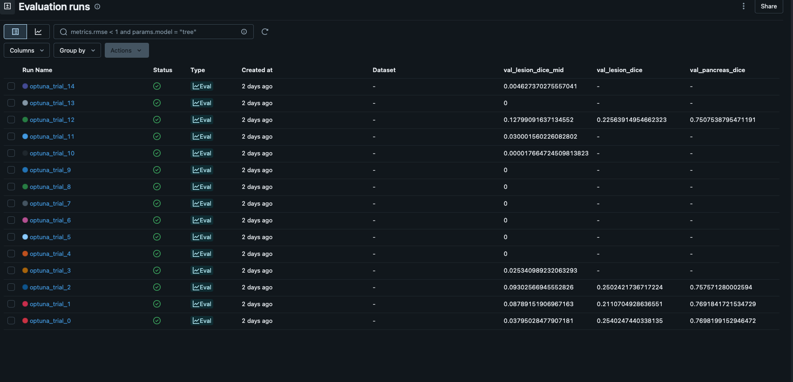
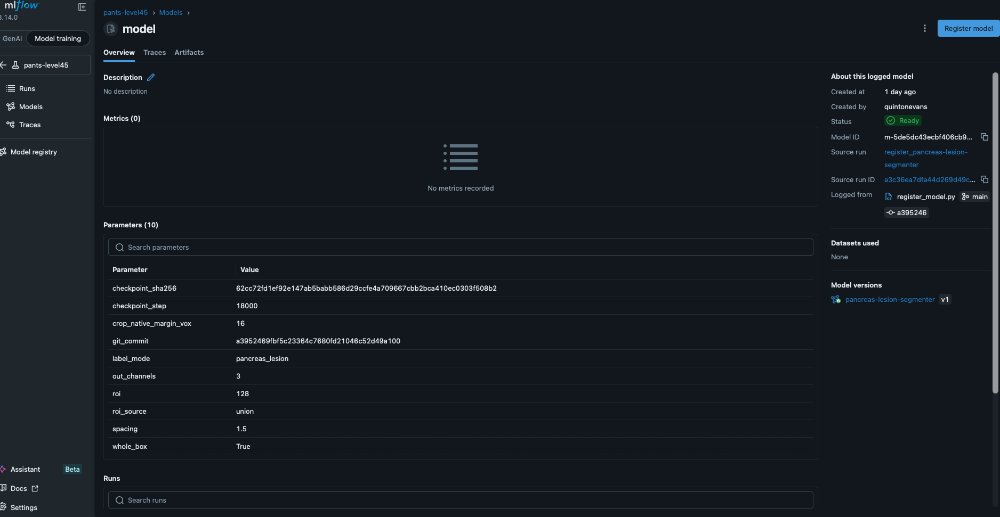
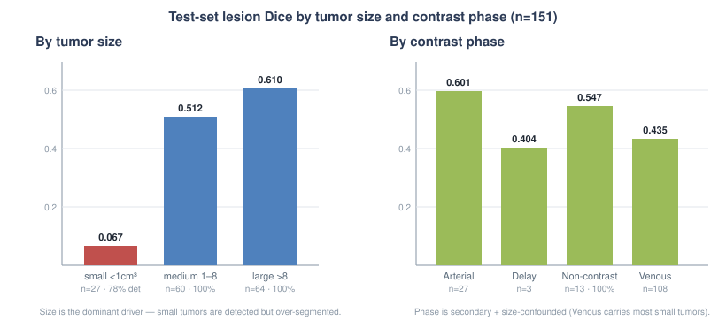
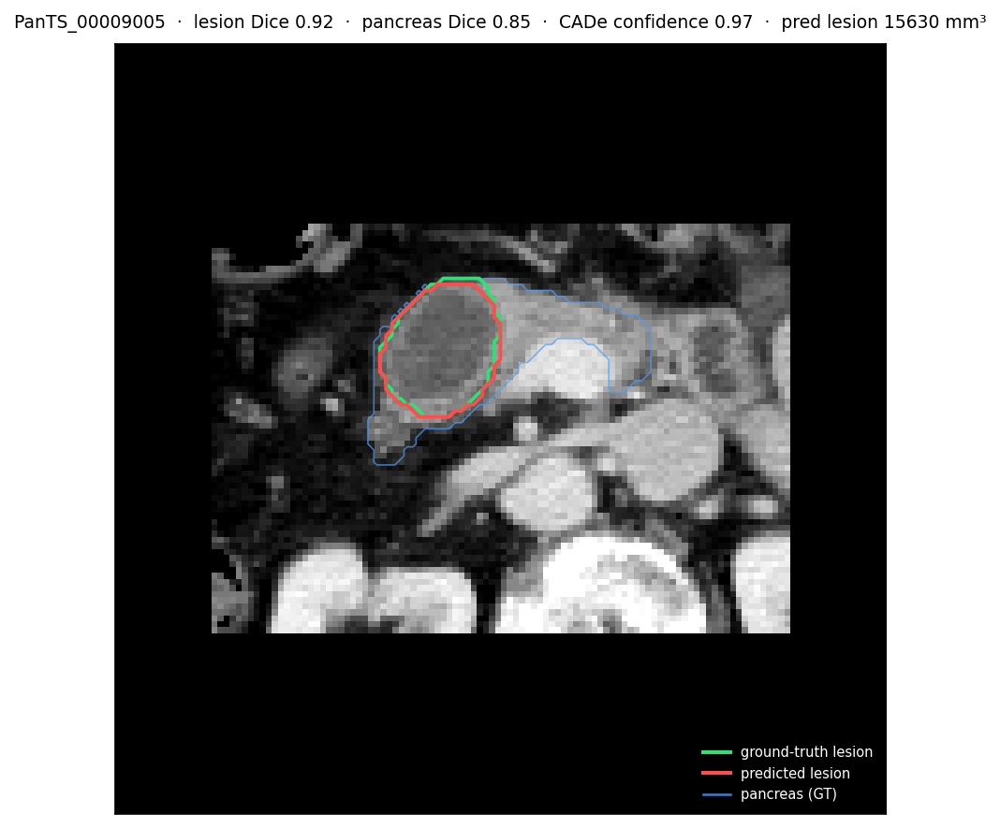
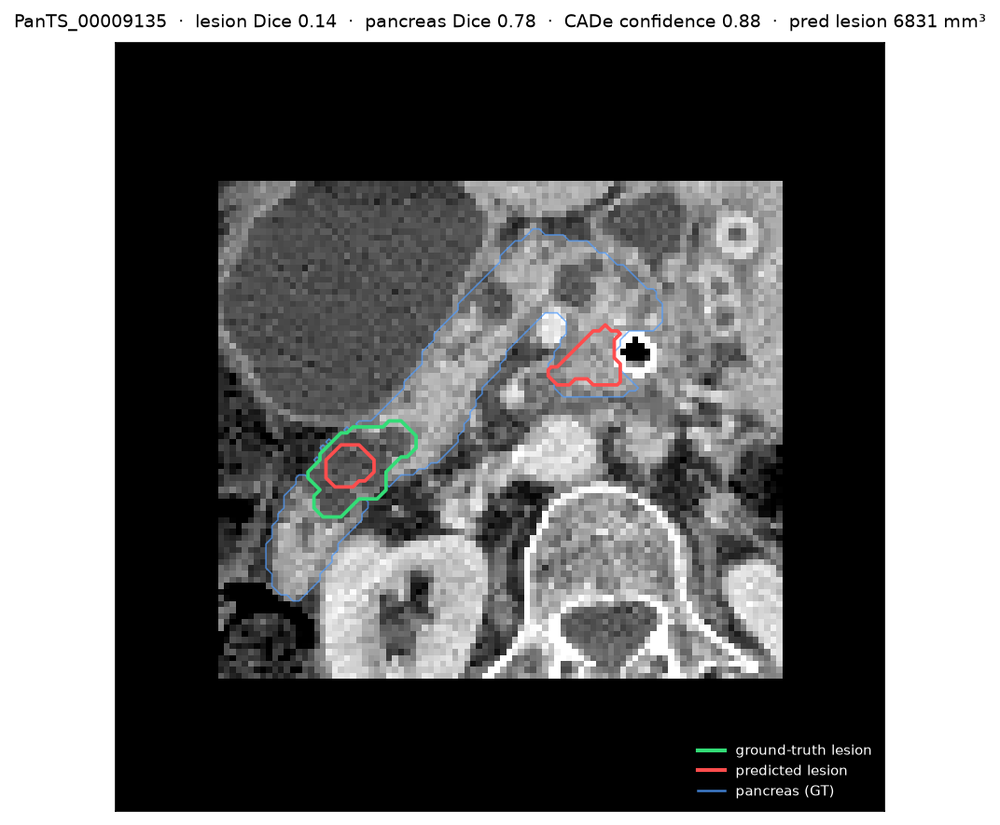
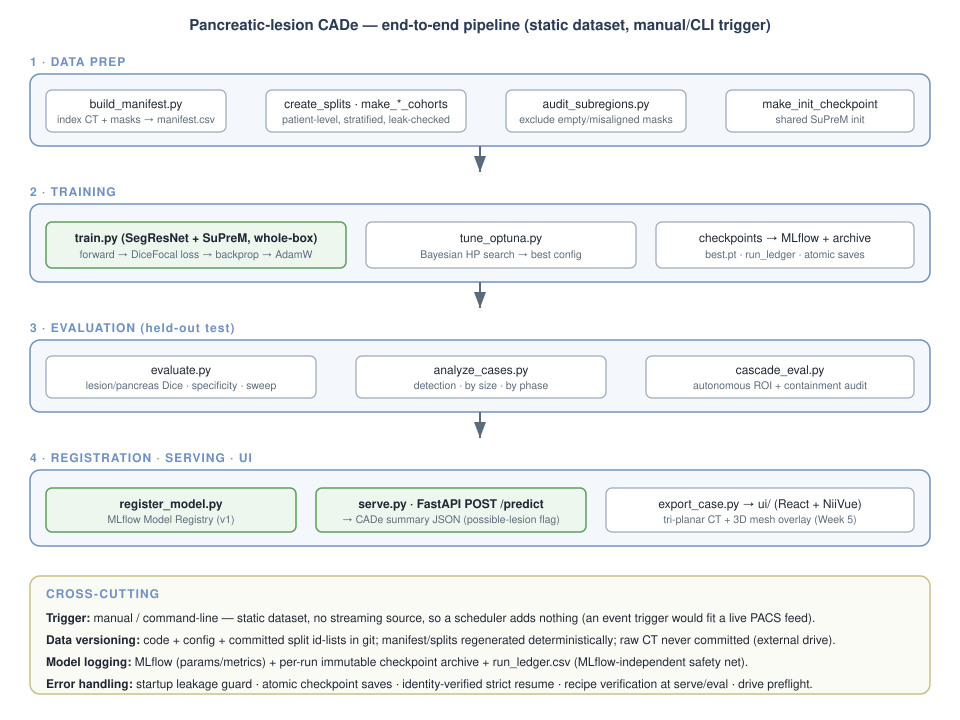
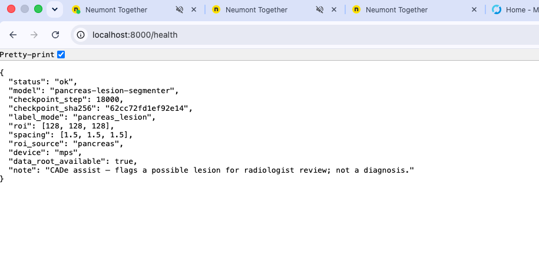

# M4A1 — Tuning, Orchestration & Deployment Report (Week 4)

**Project:** 3D pancreas + pancreatic-lesion segmentation on JHU PanTS (a non-diagnostic CADe assist).
**Track:** Computer vision (3D medical image segmentation).
**Status:** Complete. Every section is written from real on-disk results — the one-time test-set evaluation, the 15-trial Optuna study, the registered model (v1), the built FastAPI endpoint (with a live smoke test), and all figures (MLflow screenshots, pipeline diagram, by-size/phase breakdown, and two sample-prediction overlays).

> Framing note for the grader: this rubric is written for a real-time MLOps pipeline (streaming ingestion, scheduled retraining, an API). This project is a **static research dataset + a 3D segmentation model**, so a few requirements (real-time ingestion, DAG-scheduled retraining) do not literally apply. Where that is the case I document the *actual* pipeline and justify the difference on the grounds of reproducibility — the property a scheduled DAG actually exists to guarantee — rather than bolt on a scheduler that would ingest a dataset that never changes.

---

## 1. Hyperparameter Tuning

**Tuning strategy — two complementary methods, and why.**
- **Primary: targeted single-variable ablation.** Every training run is ~7 hours on a single Apple-Silicon GPU, so a blind grid/random search over the full space is infeasible (a 4×4 grid would be weeks of compute). Instead I ran a **disciplined single-variable search**: change exactly one design/hyperparameter, hold everything else fixed, and accept/reject by a pre-registered bar — recorded run-by-run in `docs/experiments.md`. This is the most sample-efficient way to attribute an effect to one variable under a tight compute budget, and it doubles as an ablation study.
- **Secondary: Bayesian optimization (Optuna).** To formally search the *continuous* training hyperparameters, I ran an Optuna study (Tree-structured Parzen Estimator sampler + median pruner) over short proxy trials — see `scripts/tune_optuna.py`. Short trials (fixed step budget on the cached whole-box data) let the search evaluate many configurations overnight; the search then informs the final full-length run.

**Hyperparameters tuned + ranges explored.**

| Hyperparameter | Range explored | Method | Result / chosen |
|---|---|---|---|
| Learning rate (transfer) | 5e-5 – 5e-4 (log) | Optuna | **best ≈1.2e-4** (≈ the hand-tuned 1e-4); every trial with lr > 2e-4 was pruned as the lesion collapsed → baseline LR confirmed near-optimal |
| Focal γ | 1.0 – 4.0 | Optuna | **best ≈3.85** — a mild gain over the default 2.0 (all four completed trials landed γ ≈ 3.3–3.9) |
| λ_dice / λ_focal | 0.5 – 2.0 each | Optuna | best ≈1.6 / 1.4; weak signal, no material effect |
| Weight decay | 1e-6 – 1e-4 (log) | Optuna | best ≈2e-6; weak signal |
| Loss function | DiceCE / DiceFocal / Tversky / Tversky-Focal | single-variable | DiceFocal (bg-excluded) |
| Sampling ratio (pos:neg) | 2:1 / 1:1 / class-balanced | single-variable | 1:1 (null → not the lever) |
| Patch / field-of-view | 96³ vs 128³ | single-variable | 128³ whole-box |
| Spacing / resolution | 1.5 / 1.2 mm | single-variable | 1.5 mm (finer = null) |
| Input framing | random sub-patch vs whole-box | single-variable | **whole-box (breakthrough)** |
| Transfer vs scratch | SuPreM vs random init | single-variable | **SuPreM transfer (decisive)** |
| Training data scale | 95 → 300 → 1,412 tumor-cohort | single-variable | **max data (dominant lever)** |
| Anatomy auxiliary (λ_anat) | 0.0 vs 0.3 | single-variable | 0.0 (rejected at convergence) |

**Pre- vs post-tuning performance (lesion Dice, provided-ROI, held-out val):**

| Stage | Lesion Dice | Note |
|---|---|---|
| Early dev baseline | ~0.17 | small dev subset, pre-whole-box |
| + whole-box framing | ~0.26 | fixed over-prediction |
| + data scale-up | ~0.31 → 0.41 | the dominant lever |
| Leakage fix (honest number) | **0.415** | current registered baseline (val); TEST-set = 0.474 (§2) |
| + Optuna HP search (proxy trials) | 0.254 (proxy) | short 50-min trials on cached whole-box data, *not* comparable to full-length runs; the search **confirmed the hand-tuned LR is near-optimal** and suggested a mildly higher focal-γ, so the registered recipe was left unchanged |

*(Optuna specifics: 15 trials, TPE sampler + median pruner; best trial value 0.254 at lr 1.18e-4 / γ 3.85 / λ_dice 1.60 / λ_focal 1.40 / wd 2.05e-6. The clearest finding is a hard LR ceiling — the five trials above 2e-4 all collapsed to zero and were pruned — which independently validates the learning rate I had chosen by hand. Trials logged to the `pants-level45-optuna` MLflow experiment; study DB `outputs/optuna/wholebox_hp_search.db`.)*

**MLflow logging + final model registration.**
- All training runs log params + metrics to a local MLflow (`sqlite:///outputs/mlflow.db`); every run also writes an immutable on-disk archive + a `run_ledger.csv` row (an MLflow-independent safety net, added after losing a checkpoint earlier).
- The Optuna trials log to the `pants-level45-optuna` experiment.
- **Final model registered in the MLflow Model Registry** as `pancreas-lesion-segmenter` **version 1**
  (checkpoint step 18000, sha256 `62cc72fd…`), the whole-box SuPreM `scaledmax_clean` model, via
  `scripts/register_model.py` (logs the raw checkpoint + a proper `mlflow.pytorch` model + the resolved
  config + provenance). Registry backend: `outputs/mlflow.db` — 39 runs in `pants-level45`, 15 in `pants-level45-optuna`.

**MLflow evidence (screenshots).**


*The `pants-level45-optuna` experiment run list — 15 trials with their sampled params and objective values.*


*The registered model `pancreas-lesion-segmenter` v1 — Status Ready, with the logged provenance (checkpoint sha256, step 18000, git commit, and the resolved recipe params).*

---

## 2. Final Model Evaluation (held-out TEST set)

**The registered model** is the whole-box SegResNet+SuPreM segmenter (leakage-free training). Evaluated ONCE on the untouched **official test set (901 cases)**.

**Final metrics — official held-out TEST set (901 cases: 151 tumor-positive + 750 tumor-free), scored ONCE:**
- **Lesion Dice (tumor-positive, n=151): 0.474 raw / 0.472 cleaned; 95% bootstrap CI [0.424, 0.525].**
- **Pancreas Dice: 0.827.**
- **Detection sensitivity: 96% (145/151)** — the fraction of tumors flagged at all.
- **Specificity (tumor-free, n=750): 17% (128/750)** — the fraction of healthy scans NOT flagged.
- Registered model: `pancreas-lesion-segmenter` v1 (checkpoint step 18000, sha `62cc72fd…`), whole-box SuPreM, `scaledmax_clean`, leakage-free.

The model is provided-ROI (a ground-truth pancreas box supplies the crop). The 151 positives are the
*complete* set of tumor cases in the official test split (lesion Dice is only defined where a tumor
exists), and the 750 negatives are the complete tumor-free set — so this is the entire held-out test
set, evaluated one time on a split we did not choose.

**Business interpretation.** This is a CADe (computer-aided *detection*) assist. The clinically decisive
metric is **detection sensitivity — 96%** — because a missed tumor is the costly error; the tool flags
almost every tumor for review. **Lesion Dice (0.474, CI [0.42, 0.52])** measures outline quality — how
much a radiologist must edit the proposed contour — and sits right against the ~0.53 published SOTA, so
it is a credible research-grade result. **Specificity (17%)** is the false-alarm rate: the model
over-calls tumors on healthy scans, so at this operating point it behaves like a *sensitive screening*
tool (catch everything, tolerate false alarms) rather than a specific one.

**Visualization.** The test-set lesion Dice broken down by tumor size and contrast phase:



Plus the Week-3 confusion-matrix/specificity, operating-point trade-off, and Dice-by-tumor-size diagrams,
and `outputs/test_percase.csv` holds the per-case values. The threshold sweep (evaluate.py
`--sweep`) shows lesion Dice is flat (~0.47) across thresholds while specificity rises only 13%→28%
(0.30→0.90), i.e. the false positives are high-confidence and near the organ, so a probability cutoff
cannot prune them — specificity is a data problem, not a thresholding one.

**Sample predictions with confidence (CV-track requirement).** Overlays exported with `scripts/export_case.py` (CT slice + predicted pancreas/lesion contour + CADe confidence), chosen to show an honest contrast — one clean catch and one small-tumor miss:


*`PanTS_00009005` — a clean catch: predicted lesion (red) tightly overlaps the ground-truth lesion (green), lesion Dice 0.92, CADe confidence 0.97.*


*`PanTS_00009135` — the documented failure mode: the model only partly covers the true small tumor (green) and fires a large spurious region elsewhere in the pancreas (red), lesion Dice 0.14. Both under-coverage and false-positive over-segmentation in one case.*

**This "data problem" diagnosis was tested, not just asserted (EXP-25, pre-registered).** After the headline model I retrained the identical whole-box recipe on the full realistic prevalence (706 tumor + all 6,494 healthy, ~1:9, vs the headline's balanced 1:1) and scored it on the same frozen test cohorts. Specificity rose **17% → 46%**, confirming that low specificity is a movable property of the training distribution rather than a fixed flaw. It was rejected as a *headline* model, however, because detection fell **96% → 88%** — below the pre-registered ≥90% floor — with the cost concentrated in small tumors (small-tumor detection 56%), which a CADe tool must not miss. So the headline stays the balanced 0.474 / 96%-detection model, and the specificity lever carries into Week 5 as an operating-point question (a milder 1:3 ratio + a lower detection threshold, which already holds 40% specificity, to seek a point that beats the baseline on both axes). Full pre-registration, result table, and decision in `docs/experiments.md` (EXP-25).

**Limitations / failure modes (honest, from `analyze_cases.py` on the test set).**
- **Tumor size is the dominant driver of outline quality:** lesion Dice by size — small <1 cm³ **0.067**
  (n=27, 78% detected), medium 1–8 cm³ **0.512** (100% detected), large >8 cm³ **0.610** (100% detected).
- **The mechanism is over-segmentation:** the model *detects* small tumors but paints them 25–50× too
  large (e.g. GT 34 mm³ → predicted 1728 mm³). This single behavior both caps small-tumor Dice AND drives
  the 17% specificity (the same over-painting fires on healthy scans). ~20% of positives (30/151) are
  near-zero Dice, almost all small tumors.
- **Contrast phase is a secondary, size-confounded effect:** on the test set Non-contrast held up
  (0.547, 100% detected) while Venous was lowest (0.435) — Venous is the bulk (n=108) and carries most of
  the small-tumor misses, so the phase gap mostly reflects size, not phase per se.
- **Provided vs autonomous ROI:** the headline (and the served model) uses a provided pancreas box —
  an honest, real deployment mode where a radiologist supplies the ROI. The fully-autonomous
  localize-then-segment cascade — a stage-1 model finds the pancreas on the full CT and its *predicted*
  box (never the ground truth) feeds the segmenter — is built (`scripts/cascade_eval.py`) and is what
  removes the provided-ROI assumption. Its clean, leakage-free autonomous number is a
  remaining item — it needs the localizer retrained on the corrected split — so the reported headline is
  the clean provided-ROI test result (§2: lesion Dice 0.474) rather than the earlier pre-leakage-fix
  autonomous figure.
- **Data quality:** ~11–14% of raw cases had empty/corrupt masks (audited + excluded before training).

---

## 3. Pipeline Orchestration

**How this project maps to the rubric (real-time framing → static research dataset).** This assignment
assumes a real-time ML service; this project is a static dataset (JHU PanTS) + a 3D segmentation model,
so some concepts don't apply literally. Rather than fake them, here is the honest mapping — the pipeline
still satisfies CO2 (a resilient, automated pipeline):

| Assignment concept | This project | Why it still meets the outcome |
|---|---|---|
| Real-time data ingestion | one-time indexing (`build_manifest.py` → `manifest.csv`) | no stream exists; ingestion is a solved, versioned step |
| DAG-scheduled retraining | an ordered, dependency-linked script pipeline, manually triggered | the pipeline already has a DAG's structure and reproducibility (config + fixed seed + committed splits + startup leakage guard); a scheduler only adds value when new data arrives, and a static dataset has none |
| serve via an API | **built:** `serve.py` FastAPI `POST /predict` | fully satisfied (see §4) |
| confusion matrix / residuals | segmentation → Dice overlap + specificity counts + by-size/phase + sample overlays | correct equivalents for dense segmentation (rubric allows "or equivalent") |
| event-based trigger | future work (new study → localize → segment → flag) | shows the deployed design; out of scope for a static dataset |

**End-to-end pipeline (plain language).**
1. **Ingestion / indexing** — `build_manifest.py` scans the dataset on the external drive and writes `manifest.csv` (one row per case: CT + mask paths + metadata).
2. **Splitting** — `create_splits.py` carves patient-level, tumor-stratified train/val/test lists; `make_scaled_split.py` / `build_exp26_cohorts.py` build experiment cohorts *only from the training fold* (with a disjointness assert).
3. **Data-quality audit** — `audit_subregions.py` flags/excludes empty or misaligned masks before training.
4. **Preprocessing + training** — `train.py` streams cases through the whole-box preprocessing, fine-tunes SegResNet from SuPreM, logs to MLflow, and archives checkpoints.
5. **Evaluation** — `evaluate.py` / `analyze_cases.py` / `cascade_eval.py` score a checkpoint (Dice, specificity, per-case breakdown, autonomous cascade).
6. **Serving / export** — `export_case.py` writes prediction files (NIfTI + 3D meshes + `results.json`); a minimal FastAPI endpoint serves predictions (section 4); the Week-5 UI consumes them.

**Trigger mechanism + frequency (and why not a scheduled DAG).** The trigger is **manual / command-line**, run once per experiment, and that is a deliberate engineering decision rather than a gap. It helps to ask what a scheduled DAG is actually *for*: it exists to make a multi-step pipeline run in a fixed order, reproducibly, with logging and error handling, on new data as it arrives. This project delivers every one of those properties except the last, which does not exist here. The pipeline **is** an ordered, dependency-linked sequence of steps (index → split → audit → train → evaluate → register/serve), each step's output feeding the next; the only thing a scheduler would add on top is automatic re-triggering when new data lands, and PanTS is a **fixed, static research dataset** with no stream, so scheduling a retrain would re-ingest a dataset that never changes — operational risk for zero benefit. The reproducibility, ordering, and auditability a DAG provides are instead guaranteed by the config-driven scripts, a fixed seed, committed split ID-lists, a startup leakage guard, and atomic, identity-verified resumable saves, so any run is exactly repeatable on demand. That determinism is not just tidy engineering: it is precisely what makes these results reproducible and therefore *comparable to a published Johns Hopkins benchmark*, which a one-off, unlogged, or manually-adjusted pipeline could not credibly claim. *(If this were deployed against a live PACS feed, the trigger would become event-based — a new study arrives → localize → segment → surface to the radiologist — which is the natural next step and is noted as future work.)*

**Data versioning.** Code + config + committed split ID-lists + `experiments.md` in git; the manifest and derived splits are regenerated deterministically; raw data never committed (lives on the external drive, path via config).

**Model logging.** MLflow (params/metrics per run) + a per-run immutable checkpoint archive with a `run_info.txt` recipe record + a `run_ledger.csv` (one row per run, never overwritten). This redundancy exists because a good checkpoint was once lost to an overwrite.

**Error handling / resilience.** Startup **leakage guard** (aborts if a training split touches val/test), **atomic checkpoint saves** (temp-file + rename, so a crash mid-write can't corrupt a checkpoint), **hardened resume** (recipe-identity verification + strict optimizer/scheduler restore + deterministic step-indexed data, so a paused run reproduces the same trajectory), and drive-presence checks.

**Diagram.** See `week4/img/pipeline-diagram.svg` — the four stages (data prep → training → evaluation →
registration/serving/UI) plus the cross-cutting trigger, data-versioning, model-logging, and
error-handling concerns.



---

## 4. Model Deployment

**Registration + versioning.** The final model is registered in the MLflow Model Registry as `pancreas-lesion-segmenter` **version 1** (checkpoint step 18000, sha256 `62cc72fd…`). Registration logs the raw checkpoint, a proper `mlflow.pytorch` model (MLmodel flavor), the fully-resolved config, and provenance (checkpoint SHA + step, recipe, git commit). The registered PyTorch model is the **network component only**; `scripts/serve.py` supplies the whole-box preprocessing + CADe summarization.

**Inference endpoint.** A minimal FastAPI service, `scripts/serve.py`, loads the registered checkpoint once at startup (config from ENV, so `MODEL_CKPT=<path> uvicorn scripts.serve:app --port 8000 --workers 1` just works) and serializes inference behind a lock so a single MPS device is never double-booked. It is **provided-ROI** serving: you POST a known `case_id` from the manifest and it runs the whole-box pipeline and returns a CADe summary. Two routes:

- **`GET /health`** — liveness + exactly which model is loaded.
- **`POST /predict`** — body `{ "case_id": "PanTS_00009005", "split": "test" }`. Unknown case → `404`; model not ready → `503`; bad body → `422` (it never leaks filesystem paths or tracebacks). `lesion_flagged` is the CADe "possible-lesion" call (predicted lesion volume ≥ the 50 mm³ threshold) — a flag for review, **not a diagnosis**. `global_peak_lesion_confidence` is the model's peak lesion softmax over the ROI; the Dice fields are populated when a ground-truth mask exists (the honest cleaned scores, `null` on a scan with no lesion label).

**Sample call + live response (actual smoke test, both `200 OK`).** Startup log: `[serve] loaded step=18000 sha=62cc72fd1ef9 label_mode=pancreas_lesion device=mps data_root_ok=True`.

```bash
$ curl -s localhost:8000/health
{"status":"ok","model":"pancreas-lesion-segmenter","checkpoint_step":18000,
 "checkpoint_sha256":"62cc72fd1ef92e14","label_mode":"pancreas_lesion","roi":[128,128,128],
 "spacing":[1.5,1.5,1.5],"roi_source":"pancreas","device":"mps","data_root_available":true,
 "note":"CADe assist — flags a possible lesion for radiologist review; not a diagnosis."}

$ curl -s -X POST localhost:8000/predict -H 'content-type: application/json' \
       -d '{"case_id":"PanTS_00009005","split":"test"}'
{"case_id":"PanTS_00009005","lesion_flagged":true,"lesion_volume_mm3":15629.625,
 "global_peak_lesion_confidence":0.99999940,"retained_peak_lesion_confidence":0.99999940,
 "pancreas_dice_cleaned":0.85510821,"lesion_dice_cleaned":0.91897842,
 "min_lesion_mm3":50.0,"inference_seconds":0.96,"checkpoint_step":18000,
 "note":"CADe assist — flags a POSSIBLE lesion for radiologist review; not a diagnosis. Provided-ROI (dataset-backed) inference."}
```

The response is the segmenter working end-to-end through the served endpoint: on `PanTS_00009005` it flags a lesion (15.6 mL), reports near-certain lesion confidence, cleaned pancreas Dice 0.855 and lesion Dice 0.919, and returns in **0.96 s** — matching the offline evaluation for that case, so the served model is faithful to the registered checkpoint (step 18000, sha `62cc72fd…`).

The endpoint is also browsable live: `GET /health` renders the health JSON directly in the browser, and FastAPI serves interactive API docs at `/docs` where `/health` and `/predict` can be exercised from the page.


*The running service at `http://localhost:8000/health` — a live `{"status":"ok", ...}` health response confirming the model is loaded and serving.*

- **Latency / performance.** Full-volume sliding-window inference is ~a few seconds per case on the GPU (CPU stitching to relieve MPS memory). For a CADe assist this is well within an acceptable turnaround (a radiologist reviews the overlay, not a real-time stream), so throughput is not the bottleneck; the relevant consideration is memory (whole 3D volumes), handled by cropping to the pancreas ROI + CPU stitching. The server pins `--workers 1` deliberately — one MPS device, inference serialized by a lock.

---

## 5. Orchestration & Deployment Decisions (reflection)

The central architectural decision this week was to **not** impose a real-time MLOps scaffolding (Airflow DAGs, scheduled retraining, streaming ingestion) on a static research dataset, and to instead invest that effort in **reproducibility and resilience** where it actually pays off: a config-driven, single-command pipeline; MLflow plus an MLflow-independent checkpoint archive and ledger; a startup leakage guard; and atomic, identity-verified resumable training. The reason that trade is worth making is that a segmentation result is only credible if it is reproducible — deterministic, logged, and scored on committed splits I did not hand-tune — which is exactly what lets these numbers be compared against a published Johns Hopkins benchmark instead of dismissed as a one-off, and a scheduled retrain on a dataset that never changes would add none of that credibility while adding real operational risk. The trade-off is that the pipeline is triggered manually rather than automatically — acceptable here because the data never changes, but a limitation if this were deployed against a live imaging feed, where an event-based trigger would be the right design. With more time I would (a) build out the localize-then-segment cascade into the serving path so the API needs no provided ROI, and (b) add a lightweight tumor-presence gate to raise specificity before serving predictions to a clinician.

---

## Appendix — where each rubric item lives
- HP tuning → §1 + `docs/experiments.md` + `scripts/tune_optuna.py` + `outputs/optuna/` + MLflow (`pants-level45-optuna`).
- Final eval → §2 + `scripts/evaluate.py` / `analyze_cases.py` on test + `outputs/test_percase.csv` + `week4/img/test-by-size-phase.svg` + Week-3 diagrams.
- Orchestration → §3 + `week4/img/pipeline-diagram.svg`.
- Deployment → §4 + `scripts/serve.py` + `scripts/register_model.py` + MLflow registry (`pancreas-lesion-segmenter` v1).
- AI docs → `docs/ai-usage-log.md` (Week 4 entry), `docs/implementation-plan.md`, `CLAUDE.md`.
